

  

# **Universidad Peruana de Ciencias Aplicadas**
## Carrera de Ingeniería de Software

Ciclo: 2025 - 20

Curso: Arquitecturas De Software Emergentes

NRC: 14653

Profesor: Berrocal Navarro, Richard Leonardo

“Informe de Trabajo Final"

Startup: TechSolutions

Producto: FitSense

Grupo: 2

|          Integrantes          |      Código      |
|:-----------------------------:|:-------------------:|
|   Calisaya Sánchez, Juan Jesús    |    u202121935    |
|   Cuadros Rodríguez, Juan Alejandro  |    u20221a359    |
|   Jarama Peñaloza, Fiorella    |   u202120418  |
|  Lucas Coronel, Nadia Alessandra   |    U202120430    |
|  Rubio Calixto, Adrian Gustavo   |    u202017622    |

Setiembre 2025 

---

## Registro de Versiones Del Informe

<table>
  <thead>
    <tr>
        <th>Versión</th>
        <th>Fecha</th>
        <th>Autor</th>
        <th>Descripción de modificación</th>
    </tr>
  </thead>
  <tbody>
  <tr>
      <td><strong>TB1</strong></td>
      <td>Sábado 16 de Setiembre</td>
      <td>
        <ul>
            <li>Calisaya Sánchez, Juan Jesús</li>
            <li>Cuadros RodriguVz, Juan Alejandro</li>
            <li>Jarama Peñaloza, Fiorella</li>
            <li>Lucas Coronel, Nadia Alessandra</li>
            <li>Rubio Calixto, Adrian Gustavo</li>
        </ul>
      </td>
      <td>
        Se han incluído los siguientes capítulos:
        <ul>
          <li>Capítulo I: Introducción</li>
          <li>Capítulo II: Requirements Elicitation & Analysis</li>
          <li>Capítulo III: Requirements Specification</li>
          <li>Capítulo IV: Strategic-Level Software Design</li>
          <li>Avance de Conclusiones, Bibliografía y Anexos</li>
        </ul>
      </td>
  </tr>
  </tbody>
</table>

## Project Report Collaboration Insights

URL Project Report (Github): https://github.com/FitSense-Emergentes-14653/Project-Report

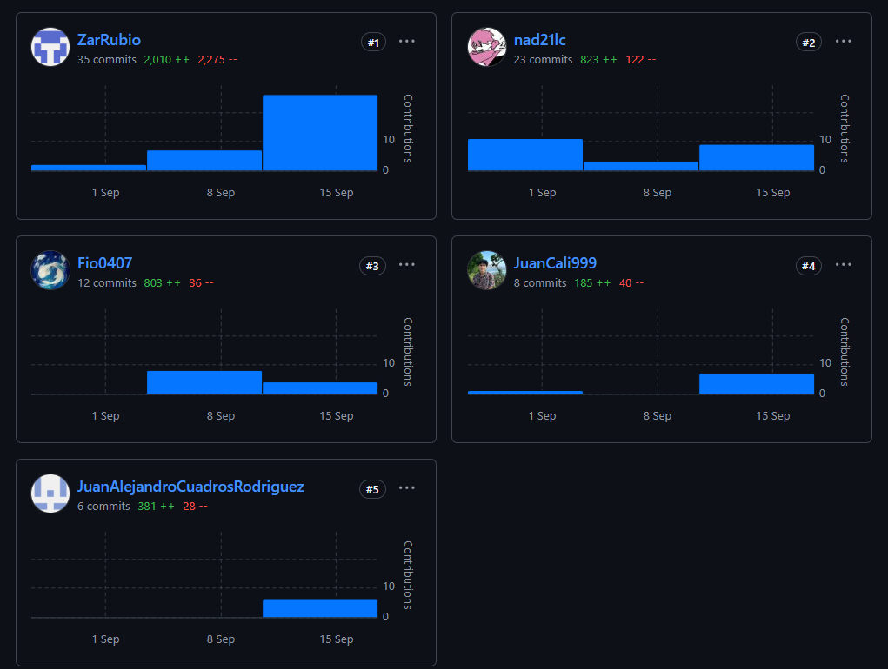

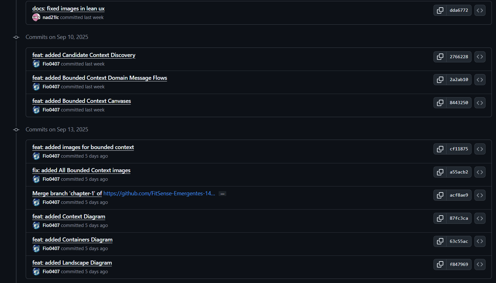

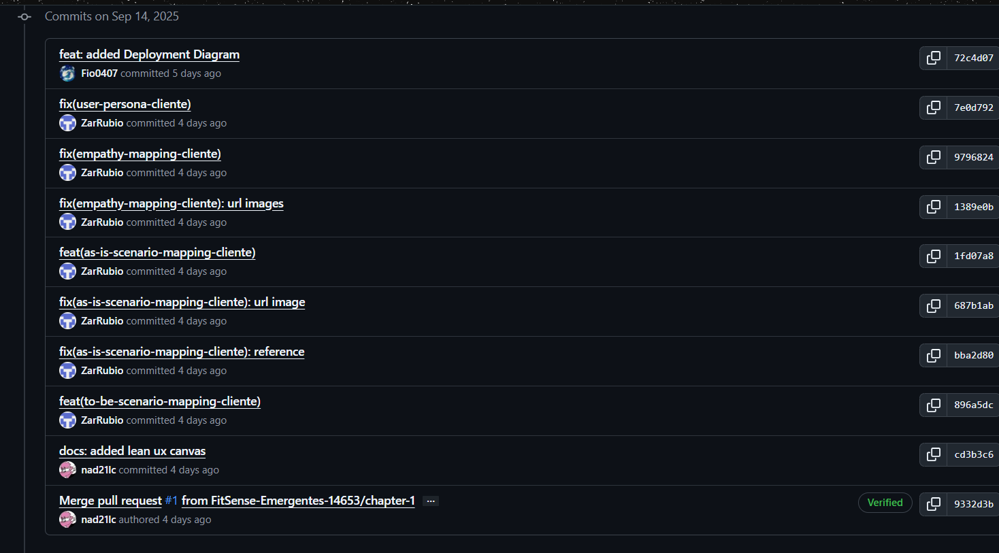

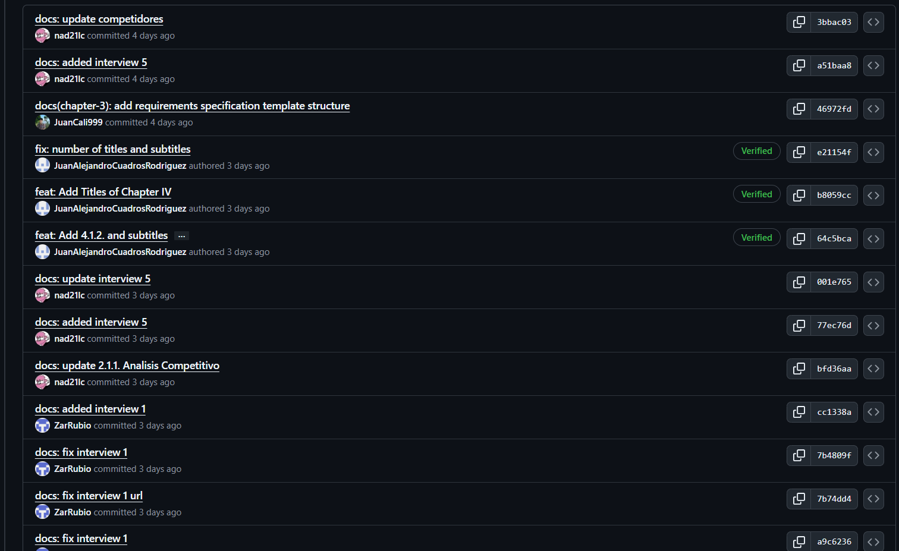

.
------

# Contenido

## [Capítulo I: Introducción](#capítulo-i-introducción)
- [1.1. Startup Profile](#11-startup-profile)
  - [1.1.1. Descripción de la Startup](#111-descripción-de-la-startup)
  - [1.1.2. Perfiles de integrantes del equipo](#112-perfiles-de-integrantes-del-equipo)
- [1.2. Solution Profile](#12-solution-profile)
  - [1.2.1. Antecedentes y problemática](#121-antecedentes-y-problemática)
  - [1.2.2. Lean UX Process](#122-lean-ux-process)
    - [1.2.2.1. Lean UX Problem Statements](#1221-lean-ux-problem-statements)
    - [1.2.2.2. Lean UX Assumptions](#1222-lean-ux-assumptions)
    - [1.2.2.3. Lean UX Hypothesis Statements](#1223-lean-ux-hypothesis-statements)
    - [1.2.2.4. Lean UX Canvas](#1224-lean-ux-canvas)
- [1.3. Segmentos objetivo](#13-segmentos-objetivo)

## [Capítulo II: Requirements Elicitation & Analysis](#capítulo-ii-requirements-elicitation--analysis)
- [2.1. Competidores](#21-competidores)
  - [2.1.1. Análisis competitivo](#211-análisis-competitivo)
  - [2.1.2. Estrategias y tácticas frente a competidores](#212-estrategias-y-tácticas-frente-a-competidores)
- [2.2. Entrevistas](#22-entrevistas)
  - [2.2.1. Diseño de entrevistas](#221-diseño-de-entrevistas)
  - [2.2.2. Registro de entrevistas](#222-registro-de-entrevistas)
  - [2.2.3. Análisis de entrevistas](#223-análisis-de-entrevistas)
- [2.3. Needfinding](#23-needfinding)
  - [2.3.1. User Personas](#231-user-personas)
  - [2.3.2. User Task Matrix](#232-user-task-matrix)
  - [2.3.3. User Journey Mapping](#233-user-journey-mapping)
  - [2.3.4. Empathy Mapping](#234-empathy-mapping)
  - [2.3.5. As-is Scenario Mapping](#235-as-is-scenario-mapping)
- [2.4. Ubiquitous Language](#24-ubiquitous-language)

## [Capítulo III: Requirements Specification](#capítulo-iii-requirements-specification)
- [3.1. To-Be Scenario Mapping](#31-to-be-scenario-mapping)
- [3.2. User Stories](#32-user-stories)
- [3.3. Impact Mapping](#33-impact-mapping)
- [3.4. Product Backlog](#34-product-backlog)

## [Capítulo IV: Solution Software Design](#capítulo-iv-solution-software-design)
- [4.1. Strategic-Level Domain-Driven Design](#41-strategic-level-domain-driven-design)
  - [4.1.1. Design Purpose](#411-eventstorming)
  - [4.1.2. Attribute-Driven Design Inputs](#412-context-mapping)
    - [4.1.2.1. Primary Functionality (Primary User Stories)](#4131-system-landscape-diagram)
    - [4.1.2.2. Quality attribute Scenarios](#4132-context-level-diagrams)
    - [4.1.2.2. Constraints](#4132-container-level-diagrams)
    - [4.1.2.3. Deployment Diagrams](#4133-deployment-diagrams)
- [4.1.3. Architectural Drivers Backlog](#413-software-architecture)
- [4.1.4. Architectural Design Decisions](#413-software-architecture)
- [4.1.5. Quality Attribute Scenario Refinements](#413-software-architecture)
- [4.2.  Strategic-Level Domain-Driven Design](#41-strategic-level-domain-driven-design)
  - [4.2.1. EventStorming](#413-software-architecture)
  - [4.2.2. Candidate Context Discovery](#413-software-architecture)
  - [4.2.3. Domain Message Flows Modeling](#413-software-architecture)
  - [4.2.4. Bounded Context Canvases](#413-software-architecture)
  - [4.2.5. Context Mapping](#413-software-architecture)
- [4.2.  Software Architecture](#41-strategic-level-domain-driven-design)
    - [4.3.1. Software Architecture System Landscape Diagram](#4131-system-landscape-diagram)
    - [4.3.2. Software Architecture Context Level Diagrams](#4132-context-level-diagrams)
    - [4.3.2. Software Architecture Container Level Diagrams](#4132-container-level-diagrams)
    - [4.3.3. Software Architecture Deployment Diagrams](#4133-deployment-diagrams)

## [Capítulo V: Tactical-Level Domain-Driven Design](#capítulo-iv-solution-software-design)
  - [5.1. Bounded Context: Security](#421-bounded-context-security)
    - [5.1.1. Domain Layer](#4211-domain-layer)
    - [5.1.2. Interface Layer](#4212-interface-layer)
    - [5.1.3. Application Layer](#4213-application-layer)
    - [5.1.4. Infrastructure Layer](#4214-infrastructure-layer)
    - [5.1.5. Bounded Context Software Architecture Component Level Diagrams](#4215-component-level-diagrams)
    - [5.1.6. Bounded Context Software Architecture Code Level Diagrams](#4215-component-level-diagrams)
      - [5.1.6.1. Domain Layer Class Diagrams](#42161-domain-layer-class-diagrams)
      - [5.1.6.2. Database Design Diagram](#42162-database-design-diagram)

## [Capítulo VI: Solution UI/UX Design](#capítulo-v-solution-uiux-design)
- [6.1. Style Guidelines](#51-style-guidelines)
  - [6.1.1. General Style Guidelines](#511-general-style-guidelines)
  - [6.1.2. Web, Mobile and IoT Style Guidelines](#512-web-mobile-and-iot-style-guidelines)
- [6.2. Information Architecture](#52-information-architecture)
  - [6.2.1. Organization Systems](#521-organization-systems)
  - [6.2.2. Labeling Systems](#522-labeling-systems)
  - [6.2.3. SEO Tags and Meta Tags](#523-seo-tags-and-meta-tags)
  - [6.2.4. Searching Systems](#524-searching-systems)
  - [6.2.5. Navigation Systems](#525-navigation-systems)
- [6.3. Landing Page UI Design](#53-landing-page-ui-design)
  - [6.3.1. Landing Page Wireframe](#531-landing-page-wireframe)
  - [6.3.2. Landing Page Mock-up](#532-landing-page-mock-up)
- [6.4. Applications UX/UI Design](#54-applications-uxui-design)
  - [6.4.1. Applications Wireframes](#541-applications-wireframes)
  - [6.4.2. Applications Wireflow Diagrams](#542-applications-wireflow-diagrams)
  - [6.4.2. Applications Mock-ups](#542-applications-mock-ups)
  - [6.4.3. Applications User Flow Diagrams](#543-applications-user-flow-diagrams)
- [6.5. Applications Prototyping](#55-applications-prototyping)

## [Capítulo VII: Product Implementation, Validation & Deployment](#capítulo-vi-product-implementation-validation--deployment)
- [7.1. Software Configuration Management](#61-software-configuration-management)
  - [7.1.1. Development Environment Configuration](#611-development-environment-configuration)
  - [7.1.2. Source Code Management](#612-source-code-management)
  - [7.1.3. Style Guide & Conventions](#613-style-guide--conventions)
  - [7.1.4. Deployment Configuration](#614-deployment-configuration)
- [7.2. Implementation](#62-implementation)
  - [7.2.1. Sprint 1](#621-sprint-1)
    - [7.2.1.1. Sprint Planning](#6211-sprint-planning)
    - [7.2.1.2. Aspect Leaders and Collaborators](#62x2-aspect-leaders-and-collaborators)
    - [7.2.1.3. Sprint Backlog](#6213-sprint-backlog)
    - [7.2.1.4. Development Evidence](#6214-development-evidence)
    - [7.2.1.5. Testing Suite Evidence](#6215-testing-suite-evidence)
    - [7.2.1.6. Execution Evidence](#6216-execution-evidence)
    - [7.2.1.7. Services Documentation](#6217-services-documentation)
    - [7.2.1.8. Software Deployment Evidence for Sprint Review](#6218-software-deployment-evidence)
    - [7.2.1.9. Team Collaboration Insights](#6219-team-collaboration-insights)

- [7.3. Validation Interviews](#63-validation-interviews)
  - [7.3.1. Diseño de Entrevistas](#631-diseño-de-entrevistas)
  - [7.3.2. Registro de Entrevistas](#632-registro-de-entrevistas)
  - [7.3.3. Evaluaciones según heurísticas](#633-evaluaciones-según-heurísticas)
- [7.4. Video About-the-Product](#64-video-about-the-product)

## [Conclusiones](#conclusiones)
- [Conclusiones y recomendaciones](#conclusiones-y-recomendaciones)
- [Video About-the-Team](#video-about-the-team)
- [Bibliografía](#bibliografía)
- [Anexos](#anexos)

## Student Outcome

<table border="1" cellpadding="8" cellspacing="0">
  <tr>
    <th>Criterio específico</th>
    <th>Acciones realizadas</th>
    <th>Conclusiones TB1</th>
  </tr>
  <tr>
    <td>Comunica oralmente sus ideas y/o resultados con objetividad a público de diferentes especialidades y niveles jerarquicos, en el marco del desarrollo de un proyecto en ingeniería. </td>
    <td>
        <strong>Cuadros Rodriguez, Juan Alejandro</strong> 
        <em>TB1</em> 
       Durante el desarrollo de FitSense se llevó a cabo el diseño arquitectónico siguiendo el enfoque Attribute-Driven Design (ADD), priorizando las funcionalidades de mayor impacto en la arquitectura y definiendo escenarios representativos junto con sus soluciones, así como los drivers arquitectónicos que guiaron las decisiones clave; tras evaluar distintas alternativas estructurales, se optó por una arquitectura de tipo monolito modular por su adecuación al contexto del proyecto, y finalmente se elaboraron dos escenarios de prueba con sus respectivas soluciones para validar la solidez y el desempeño de la propuesta. 
        <strong>Calisaya Sánchez, Juan Jesús</strong> 
        <em>TB1</em> 
        Durante el proyecto FitSense, presenté los resultados del Impact Mapping, User Stories y requisitos del sistema a diferentes audiencias del proyecto. Comuniqué de forma clara cómo las épicas y features se conectan con los objetivos de negocio, adaptando la explicación para que tanto stakeholders como el equipo técnico entendieran la priorización y el valor de cada funcionalidad.  
        <strong>Jarama Peñaloza, Fiorella</strong> 
        <em>TB1</em> 
        Realicé el EventStorming para mapear eventos, comandos, políticas, puntos de dolor y momentos clave; identifiqué bounded contexts (Plan, Monitoring, Notification, Security y Social) y modelé sus interacciones mediante context mapping. También generé los artefactos de arquitectura: System Landscape, Context, Container y Deployment Diagrams siguiendo el enfoque C4. 
        <strong>Lucas Coronel, Nadia Alessandra</strong> 
        <em>TB1</em> 
        Durante el avance de este TB1 pude identificar la falta de soluciones integrales y accesibles en el ámbito del fitness digital y plantear a FitSense como respuesta innovadora, basada en IA, métricas personalizadas y motivación social. A través del análisis competitivo y el Lean UX Canvas, se definieron estrategias, hipótesis y un MVP que facilitarán validar la propuesta. En conjunto, se comunica de forma objetiva un proyecto de ingeniería con impacto positivo en la salud y la constancia de los usuarios. 
        <strong>Rubio Calixto, Adrian Gustavo</strong> 
        <em>TB1</em> 
        Durante el desarrollo de FitSense, diseñé, registré y analicé entrevistas para identificar necesidades clave de los usuarios. Posteriormente, elaboré el proceso de Needfinding mediante User Personas, User Task Matrix, Empathy Mapping y As-is Scenario Mapping, lo que permitió comprender a fondo su contexto. Además, definí el Ubiquitous Language para unificar la comunicación entre el equipo y realicé el To-Be Scenario Mapping en el Capítulo III, proyectando escenarios futuros alineados con los objetivos del proyecto. 
    </td>
    <td>
        <em>TB1</em> 
        En conclusión, el desarrollo de FitSense permitió comunicar con objetividad y claridad los resultados obtenidos, abarcando desde el análisis de necesidades y la definición de requisitos hasta el diseño de la arquitectura emergente. De esta manera, logramos transmitir a públicos diversos técnicos y no técnicos, el valor, la viabilidad y el impacto positivo de la propuesta en el ámbito del fitness digital. 
    </td>
  </tr>
  <tr>
    <td>Comunica en forma escrita ideas y/o resultados con objetividad a público de diferentes especialidades y niveles jerarquicos, en el marco del desarrollo de un proyecto en ingeniería.</td>
    <td>
        <strong>Cuadros Rodriguez, Juan Alejandro</strong> 
        <em>TB1</em> 
       El diseño arquitectónico se basó en el enfoque ADD, priorizando funcionalidades clave, definiendo escenarios representativos y alineando decisiones con drivers de negocio como rapidez, evolución y confianza del usuario; se optó por una arquitectura monolítica para una implementación ágil, dejando abierta la posibilidad de migrar a microservicios cuando el sistema crezca, y se aplicó el Reglamento de Protección de Datos para garantizar un entorno seguro y confiable para los usuarios. 
        <strong>Calisaya Sánchez, Juan Jesús</strong> 
        <em>TB1</em> 
        Elaboré la documentación de requisitos de FitSense (Capítulos III y IV) creando User Stories, Impact Mapping y Product Backlog que comunican las necesidades del usuario y objetivos de negocio. La documentación incluye desde épicas comprensibles para product owners hasta especificaciones técnicas detalladas, permitiendo que diferentes niveles del equipo entiendan los requisitos y su priorización. 
        <strong>Jarama Peñaloza, Fiorella</strong> 
        <em>TB1</em> 
        Realicé el EventStorming para mapear eventos, comandos, políticas, puntos de dolor y momentos clave; identifiqué bounded contexts (Plan, Monitoring, Notification, Security y Social) y modelé sus interacciones mediante context mapping. También generé los artefactos de arquitectura: System Landscape, Context, Container y Deployment Diagrams siguiendo el enfoque C4. 
        <strong>Lucas Coronel, Nadia Alessandra</strong> 
        <em>TB1</em> 
        El desarrollo de FitSense me permitió analizar de manera objetiva la problemática del mercado fitness digital y proponer una solución innovadora que combina personalización mediante IA, seguimiento de métricas y motivación social. Los resultados obtenidos, plasmados en el Lean UX Canvas y el análisis competitivo, fueron presentados de forma clara y estructurada para que puedan ser comprendidos por públicos de distintas especialidades y niveles jerárquicos, garantizando así una comunicación efectiva en el marco de un proyecto de ingeniería orientado a la mejora del bienestar de los usuarios. 
        <strong>Rubio Calixto, Adrian Gustavo</strong> 
        <em>TB1</em> 
        Desarrollé el diseño, registro y análisis de entrevistas para recopilar información relevante sobre las necesidades de los usuarios. A partir de ello, elaboré el proceso de Needfinding, creando User Personas, User Task Matrix, Empathy Mapping y As-is Scenario Mapping, lo que permitió identificar puntos críticos de la experiencia. Además, definí el Ubiquitous Language para unificar la comunicación entre el equipo y los interesados. Finalmente, realicé el To-Be Scenario Mapping en el Capítulo III, proyectando escenarios futuros que orientan el diseño de la solución y alinean los objetivos del proyecto con las expectativas de los usuarios. 
    </td>
    <td>
       <em>TB1</em> 
        En conjunto, el desarrollo de FitSense permitió al equipo plasmar de manera escrita y objetiva los avances del proyecto, desde el análisis de necesidades de los usuarios y la definición de requisitos, hasta el diseño de la arquitectura emergente y la propuesta de solución innovadora. A través de técnicas como entrevistas, Needfinding, Impact Mapping, EventStorming, Lean UX Canvas y el enfoque C4, se generó documentación clara, estructurada y comprensible tanto para públicos técnicos como no técnicos. De esta forma, se aseguró una comunicación efectiva que integra la visión de negocio, la perspectiva del usuario y la solidez técnica en el marco de un proyecto de ingeniería orientado a la salud y el bienestar. 
    </td>
  </tr>
</table>

## Capítulo I: Introducción 

## 1.1. Startup Profile

### 1.1.1. Descripción de la Startup

Tech Solutions nace como una startup enfocada en crear soluciones digitales innovadoras que aprovechan la inteligencia artificial y la tecnología móvil para resolver problemas cotidianos de manera práctica, accesible y personalizada. Nuestro objetivo es transformar la forma en que las personas se relacionan con la tecnología, poniendo al usuario en el centro de cada solución.

**Misión**

Desarrollar soluciones tecnológicas inteligentes que mejoren la calidad de vida de las personas, integrando innovación, accesibilidad y personalización en cada proyecto que emprendemos.

**Visión**

Ser reconocidos como una startup líder en el desarrollo de aplicaciones y plataformas que combinen tecnología de vanguardia con un impacto positivo en la salud, el bienestar y el estilo de vida de los usuarios.

### 1.1.2. Perfiles de integrantes del equipo

<table>
  <tr>
    <th>
      
    </th>
    <td valign="top">
      
<b>Calisaya Sánchez, Juan Jesús</b>

      

        Soy estudiante de octavo ciclo de Ingeniería de Software en la UPC, con sólidos conocimientos en arquitecturas de software escalables y mantenibles, aplicando metodologías ágiles y buenas prácticas de desarrollo. Domino tecnologías como Java, Spring Boot, .NET, TypeScript, React, Angular y Docker, además de bases de datos SQL y NoSQL. Me considero una persona colaboradora y comunicativa, capaz de aportar tanto en el diseño técnico como en la coordinación del equipo para asegurar la calidad del proyecto.
      

    </td>
  </tr>
  <tr>
    <th>
      
    </th>
    <td valign="top">
      
<b>Cuadros Rodriguez, Juan Alejandro</b>

      

        Mi nombre es Juan Cuadros me considero una persona responsable, paciente y comprometida. Tengo conocimientos en los lenguajes de programación C/C++, Python y Java. Además de experiencia en gran manejo de datos usando SQL. También tengo conocimientos en Análisis de vulnerabilidades y explotación de datos. Estoy comprometido con el equipo y el proyecto.
      

    </td>
  </tr>
  <tr>
    <th>
      
    </th>
    <td valign="top">
      
<b>Jarama Peñaloza, Fiorella</b>

      

        Mi nombre es Fiorella Jarama Peñaloza y soy estudiante de noveno ciclo de Ingeniería de Software. Me considero una persona apasionada por la tecnología, curiosa y orientada al detalle. Tengo experiencia en Flutter, MySQL, APIs, y estoy en constante aprendizaje sobre Inteligencia Artificial. Mi objetivo es aplicar mis habilidades para desarrollar soluciones innovadoras y eficientes, contribuyendo a proyectos que tengan un impacto positivo y sostenible.
      

    </td>
  </tr>
  <tr>
    <th>
      
    </th>
    <td valign="top">
      
<b>Lucas Coronel, Nadia Alessandra</b>

      

        Mi nombre es Nadia Alessandra Lucas Coronel y soy estudiante de noveno ciclo de la carrera de Ingeniería de Software. Me considero una persona entusiasta, perseverante y responsable. Cuento con conocimientos en SQL, C++, Python, HTML, CSS, JavaScript, despligue y metodologías ágiles. Me comprometo a aplicar mis conocimientos de manera efectiva para contribuir al desarrollo de soluciones de software de alta calidad.
      

    </td>
  </tr>
  <tr>
    <th>
      
    </th>
    <td valign="top">
      
<b>Rubio Calixto, Adrian</b>

      

        Mi nombre es Adrian Gustavo Rubio Calixto, soy estudiante de la carrera de ingeniería de software, con interés en la inteligencia artificial y la arquitectura de microprocesadores. En mi tiempo libre me gusta tocar la guitarra, leer y jugar videojuegos. Tengo conocimiento en los lenguajes C + +, Java, JavaScript, Python, Flutter, HTML5 y CSS. Tambien manejo habilidades blandas y el trabajo en equipo
      

    </td>
  </tr>
</table>

## 1.2. Solution Profile

### 1.2.1 Antecedentes y problemática

- **What:**  
  Muchas personas desean mejorar su condición física —bajar de peso, ganar músculo, prepararse para una meta personal—, pero enfrentan limitaciones como la falta de planes personalizados adecuados y seguimiento constante.

- **Where:**  
  Esta problemática es global, aunque su impacto se intensifica en zonas urbanas con alto consumo de apps de salud y fitness.

- **When:**  
  En los últimos años, especialmente desde 2020, el uso de aplicaciones móviles de fitness ha experimentado un crecimiento acelerado, intensificado por la pandemia y la conciencia creciente sobre la salud personal.

- **Who:**  
  Personas que buscan mejorar su condición física y tener planes de entrenamiento personalizados con métricas claras (IMC, calorías ideales, evolución física) sin depender de entrenadores costosos.

- **Why:**  
  - Contratar entrenadores personales o nutricionistas es costoso y poco accesible.  
  - Los planes gratuitos disponibles en internet suelen ser genéricos y no consideran el contexto o circunstancias de cada usuario.  
  - Sin seguimiento constante, la motivación disminuye rápidamente al no visualizar progreso de forma clara.

- **How:**  
  Los usuarios, al no encontrar una herramienta integral y asequible, terminan combinando varias aplicaciones desconectadas (una para entrenar, otra para contar calorías, otra para medir progreso). Este proceso fragmentado genera frustración, falta de constancia y, en muchos casos, abandono de sus objetivos.

- **How much:**  
  El mercado global de aplicaciones de fitness se encuentra en plena expansión. Por ejemplo, más del **74 % de ciudadanos estadounidenses** utiliza al menos una app de fitness, y el **60 % la ha sustituido por completo por membresías de gimnasio tradicionales**.

    (Revisar [Anexo N°1: Estadística sobre uso de apps de fitness](https://www.grandviewresearch.com/industry-analysis/fitness-app-market))  

    

    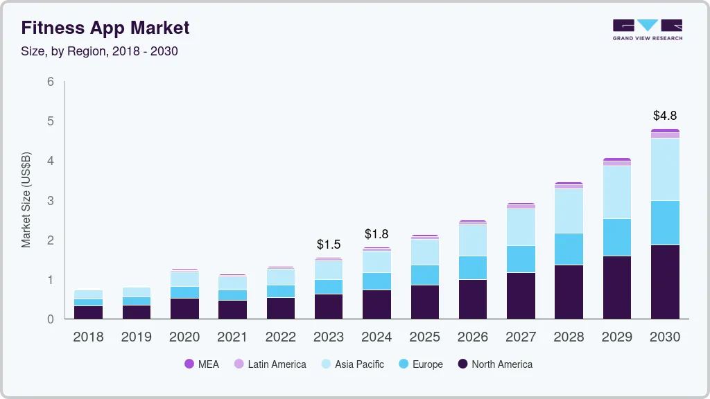
    

### 1.2.2 Lean UX Process

#### 1.2.2.1. Lean UX Problem Statements

***Problem Statement 1***  

|Nuestro producto tiene como objetivo mejorar la condición física de las personas mediante un acompañamiento integral basado en IA (ejercicio + calorías ideales).|
| - |
|Hemos observado que muchas personas que desean bajar de peso, ganar músculo o cumplir metas personales se enfrentan a planes genéricos, costosos o poco accesibles. Esto impacta negativamente en su motivación y resultados.|
|¿Podría FitSense, a través de planes de entrenamiento personalizados con IA y métricas de calorías ideales, ayudar a los usuarios a lograr sus metas físicas de manera más accesible y sostenible?|

---

***Problem Statement 2***  

|Nuestro producto tiene como objetivo aumentar la adherencia y motivación de las personas hacia el ejercicio y una vida saludable.|
| - |
|Hemos observado que muchos usuarios abandonan sus rutinas por falta de seguimiento continuo, métricas claras o retroalimentación visual que muestre sus progresos.|
|¿Podría FitSense, mediante un dashboard visual con evolución de métricas (IMC, calorías, progreso semanal) y recordatorios personalizados, ayudar a mejorar la constancia y motivación de los usuarios?|

---

***Problem Statement 3***  

|Nuestro producto tiene como objetivo hacer accesible el acompañamiento fitness sin necesidad de pagar entrenadores costosos.|
| - |
|Hemos observado que los servicios profesionales de entrenamiento son caros y poco accesibles para la mayoría de personas.|
|¿Podría FitSense, mediante un entrenador digital impulsado por IA, ofrecer una alternativa más asequible y práctica que democratice el acceso al bienestar físico?|

---

#### 1.2.2.2. Lean UX Assumptions  

1. **¿Quién es el usuario?**  
   Personas que desean mejorar su condición física (bajar de peso, ganar músculo, prepararse para una meta específica) y buscan una solución digital personalizada, accesible y fácil de usar. Incluye tanto usuarios principiantes como intermedios, que no quieren depender de entrenadores costosos.  

2. **¿Dónde encaja nuestro producto en su vida?**  
   FitSense se integra en el día a día del usuario a través de su celular. La app acompaña desde la planificación de entrenamientos y comidas, hasta el seguimiento de métricas y recomendaciones de suplementos. Así se convierte en un **coach integral** en el bolsillo del usuario.  

3. **¿Qué problemas resuelve nuestro producto?**  
   - Planes genéricos que no consideran edad, peso o contexto.  
   - Falta de motivación por ausencia de métricas visibles.  
   - Costos elevados de entrenadores personales.  
   - Dificultad para unificar en un solo lugar ejercicio + calorías ideales + métricas de progreso.  

4. **¿Cuándo y cómo es usado el producto?**  
   A diario, a través del smartphone. Los usuarios consultan FitSense antes de entrenar, al registrar comidas, o al evaluar sus progresos en gráficos. Además, reciben notificaciones motivacionales y recordatorios personalizados.  

5. **¿Qué características son importantes?**  
   - **Planes personalizados con IA**: rutinas adaptadas a metas reales.  
   - **Dashboard de progreso**: métricas visuales de IMC, calorías ideales, peso y comparativas. 
   - **Recordatorios inteligentes**: notificaciones para mantener la motivación.
   - **Funcionalidad social**: compartir logros y resultados.
   - **Accesibilidad**: interfaz simple, amigable y multilenguaje.  

6. **¿Cómo debe verse y comportarse el producto?**  
   - **UI**: limpia, colorida y motivadora (paleta morado + verde + naranja).  
   - **UX**: fluida, intuitiva y gamificada (barra de progreso, badges, logros).  
   - **Comportamiento**: actualización en tiempo real de métricas y recomendaciones personalizadas.  

---

#### 1.2.2.3. Lean UX Hypothesis Statements  

**Hypothesis Statement 1**  
|Creemos que al ofrecer planes personalizados que integren ejercicio y cálculo de calorías ideales en FitSense, los usuarios obtendrán mejores resultados físicos de manera más eficiente y accesible.|
| - |
|Sabremos que esto es cierto…|
|Cuando al menos el 70% de los usuarios reporten mejoras en sus métricas (peso, IMC, resistencia) durante los primeros 3 meses de uso de la app.|

---

**Hypothesis Statement 2**  
|Creemos que al mostrar métricas visuales (gráficos de progreso semanal, calorías, comparativas) en un dashboard amigable, los usuarios aumentarán su motivación y constancia en sus rutinas.|
| - |
|Sabremos que esto es cierto…|
|Cuando observemos que al menos el 60% de los usuarios activos mantienen su constancia en rutinas y registro de comidas por más de 8 semanas consecutivas.|

---

**Hypothesis Statement 3**  
|Creemos que al posicionar FitSense como un “entrenador digital accesible” impulsado por IA, se logrará democratizar el acceso al bienestar físico frente a servicios tradicionales caros.|
| - |
|Sabremos que esto es cierto…|
|Cuando los usuarios destaquen en encuestas de satisfacción que FitSense reemplaza en al menos un 50% la necesidad de pagar entrenadores externos.|

---

**Hypothesis Statement 4**  
|Creemos que al integrar recordatorios inteligentes y gamificación en FitSense, los usuarios aumentarán su nivel de compromiso con sus metas personales.|
| - |
|Sabremos que esto es cierto…|
|Cuando se observe un incremento del 20% en el tiempo promedio de uso semanal y un 15% más de usuarios completando sus rutinas de manera consistente en los primeros 6 meses de lanzamiento.|

#### 1.2.2.4. Lean UX Canvas

El Lean UX Canvas de FitSense nos permitió alinear los problemas de negocio, las necesidades de los usuarios y las soluciones propuestas en un marco visual simple y colaborativo. Gracias a este ejercicio identificamos los beneficios clave para los usuarios, formulamos hipótesis verificables y definimos los experimentos mínimos necesarios para validar el producto. De esta forma, el canvas se convierte en una guía estratégica que conecta los objetivos de negocio con la experiencia real de los usuarios.

## 1.3. Segmentos objetivo

Nuestro público objetivo son las personas interesadas en **mejorar su condición física** (bajar de peso, ganar masa muscular, prepararse para una meta específica como una maratón, o simplemente mantener un estilo de vida saludable), que buscan una alternativa **más accesible y personalizada** que contratar entrenadores.  

De acuerdo con el informe **Global Fitness App Market Size, Share & Trends Report 2023–2030 (Grand View Research, 2023)**, el uso de aplicaciones móviles de fitness ha crecido exponencialmente, alcanzando a millones de usuarios a nivel mundial, especialmente en el rango de **18 a 45 años**, quienes representan la mayoría de consumidores digitales en este sector.  

Estos usuarios valoran soluciones que combinen en un solo lugar **entrenamiento, cálculo de calorías ideales y seguimiento visual de progreso**, evitando tener que utilizar múltiples aplicaciones o servicios separados. **FitSense** cubre precisamente esta necesidad al integrar un **coach digital basado en IA para entrenamiento y seguimiento físico**.  

| **Segmento objetivo** | Personas que buscan crear su propio plan fitness |
| :- | :- |
| **Edad** | 16-45 años |
| **Ubicación** | Principalmente áreas urbanas con alto uso de smartphones e internet |
| **Sexo** | Masculino y Femenino |
| **Formación educativa** | Secundaria completa a universitaria, con uso básico de tecnología |
| **Poder adquisitivo** | Medio, usuarios que buscan alternativas accesibles a entrenadores personales |
| **Tecnología utilizada** | Smartphones con acceso a internet, aplicaciones móviles de fitness, dispositivos portátiles (wearables) para seguimiento de actividad física (opcional) |

# Capítulo II Requirements Elicitation & Analysis

## 2.1. Competidores

### 2.1.1. Análisis competitivo

| **Competitive Analysis Landscape** |  |
|----------------------------------|--|
| **¿Por qué llevar a cabo este análisis?** | Objetivo 1: Conocer las propuestas de aplicaciones móviles/web de fitness más cercanas a FitSense y aprender de sus fortalezas y limitaciones. Objetivo 2: Identificar áreas de mejora y diferenciación para posicionar a FitSense en un mercado competitivo y en expansión.|

| Empresa/App | Freeletics | Fitbod | Nike Training Club | FitSense |
|-------------|------------|--------|-------------------|----------|
| Logo | 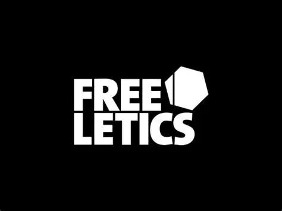 |  |  | 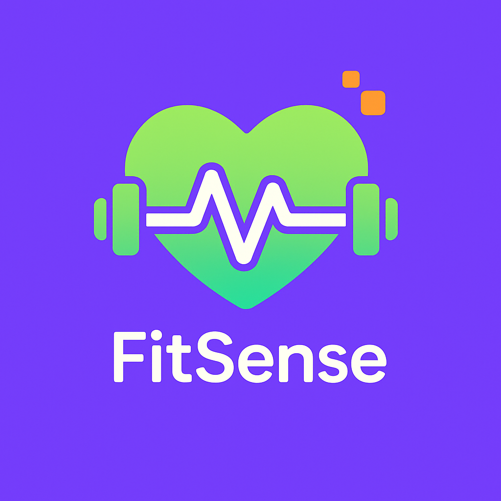 |

**Perfil**

| Perfil | Overview |
|--------|---------|
| Freeletics | App de entrenamiento personalizado con rutinas HIIT impulsadas por IA. |
| Fitbod | Genera rutinas de gimnasio adaptadas al progreso y equipo disponible. |
| Nike Training Club | Ofrece entrenamientos guiados en video para diferentes niveles y objetivos. |
| FitSense | App AI-powered que combina entrenamiento personalizado, cálculo de calorías ideales y dashboards de métricas con gamificación y motivación social. |

**Ventaja competitiva**

| Perfil | Ventaja competitiva / Valor para el usuario |
|--------|--------------------------------------------|
| Freeletics | Algoritmos de personalización en entrenamientos intensivos. |
| Fitbod | Adaptación según equipo disponible y progreso del usuario. |
| Nike Training Club | Calidad visual y branding fuerte, rutinas variadas y guiadas. |
| FitSense | Personalización con IA más seguimiento visual de métricas (IMC, calorías ideales, dashboards semanales) y motivación social integrada. |

**Perfil de Marketing**

| Perfil | Mercado objetivo | Estrategias de marketing |
|--------|----------------|------------------------|
| Freeletics | Jóvenes adultos motivados por entrenamientos HIIT y fitness en casa. | Campañas digitales, embajadores fitness, retos globales. |
| Fitbod | Usuarios de gimnasio con experiencia intermedia/avanzada. | Integraciones con Apple/Google Health, marketing de rendimiento. |
| Nike Training Club | Usuarios generales que buscan motivación con rutinas guiadas de calidad. | Aprovecha la marca Nike, campañas inspiracionales, influencers. |
| FitSense | Personas de 18–45 años que buscan un coach digital integral accesible. | Marketing de contenido digital, redes sociales, colaboraciones con gimnasios y entrenadores locales. |

**Perfil de Producto**

| Perfil | Productos & Servicios | Precios & Costos | Canales de distribución |
|--------|--------------------|----------------|----------------------|
| Freeletics | Rutinas HIIT personalizadas, planes de entrenamiento. | Freemium + planes premium mensuales/anuales. | App móvil (iOS/Android). |
| Fitbod | Rutinas de fuerza adaptadas con IA, registro de progreso. | Suscripción mensual/anual. | App móvil (iOS/Android). |
| Nike Training Club | Entrenamientos en video, planes guiados. | Gratis (con algunas funciones premium). | App móvil (iOS/Android). |
| FitSense | Entrenamiento personalizado con IA, calorías ideales, dashboards, gamificación y comunidad. | Modelo freemium con suscripción mensual/anual. | App móvil (iOS/Android) con dashboards web opcionales. |

**Análisis FODA (Fortalezas, Debilidades, Oportunidades y Amenazas)**

| Perfil | Fortalezas | Debilidades | Oportunidades | Amenazas |
|--------|------------|-------------|---------------|----------|
| Freeletics | IA para personalización, comunidad global, rutinas intensivas. | Enfoque limitado a HIIT, poco flexible para principiantes. | Expansión hacia rutinas moderadas y otros perfiles. | Competencia de apps más versátiles y accesibles. |
| Fitbod | Adaptación en gimnasio, integración con Apple Health. | Poco atractivo para entrenar en casa, alto costo de suscripción. | Mercado creciente de apps para fuerza y rendimiento. | Competencia de apps freemium más accesibles. |
| Nike Training Club | Marca fuerte, rutinas variadas, contenido motivacional. | Personalización limitada, no mide métricas del usuario. | Ampliar personalización con IA. | CCompetidores AI-driven con mejor segmentación. |
| FitSense | IA con personalización + métricas visuales + motivación social. | Nuevo en el mercado, sin base de usuarios consolidada. | Crecimiento de apps AI-driven en fitness accesible. | Rivales con marcas consolidadas y apps gratuitas. |

### 2.1.2. Estrategias y tácticas frente a competidores

**Estrategias:**

- **Diferenciación basada en datos y métricas:** FitSense se posicionará como la app que no solo ofrece planes de entrenamiento personalizados, sino también seguimiento integral con dashboards y calorías ideales. 
- **Accesibilidad:** ofrecer modelo freemium que elimine barreras de entrada frente a competidores de alto costo.
- **Motivación social y gamificación:** crear una comunidad activa donde compartir logros impulse la constancia, algo que los competidores no han integrado de manera fuerte.

**Tácticas:**

- **Marketing de contenido educativo y motivacional:** publicar tips de entrenamiento, calorías y métricas en redes sociales y blogs.
- **Pruebas gratuitas y retos fitness gamificados:** desafíos semanales para enganchar a nuevos usuarios.
- **Alianzas estratégicas con gimnasios y entrenadores locales:** reforzar credibilidad y alcance.
- **Integración tecnológica con wearables y apps de salud:** permitir conexión opcional para ampliar métricas (ej. Apple Health, Google Fit).
- **Soporte y comunidad online:** foros de usuarios, logros compartidos y soporte rápido dentro de la app.

## 2.2. Entrevistas

### 2.2.1. Diseño de entrevistas

#### 2.2.1.1. Usuario objetivo

**Datos demográficos:**
- Nombre
- Edad
- Ubicación
- Ocupación
- Nivel educativo
- Nivel de actividad física (sedentario, principiante, intermedio, avanzado)
- Dispositivos tecnológicos utilizados (smartphone, smartwatch, apps de fitness)

**Preguntas principales**

1. ¿Qué medio utilizas actualmente para planificar tus entrenamientos o rutinas de alimentación? ¿Por qué?

2. ¿Has utilizado antes alguna aplicación de fitness o nutrición? ¿Qué problemas encontraste?

3. ¿Qué tan importante es para ti que un plan de entrenamiento o nutrición esté personalizado según tus metas y características?

4. ¿Qué factores te motivan a continuar usando una aplicación de salud o ejercicio?

5. ¿Qué hace que abandones una aplicación o dejes de seguir un plan fitness?

6. ¿Cómo te gustaría que una aplicación como FitSense te ayude a alcanzar tus objetivos?

7. ¿Qué características consideras indispensables en una app de fitness (ejemplo: recordatorios, dashboard de progreso, recetas, integración con wearables)?

8. ¿Qué tan importante es para ti poder visualizar tu progreso (peso, IMC, calorías quemadas, etc.) en gráficos o reportes dentro de la app?

9. ¿Qué opinas sobre recibir recordatorios o notificaciones inteligentes que te motiven a no abandonar tu plan?

10. Si pudieras diseñar tu aplicación de fitness ideal, ¿qué funcionalidades incluirías?

### 2.2.2 Registro de entrevistas

**Usuario Cliente**

####  **Entrevista N.º 1**

- **Entrevistador:** Adrian Gustavo Rubio Calixto
- **Entrevistado:** Jesus Pedro Casana Espinoza
- **Duración:** [00:00:00 – 00:06:58] (**6 minutos 58 segundos**) 

- **Datos demográficos:**
  - Nombre: Jesus Pedro Casana Espinoza
  - Edad: 22
  - Ubicación: Callao, Peru
  - Ocupación: Estudiante
  - Nivel de actividad física: Avanzado - Entrena todos los dias menos los fin de semana
  - Dispositivos tecnológicos utilizados: Smartphone y Smartwatch 

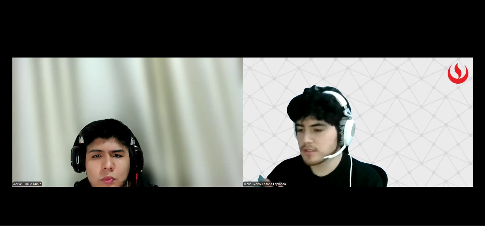  
*Entrevista a Jesus Casana*

**Resumen:**  
Jesús, de 22 años, es un usuario con nivel avanzado en actividad física. Actualmente utiliza un smartwatch para monitorear sus pasos y entrenamientos, además de recurrir a YouTube para seguir rutinas y ejercicios. También emplea la aplicación MyFitnessPal para el control de comidas y el cálculo de calorías. Sin embargo, dejó de usarla debido a la inexactitud de la información nutricional de los productos que consume, señalando que debería estar mejor adaptada a la oferta local de alimentos en Perú.
Para él es fundamental que un plan de entrenamiento se personalice según sus características individuales y que la aplicación ofrezca métricas claras como IMC, peso y calorías en tableros visuales e intuitivos. Además, valora la presencia de recordatorios inteligentes que le ayuden a mantener la constancia. La posibilidad de compartir logros con la comunidad también representa un importante factor motivacional. Reconoce que tiende a abandonar aplicaciones cuando resultan demasiado complejas, poco atractivas o si tiene poco enganche ya que se vuelve algo agoviante mantener el control de comidas y rutinas.

---

####  **Entrevista N.º 2**

- **Entrevistador:** Juan Cuadros 
- **Entrevistado:** Diego Bazan
- **Duración:** [00:00:00 – 00:07:39] (**7 minutos 39 segundos**)

- **Datos demográficos:**
  - Nombre: Diego Alonso Bazan Flores
  - Edad: 22
  - Ubicación: Lince
  - Ocupación: Bachiller de Administracion y Negocios Internacionales
  - Nivel de actividad física: Avanzado - Entrena Todos los dias
  - Dispositivos tecnológicos utilizados: Fitia

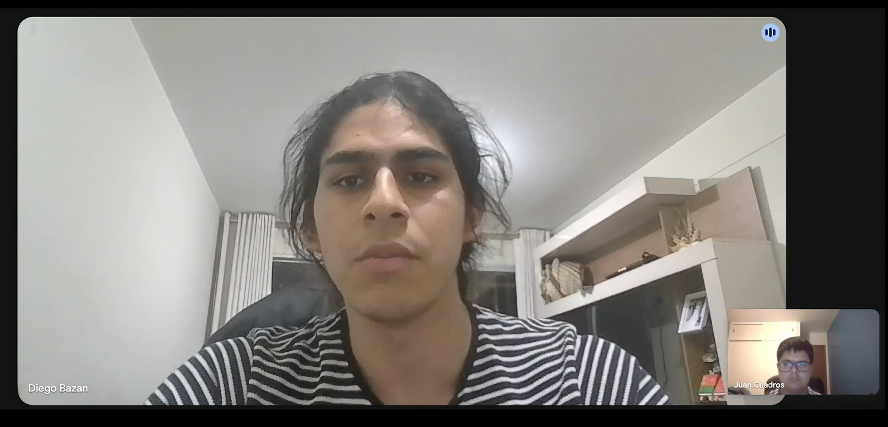  
*Entrevista a Diego Bazan*

**Resumen:**  
Diego es un joven de 22 años con un nivel avanzado de actividad física que actualmente sigue un plan de alimentación a través de la aplicación Fitia. Considera que el ejercicio es una práctica indispensable para todas las personas y, al conocer la propuesta de FitSense, manifestó gran interés por sus funcionalidades, especialmente aquellas relacionadas con métricas como el índice de masa corporal (IMC), peso y calorías. Según su perspectiva, disponer de estas métricas podría resultar muy motivador para que los usuarios mantengan la constancia en sus entrenamientos. Además, considera que la incorporación de recordatorios es un elemento clave, ya que contribuiría a que los usuarios no abandonen sus rutinas y logren consolidar hábitos saludables a largo plazo.

---

####  **Entrevista N.º 3**

- **Entrevistador:** Nadia Lucas 
- **Entrevistado:** Nayeli Chavez  
- **Duración:** [00:00:00 – 00:05:41] (**5 minutos 41 segundos**)  

- **Datos demográficos:**
  - Nombre: Nayeli
  - Edad: 23 años
  - Ubicación: Lima, Perú
  - Ocupación: Estudiante de Psicología (últimos ciclos)
  - Nivel educativo: Universitario en curso
  - Nivel de actividad física: Principiante – entrena 1 vez por semana, quiere mejorar constancia
  - Dispositivos tecnológicos utilizados: Smartphone Android, smartwatch económico, apps básicas como YouTube y Google Fit

  
*Entrevista a Nayeli Chavez*

**Resumen:**  
Nayeli es una usuaria de 23 años con nivel principiante de actividad física, que actualmente se apoya en YouTube, Instagram y Google Fit para entrenar, además de un smartwatch básico. Ha probado aplicaciones como Nike Training Club, pero las abandonó por falta de personalización y seguimiento. Considera indispensable que un plan se adapte a sus características, que la aplicación muestre calorías ideales y métricas claras (IMC, peso, calorías) en dashboards visuales, y que incluya recordatorios inteligentes para mejorar su constancia. Además, valora la posibilidad de compartir logros con su comunidad como factor motivacional. Señala que suele dejar de usar apps cuando son complejas, poco motivadoras o le piden pagos demasiado pronto.

---

## Análisis de entrevistas

Tras la realización de las entrevistas con usuarios representativos del segmento objetivo, se obtuvo información valiosa que permitió identificar necesidades, expectativas y frustraciones en torno al uso de aplicaciones de fitness y salud.  

### Principales hallazgos

1. **Personalización de planes**  
   Los participantes coincidieron en que los planes de entrenamiento deben adaptarse a las características individuales del usuario (nivel de actividad, objetivos específicos, tiempo disponible). Las rutinas genéricas suelen resultar poco motivadoras y propician el abandono.  

2. **Métricas claras y confiables**  
   Existe una fuerte demanda por indicadores de progreso como IMC, peso y calorías, presentados en dashboards visuales e intuitivos. Estas métricas generan motivación al permitir visualizar resultados tangibles y ofrecen mayor confianza en la aplicación.  

3. **Recordatorios inteligentes**  
   Los entrevistados señalaron la importancia de contar con notificaciones personalizadas que los ayuden a mantener la constancia y la disciplina, especialmente en las primeras semanas, donde el riesgo de abandono es mayor.  

4. **Comunidad y motivación social**  
   La posibilidad de compartir logros con otros usuarios se percibe como un factor motivacional clave. Este componente social fortalece el compromiso y fomenta un sentido de acompañamiento.  

5. **Frustraciones y barreras**  
   - Aplicaciones demasiado complejas o con interfaces poco amigables.  
   - Falta de motivación por ausencia de seguimiento o acompañamiento.  
   - Cobros prematuros que limitan el acceso a funcionalidades esenciales.  
   - Para usuarios avanzados, la inexactitud de las bases de datos nutricionales, que deberían estar mejor adaptadas al contexto local (ejemplo: productos disponibles en Perú).  

### Conclusión

Los hallazgos evidencian la necesidad de una solución digital integral como **FitSense**, que combine en una sola plataforma:  
- **Planes personalizados** ajustados a las necesidades del usuario.  
- **Dashboards visuales** con métricas confiables y fáciles de interpretar.  
- **Recordatorios inteligentes** para reforzar la constancia.  
- **Comunidad activa** que impulse la motivación social.  
- **Contenido adaptado al contexto local** en cuanto a nutrición y suplementos.  

De esta manera, se incrementa la adherencia de los usuarios y se potencia su motivación para alcanzar objetivos de salud y bienestar.  

---

## 2.3 Needfinding

A continuación, se mostrará los artefactos realizados de acuerdo a la retroalimentación de las necesidades de los usuarios a través de las entrevistas. Estos artefactos creados son para los dos tipos de segmentos objetivos: cliente. Estos son user personas, user tax matrix, empathy mapping y el as-is escenario mapping.

### 2.3.1 User personas

#### 2.3.1.1 Cliente

<image
  src="../img/chapter-2/user-persona-cliente.png"
  alt="User persona cliente">

### 2.3.2 User Task Matrix

Se realiza un análisis de las principales funciones detectadas en la problemática. Esto se elaboró a partir de los comentarios obtenidos en las entrevistas realizadas al único segmento de usuario definido: personas que buscan crear su propio plan fitness.

| Task Matrix                                  | Frecuencia percibida por el usuario  | Importancia para el usuario |
|----------------------------------------------|-----------------------|------------------------|
| Planificar entrenamientos semanales          | Siempre              | Alta                   |
| Registrar comidas                            | Frecuente            | Media                  |
| Visualizar métricas de progreso (peso, IMC, calorías) | A veces              | Alta                   |
| Recibir recordatorios o notificaciones       | A veces              | Alta                   |
| Consultar recomendaciones de suplementos     | Rara vez             | Media                  |
| Compartir logros con la comunidad            | A veces              | Media / Alta           |
| Recibir planes personalizados adaptados      | Siempre              | Alta                   |
| Usar la app de manera simple y motivadora    | Siempre              | Alta                   |

### 2.3.3 Empathy mapping

#### 2.3.3.1 cliente

<image
  src="../img/chapter-2/empathy-mapping-cliente.png"
  alt="Emapthy mapping de cliente">

### 2.3.4 As-is scenario mapping

Esta sección presenta la experiencia actual que los usuarios viven al intentar mejorar su condición física mediante aplicaciones y recursos digitales disponibles en el mercado. Visualiza sus frustraciones y obstáculos, mostrando cómo, a pesar de sus esfuerzos iniciales, terminan enfrentándose a barreras que dificultan la constancia y el logro de resultados.  

A diferencia del mapa "To-Be", este escenario refleja una realidad fragmentada: los usuarios prueban múltiples aplicaciones o rutinas en línea, pero encuentran planes poco personalizados, interfaces complejas y falta de acompañamiento. Esto provoca desmotivación, abandono y la necesidad de reiniciar el ciclo constantemente, evidenciando la oportunidad de crear una solución integral como FitSense.  

<em>Escenario actual de usuarios de aplicaciones de fitness</em>

  
<image
  src="../img/chapter-2/as-is-scenario-mapping-cliente.png"
  alt="As-is scenario mapping cliente">
>

### 2.4 Ubiquitous Language

El lenguaje ubicuo es un conjunto de términos definidos que permiten al equipo de desarrollo y a los usuarios mantener una comunicación clara y sin ambigüedades. A continuación, se presentan los principales términos adoptados en el proyecto <b>FitSense</b>:

<table>
  <tr>
    <th>Término</th>
    <th>Definición</th>
  </tr>
  <tr>
    <td>Plan</td>
    <td>Conjunto de rutinas de entrenamiento y pautas de alimentación personalizadas para el usuario.</td>
  </tr>
  <tr>
    <td>Rutina</td>
    <td>Serie de ejercicios programados para un día específico, adaptados al nivel y objetivos del usuario.</td>
  </tr>
  <tr>
    <td>Dashboard</td>
    <td>Vista central de la aplicación donde el usuario puede monitorear métricas de progreso (peso, IMC, calorías, etc.).</td>
  </tr>
  <tr>
    <td>Recordatorio</td>
    <td>Notificación inteligente enviada al usuario para mantener la motivación y la constancia en su plan.</td>
  </tr>
  <tr>
    <td>Progreso</td>
    <td>Evolución de las métricas del usuario (peso, IMC, calorías consumidas/quemadas) a lo largo del tiempo.</td>
  </tr>
  <tr>
    <td>Suplemento</td>
    <td>Producto recomendado que complementa la dieta del usuario para alcanzar sus metas de forma más eficiente.</td>
  </tr>
</table>

# Capítulo III Requirements Specification

Aquí detallamos los requisitos para la aplicación FitSense. Con base en nuestra investigación de usuarios, hemos definido las funciones y características que el producto debe tener para resolver los problemas encontrados. Todo está organizado con herramientas de Lean UX para asegurar que las necesidades del usuario y los objetivos del negocio estén perfectamente alineados.

### 3.1 To-Be Scenario Mapping

Esta sección presenta la experiencia ideal que el usuario tendrá con FitSense. Visualiza su transformación, pasando de la frustración al éxito. A diferencia del mapa "As-is", este proyecta cómo el usuario se sentirá y actuará con una solución integrada, destacando los cambios positivos y el valor que nuestra aplicación le ofrecerá.

<em>Escenario ideal para Entusiastas del fitness digital </em>

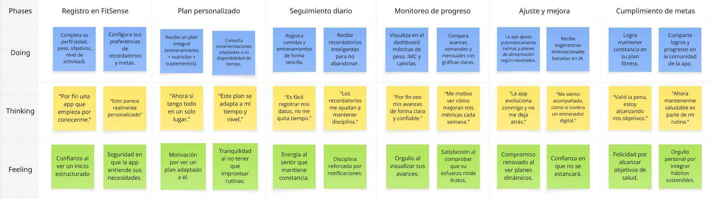

### EPICS

| **Epic ID** | **Título**  | **Descripción**      |
| ----------- | ----------- | -------------------- |
| **EP-1**    | **Presencia Digital y Adquisición de Usuarios**        | Establecer una presencia digital sólida a través de una landing page y estrategias de marketing que comuniquen la propuesta de valor de FitSense: ser el "entrenador digital" todo-en-uno, inteligente y asequible. El objetivo es atraer, educar y convertir a nuestro público objetivo en usuarios activos de la aplicación.                                                         |
| **EP-2**    | **Onboarding y Configuración del Perfil Inicial**      | Como nuevo usuario, quiero un proceso de registro y configuración inicial que sea rápido e intuitivo. Deseo ingresar mis datos personales (edad, peso, altura), objetivos (perder peso, ganar músculo), nivel de experiencia y equipamiento disponible, para que la aplicación genere un plan de partida 100% personalizado y adaptado a mis necesidades.                              |
| **EP-3**    | **Generación y Adaptación de Planes con IA**           | Como usuario, quiero que la aplicación utilice inteligencia artificial para crear y ajustar dinámicamente mis planes de entrenamiento y nutrición. El sistema debe aprender de mi progreso, mi feedback y mis datos registrados para optimizar las rutinas, asegurando que siempre sean desafiantes pero alcanzables.                                                                  |
| **EP-4**    | **Seguimiento y Registro Diario de Actividades**       | Como usuario activo, necesito una forma sencilla y rápida de registrar mis entrenamientos completados, las comidas ingeridas y mi consumo de agua. El objetivo es que el registro de datos sea una tarea simple que no interrumpa mi rutina, permitiendo a la app tener la información necesaria para un seguimiento preciso y eliminando la necesidad de usar múltiples aplicaciones. |
| **EP-5**    | **Dashboard de Progreso y Métricas Visuales**          | Para mantenerme motivado, quiero un dashboard central que me muestre de forma clara y visual mi progreso a lo largo del tiempo. Debe incluir gráficos de peso, Índice de Masa Corporal (IMC), calorías consumidas vs. quemadas y otros indicadores clave, permitiéndome ver el resultado tangible de mi esfuerzo y entender mi evolución.                                              |
| **EP-6**    | **Sistema de Gamificación y Motivación Social**        | Como usuario que a veces pierde la motivación, quiero que la app incluya elementos de juego, como la obtención de insignias por logros, la superación de desafíos y la posibilidad de compartir mi progreso con una comunidad. Esto busca convertir el fitness en una experiencia más atractiva, social y divertida, fomentando la constancia a largo plazo.                           |
| **EP-7**    | **Gestión de Cuenta y Modelo de Suscripción Freemium** | Como usuario, quiero tener la libertad de gestionar mi perfil y acceder a las funcionalidades esenciales de la aplicación de forma gratuita. También, deseo tener la opción de suscribirme a un plan premium asequible para desbloquear características avanzadas, como análisis más detallados o acceso a entrenadores, garantizando que la app sea accesible para todos.             |
| **EP-8**    | **Notificaciones y Recordatorios Inteligentes**        | Para asegurar mi constancia, quiero que la aplicación me envíe recordatorios inteligentes y personalizados. Estas notificaciones deben ser proactivas, como "Recuerda tu entrenamiento de hoy a las 6 pm" o "¡Estás cerca de tu objetivo de hidratación!", ayudándome a mantenerme enfocado en mis metas diarias y semanales.                                                          |
| **EP-9**    | **Backend y API RESTful para FitSense**        | Como desarrollador, quiero construir una API RESTful segura y eficiente que gestione toda la lógica de negocio, datos de usuario, autenticación, generación de planes con IA y comunicación con la aplicación móvil. Esta épica abarca todos los servicios backend necesarios para soportar las funcionalidades de FitSense de manera escalable y confiable.                   |

### 3.2. User Stories

# User Stories - FitSense

| **Epic / Story ID** | **Título** | **Descripción** | **Criterios de Aceptación** | **Relacionado con (Epic ID)** |
|---------------------|------------|-----------------|----------------------------|-------------------------------|
| **EP-1** | **Presencia Digital y Adquisición de Usuarios** | **Establecer una presencia digital sólida a través de una landing page y estrategias de marketing que comuniquen la propuesta de valor de FitSense** | - | - |
| US-01 | Sección hero de landing page | Como visitante, quiero visualizar información introductoria de la aplicación para comprender los servicios ofrecidos. | **Scenario: Visualización de la presentación de la aplicación** Given que un visitante accede al landing page When consulta la sección inicial Then se muestra información introductoria clara sobre FitSense como entrenador digital personalizado.  **Scenario: Acceso a la sección inicio del producto** Given que el visitante está en el landing page And utiliza la barra de navegación When selecciona el logo Then observa una presentación clara de la aplicación con propuesta de valor visible. | EP-1 |
| US-02 | Barra de navegación en landing page | Como visitante quiero una barra de navegación de landing page para tener accesos directos a la información de la aplicación | **Scenario: Acceso a la presentación inicial de la aplicación** Given que un visitante navega en la landing page When accede a la sección de inicio Then se muestra una presentación clara de FitSense.  **Scenario: Acceso a beneficios para usuarios** Given que un visitante navega en la landing page When accede a la sección de beneficios Then se muestran los beneficios de personalización con IA y seguimiento visual.  **Scenario: Acceso a los planes disponibles** Given que un visitante navega en la landing page When accede a la sección de planes Then se muestran las opciones freemium y premium.  **Scenario: Acceso a información de contacto** Given que un visitante navega en la landing page When accede a la sección de contacto Then se muestra información relevante de contacto y soporte. | EP-1 |
| US-03 | Sección de planes en landing page | Como visitante, quiero visualizar los planes que ofrece la aplicación para considerar adquirir una membresía premium. | **Scenario: Visualización de los planes disponibles** Given que un visitante navega en la landing page When consulta la sección de planes Then se muestran las opciones freemium (gratuito) y premium con comparación de características y precios accesibles. | EP-1 |
| US-04 | Registro desde landing page | Como visitante interesado, quiero poder acceder a la aplicación directamente desde la landing page para empezar a usar FitSense. | **Scenario: Mostrar call-to-action visible** Given que el visitante accede a la landing page When selecciona "Comenzar ahora gratis" Then debe redireccionar a la aplicación móvil y mostrar formulario de registro.  **Scenario: Confirmación de registro exitoso** Given que el visitante completa el formulario correctamente When confirma el registro Then debe ser redirigido a la app And comenzar el proceso de onboarding personalizado. | EP-1 |
| **EP-2** | **Onboarding y Configuración del Perfil Inicial** | **Proceso de registro y configuración inicial rápido e intuitivo para generar plan personalizado** | - | - |
| US-05 | Registro rápido en aplicación móvil | Como nuevo usuario, quiero registrarme en la aplicación de forma rápida y sencilla para comenzar mi experiencia fitness. | **Scenario: Visualización del formulario de registro** Given que el usuario accede a la aplicación por primera vez When selecciona la opción de registrarse Then el sistema muestra un formulario simple con opciones de registro (email, Google, Apple).  **Scenario: Registro exitoso** Given que el usuario completa el formulario de registro When ingresa datos válidos y acepta términos Then el sistema crea la cuenta y procede al onboarding personalizado. | EP-2 |
| US-06 | Inicio de sesión en aplicación móvil | Como usuario registrado, quiero iniciar sesión con mi cuenta para acceder a mis planes personalizados. | **Scenario: Ingreso exitoso** Given que el usuario está en el formulario de inicio de sesión When ingresa su correo electrónico y contraseña correctamente Then accede exitosamente a su dashboard personalizado.  **Scenario: Error en las credenciales** Given que el usuario está en el formulario de inicio de sesión When ingresa credenciales incorrectas Then el sistema muestra mensaje de error y opción de recuperar contraseña. | EP-2 |
| US-07 | Recuperación de contraseña | Como usuario que olvidó su contraseña, quiero poder restablecerla fácilmente para recuperar el acceso a mi cuenta. | **Scenario: Ingreso exitoso** Given que el usuario está en la pantalla de inicio de sesión When selecciona "¿Olvidaste tu contraseña?" e ingresa su correo Then recibe un correo electrónico con un enlace para restablecerla.  Scenario: Cambiar la contraseña exitosamente Given que el usuario accede al enlace de recuperación When ingresa y confirma su nueva contraseña Then el sistema actualiza la contraseña y le permite iniciar sesión.  **Scenario: Error en las credenciales** Given que el usuario está en el formulario de inicio de sesión When ingresa credenciales incorrectas Then el sistema muestra mensaje de error y opción de recuperar contraseña. | EP-2 |
| US-08 | Configuración del perfil personal | Como nuevo usuario, quiero ingresar mis datos personales básicos (edad, peso, altura, género) para que la app pueda crear planes personalizados. | **Scenario: Ingreso de datos personales** Given que el usuario está en el proceso de onboarding When completa sus datos físicos básicos Then el sistema valida y guarda la información de forma segura.  **Scenario: Validación de datos** Given que el usuario ingresa datos inconsistentes When intenta continuar Then el sistema muestra mensajes de validación específicos. | EP-2 |
| US-09 | Definición de objetivos fitness | Como usuario, quiero establecer mis objetivos principales (perder peso, ganar músculo, mantenimiento) para recibir un plan acorde a mis metas. | **Scenario: Selección de objetivos** Given que el usuario está configurando su perfil When selecciona sus objetivos principales Then el sistema adapta las preguntas siguientes según los objetivos elegidos.  **Scenario: Objetivos múltiples** Given que el usuario tiene objetivos combinados When selecciona múltiples opciones Then el sistema prioriza y balancea los planes según las selecciones. | EP-2 |
| US-10 | Evaluación del nivel de experiencia | Como usuario, quiero indicar mi nivel de experiencia en fitness para recibir rutinas apropiadas a mi capacidad. | **Scenario: Selección de nivel** Given que el usuario está en la evaluación inicial When selecciona su nivel de experiencia (principiante, intermedio, avanzado) Then el sistema ajusta la intensidad de los ejercicios recomendados.  **Scenario: Guía para selección** Given que el usuario no está seguro de su nivel When accede a la información de ayuda Then se muestran descripciones claras y ejemplos de cada nivel. | EP-2 |
| US-11 | Configuración de equipamiento disponible | Como usuario, quiero especificar qué equipamiento tengo disponible para que mis rutinas sean realizables en mi entorno. | **Scenario: Selección de equipamiento** Given que el usuario está configurando su perfil When selecciona el equipamiento disponible Then el sistema filtra ejercicios según el equipamiento seleccionado.  **Scenario: Sin equipamiento** Given que el usuario solo tiene peso corporal disponible When completa la configuración Then recibe rutinas exclusivamente de ejercicios corporales. | EP-2 |
| **EP-3** | **Generación y Adaptación de Planes con IA** | **Utilizar inteligencia artificial para crear y ajustar dinámicamente planes de entrenamiento y nutrición** | - | - |
| US-12 | Generación inicial de plan personalizado | Como usuario que completó su perfil, quiero recibir mi primer plan de entrenamiento personalizado generado por IA en menos de 3 segundos. | **Scenario: Generación automática de plan** Given que el usuario completó toda la configuración inicial When confirma su perfil Then el sistema genera un plan personalizado en menos de 3 segundos.  **Scenario: Plan completo e integral** Given que se genera el plan inicial When el usuario lo revisa Then incluye rutinas semanales, ejercicios específicos y recomendaciones nutricionales básicas. | EP-3 |
| US-13 | Adaptación dinámica basada en progreso | Como usuario activo, quiero que mis rutinas se adapten automáticamente basándose en mi progreso para mantener el desafío apropiado. | **Scenario: Ajuste por rendimiento** Given que el usuario ha completado varias sesiones When el sistema detecta mejora consistente Then incrementa automáticamente la dificultad de los ejercicios.  **Scenario: Ajuste por feedback** Given que el usuario indica que los ejercicios están muy fáciles o difíciles When proporciona feedback Then el sistema recalibra inmediatamente la intensidad. | EP-3 |
| US-14 | Recomendaciones nutricionales inteligentes | Como usuario, quiero recibir sugerencias nutricionales personalizadas que se ajusten a mis objetivos y preferencias. | **Scenario: Recomendaciones basadas en objetivos** Given que el usuario tiene objetivos específicos When accede a la sección nutricional Then recibe recomendaciones de macronutrientes y comidas acordes a su meta.  **Scenario: Adaptación a restricciones** Given que el usuario tiene restricciones alimentarias When configura sus limitaciones Then las recomendaciones excluyen automáticamente alimentos problemáticos. | EP-3 |
| **EP-4** | **Seguimiento y Registro Diario de Actividades** | **Forma sencilla de registrar entrenamientos, comidas y métricas para seguimiento preciso** | - | - |
| US-15 | Registro rápido de entrenamientos | Como usuario activo, quiero registrar mis entrenamientos completados de forma rápida para mantener mi seguimiento actualizado. | **Scenario: Registro con un tap** Given que el usuario completó un entrenamiento When marca los ejercicios como completados Then se registra automáticamente con fecha, hora y duración.  **Scenario: Agregar notas de sesión** Given que el usuario quiere registrar observaciones When agrega notas al entrenamiento Then se guarda junto con los datos de la sesión para referencia futura. | EP-4 |
| US-16 | Registro de comidas y seguimiento calórico | Como usuario, quiero registrar mis comidas de forma simple para llevar control de mi consumo calórico diario. | **Scenario: Búsqueda rápida de alimentos** Given que el usuario quiere registrar una comida When busca un alimento en la base de datos Then encuentra opciones relevantes con información nutricional completa.  **Scenario: Escaneo de códigos de barras** Given que el usuario tiene un producto empaquetado When usa la función de escaneo Then se registra automáticamente el alimento con sus valores nutricionales. | EP-4 |
| US-17 | Editar un registro de comida	| Como usuario, quiero poder editar o eliminar una comida que registré por error para mantener la precisión de mi conteo de calorías. | **Scenario:  Editar una comida registrada** Given que el usuario está en su registro de comidas del día When selecciona una comida y elige "Editar" Then puede modificar la cantidad o el alimento y guardar los cambios.  Scenario: Eliminar una comida registrada Given que el usuario está en su registro de comidas del día When selecciona una comida y elige "Eliminar" Then la comida se elimina del registro y el conteo de calorías se actualiza. | EP-4 |
| US-18 | Seguimiento de hidratación diaria | Como usuario, quiero registrar mi consumo de agua para mantener una hidratación adecuada según mis objetivos. | **Scenario: Registro rápido de agua** Given que el usuario consumió agua When presiona el botón de hidratación Then se registra la porción predeterminada y actualiza el progreso diario.  **Scenario: Personalización de porciones** Given que el usuario tiene recipientes de diferentes tamaños When configura porciones personalizadas Then puede registrar usando sus medidas habituales. | EP-4 |
| **EP-5** | **Dashboard de Progreso y Métricas Visuales** | **Dashboard central con progreso visual claro y motivador para mantener engagement** | - | - |
| US-19 | Dashboard principal de progreso | Como usuario, quiero ver un dashboard central que muestre mi progreso general de forma clara y motivadora. | **Scenario: Vista general del progreso** Given que el usuario accede a la pantalla principal When revisa su dashboard Then ve resumen visual de peso, entrenamientos completados y objetivos cumplidos.  **Scenario: Métricas de la semana** Given que el usuario quiere revisar su progreso reciente When filtra por período semanal Then se muestran logros y tendencias de los últimos 7 días. | EP-5 |
| US-20 | Gráficos de evolución de peso | Como usuario, quiero ver gráficos de mi evolución de peso a lo largo del tiempo para monitorear mi progreso visualmente. | **Scenario: Gráfico de tendencia de peso** Given que el usuario ha registrado peso por varias semanas When accede a la sección de peso Then ve un gráfico de línea con su evolución y tendencia proyectada.  **Scenario: Comparación con objetivos** Given que el usuario tiene una meta de peso When revisa el gráfico Then se muestra visualmente su progreso hacia el objetivo establecido. | EP-5 |
| US-21 | Seguimiento visual de IMC | Como usuario, quiero monitorear mi Índice de Masa Corporal de forma visual para entender mi condición de salud. | **Scenario: Cálculo automático de IMC** Given que el usuario actualiza su peso When se recalcula automáticamente Then se muestra el IMC actual con interpretación de rangos saludables.  **Scenario: Histórico de IMC** Given que el usuario quiere ver su evolución When accede al histórico de IMC Then ve gráfico temporal con mejoras o cambios en su condición. | EP-5 |
| US-22 | Balance calórico visual | Como usuario, quiero ver mi balance entre calorías consumidas y quemadas para entender mi déficit o superávit energético. | **Scenario: Balance diario visual** Given que el usuario registró comidas y ejercicios When revisa su balance calórico Then ve gráficamente si está en déficit, equilibrio o superávit.  **Scenario: Tendencia semanal de balance** Given que el usuario quiere analizar patrones When revisa la vista semanal Then observa tendencias de balance calórico y su impacto en objetivos. | EP-5 |
| **EP-6** | **Sistema de Gamificación y Motivación Social** | **Elementos de juego, logros, comunidad para convertir fitness en experiencia atractiva y social** | - | - |
| US-23 | Sistema de logros e insignias | Como usuario, quiero ganar insignias y logros por completar entrenamientos y alcanzar metas para mantenerme motivado. | **Scenario: Obtención de insignias por logros** Given que el usuario completa un hito (primera semana, 10 entrenamientos) When el sistema detecta el logro Then se otorga una insignia específica con notificación celebratoria.  **Scenario: Progreso hacia insignias** Given que el usuario está cerca de un logro When revisa sus insignias Then ve el progreso hacia logros pendientes con motivación clara. | EP-6 |
| US-24 | Desafíos y competencias | Como usuario, quiero participar en desafíos grupales para hacer el fitness más divertido y competitivo. | **Scenario: Participación en desafíos semanales** Given que hay un desafío activo When el usuario se inscribe Then participa en competencia con otros usuarios con tabla de posiciones.  **Scenario: Desafíos personalizados** Given que el usuario quiere un reto personal When crea un desafío individual Then el sistema genera metas específicas basadas en su historial. | EP-6 |
| **EP-7** | **Gestión de Cuenta y Modelo Freemium** | **Gestión de perfil y acceso a funcionalidades gratuitas y premium de forma accesible** | - | - |
| US-25 | Acceso gratuito a funciones básicas | Como usuario no premium, quiero acceder a las funciones esenciales de forma gratuita para evaluar la utilidad de FitSense. | **Scenario: Acceso a plan básico gratuito** Given que el usuario usa la versión gratuita When accede a sus planes Then puede usar rutinas básicas personalizadas y dashboard simplificado.  **Scenario: Límites claros de versión gratuita** Given que el usuario alcanza límites de la versión gratuita When intenta acceder a funciones premium Then se muestra información clara sobre beneficios de actualización. | EP-7 |
| US-26 | Gestión de perfil y configuraciones | Como usuario, quiero editar mi perfil y configuraciones para mantener mi información actualizada. | **Scenario: Edición de datos personales** Given que el usuario quiere actualizar su información When accede a configuraciones de perfil Then puede modificar datos físicos, objetivos y preferencias.  **Scenario: Configuraciones de privacidad** Given que el usuario quiere controlar su privacidad When ajusta configuraciones Then puede decidir qué información compartir en la comunidad. | EP-7 |
| US-27 | Suscripción a plan premium | Como usuario interesado, quiero suscribirme a un plan premium asequible para acceder a funciones avanzadas. | **Scenario: Información de planes premium** Given que el usuario considera actualizarse When revisa opciones premium Then ve comparación clara de beneficios con precios accesibles.  **Scenario: Proceso de suscripción simple** Given que el usuario decide suscribirse When completa el proceso de pago Then obtiene acceso inmediato a funciones premium. | EP-7 |
| **EP-8** | **Notificaciones y Recordatorios Inteligentes** | **Sistema proactivo de recordatorios personalizados para mantener constancia y engagement** | - | - |
| US-28 | Recordatorios inteligentes de entrenamientos | Como usuario, quiero recibir notificaciones personalizadas que me recuerden mis entrenamientos para mantener constancia. | **Scenario: Recordatorios adaptativos por horario** Given que el usuario tiene rutina establecida When llega la hora programada de entrenamiento Then recibe notificación personalizada con mensaje motivacional.  **Scenario: Ajuste por patrones de uso** Given que el usuario cambia sus horarios habituales When el sistema detecta nuevos patrones Then adapta automáticamente los horarios de recordatorios. | EP-8 |
| US-29 | Alertas de hidratación inteligentes | Como usuario, quiero recibir recordatorios para mantener hidratación adecuada a lo largo del día. | **Scenario: Recordatorios basados en actividad** Given que el usuario hizo ejercicio intenso When el sistema detecta mayor necesidad de hidratación Then envía recordatorios más frecuentes y específicos.  **Scenario: Pausa durante horas de sueño** Given que el usuario configuró horarios de sueño When es hora de descanso Then se pausan automáticamente las notificaciones de hidratación. | EP-8 |
| US-30 | Notificaciones de progreso y celebración | Como usuario, quiero recibir alertas sobre mis logros alcanzados para mantenerme motivado. | **Scenario: Celebración de hitos importantes** Given que el usuario alcanza un objetivo significativo When se detecta el logro Then recibe notificación celebratoria con reconocimiento del esfuerzo.  **Scenario: Resúmenes motivacionales semanales** Given que termina una semana de actividad When se genera el resumen Then recibe notificación con logros de la semana y motivación para continuar. | EP-8 |
| US-31 | Personalización de notificaciones | Como usuario, quiero controlar qué notificaciones recibo y cuándo para evitar interrupciones no deseadas. | **Scenario: Control granular por tipo** Given que el usuario quiere personalizar alertas When accede a configuraciones de notificaciones Then puede activar/desactivar cada tipo específico de notificación.  **Scenario: Horarios de "no molestar"** Given que el usuario tiene horarios específicos de trabajo/descanso When configura períodos de silencio Then las notificaciones se pausan automáticamente en esos horarios. | EP-8 |
| **EP-9**  | **Backend y API RESTful para FitSense**    | - | - |
| US-32 | Recordatorios inteligentes de entrenamientos | Como usuario, quiero recibir notificaciones personalizadas que me recuerden mis entrenamientos para mantener constancia.                                       | **Scenario: Recordatorios adaptativos por horario** Given que el usuario tiene rutina establecida When llega la hora programada de entrenamiento Then recibe notificación personalizada con mensaje motivacional.  **Scenario: Ajuste por patrones de uso** Given que el usuario cambia sus horarios habituales When el sistema detecta nuevos patrones Then adapta automáticamente los horarios de recordatorios.  | **EP-9** |
| US-33 | Crear Usuario (Sign-Up) a través de API      | Como desarrollador, quiero registrar un nuevo usuario en la base de datos a través de la API para permitir la creación de cuentas.                             | **Scenario: Crear usuario con datos válidos** Given que el endpoint `/api/v1/auth/sign-up` está disponible When se envía una solicitud POST con email, password y fullName válidos Then se recibe una respuesta con estado `201 Created` And el cuerpo de la respuesta incluye el `userId` y un `token` de sesión.  **Scenario: Crear usuario con email duplicado** Given que el email proporcionado ya existe When se intenta registrar el nuevo usuario Then se recibe una respuesta con estado `400 Bad Request` And un mensaje de error "El email ya está en uso."    | **EP-9** |
| US-34 | Autenticar Usuario (Sign-In) a través de API | Como desarrollador, quiero autenticar a un usuario a través de la API para que pueda acceder a su perfil y funcionalidades.                                    | **Scenario: Autenticación exitosa** Given que el endpoint `/api/v1/auth/sign-in` está disponible When se envía una solicitud POST con email y password correctos Then se recibe una respuesta con estado `200 OK` And el cuerpo de la respuesta incluye el `userId` y un nuevo `token` de sesión.  **Scenario: Autenticación con credenciales incorrectas** Given que se envía un email válido pero una contraseña incorrecta When se intenta iniciar sesión Then se recibe una respuesta con estado `401 Unauthorized` And un mensaje de error "Credenciales inválidas." | **EP-9** |
| US-35 | Crear o Actualizar Perfil de Usuario         | Como desarrollador, quiero un endpoint para que el usuario guarde sus datos de perfil (edad, peso, altura, objetivos) después del registro.                    | **Scenario: Crear perfil con datos válidos** Given que el usuario está autenticado y no tiene perfil When se envía una solicitud POST a `/api/v1/profiles/{userId}` con datos válidos Then se recibe una respuesta con estado `201 Created` And el perfil del usuario se guarda en la base de datos.  **Scenario: Actualizar perfil existente** Given que el usuario ya tiene un perfil When se envía una solicitud PUT a `/api/v1/profiles/{userId}` con datos actualizados Then se recibe una respuesta `200 OK` y los datos se actualizan.  | **EP-9** |
| US-36 | Obtener Perfil de Usuario              | Como desarrollador, quiero obtener la información completa de un perfil de usuario para mostrarla en la aplicación.                                            | **Scenario: Obtener perfil con userId válido** Given que el usuario está autenticado When se realiza una solicitud GET a `/api/v1/profiles/{userId}` Then se recibe una respuesta `200 OK` And el cuerpo contiene los datos del perfil: peso, altura, objetivos, nivel, etc.  **Scenario: Intentar obtener perfil con userId inexistente** When se realiza una solicitud GET con un `userId` que no existe Then se recibe una respuesta `404 Not Found`.  | **EP-9** |
| US-37 | Generar Plan de Entrenamiento con IA      | Como desarrollador, quiero un endpoint que, a partir del perfil de un usuario, genere su primer plan de entrenamiento personalizado.                           | **Scenario: Generar plan exitosamente** Given que el usuario ha completado su perfil When se envía una solicitud POST a `/api/v1/plans/{userId}/generate` Then se recibe una respuesta `201 Created` And el cuerpo de la respuesta contiene la estructura del plan semanal (rutinas y ejercicios).  **Scenario: Falla al generar plan por perfil incompleto** When se intenta generar un plan para un usuario sin perfil Then se recibe una respuesta `400 Bad Request` And un mensaje "El perfil del usuario está incompleto."                                               | **EP-9** |
| US-38 | Registrar Actividad (Entrenamiento, Comida)  | Como desarrollador, quiero endpoints para que los usuarios registren sus actividades diarias y se pueda hacer seguimiento de su progreso.                      | **Scenario: Registrar entrenamiento completado** Given que el usuario está autenticado When envía una solicitud POST a `/api/v1/activities/{userId}/workout` con los datos del entrenamiento Then se recibe una respuesta `201 Created` y la actividad queda registrada.  **Scenario: Registrar comida** Given que el usuario está autenticado When envía una solicitud POST a `/api/v1/activities/{userId}/meal` con los datos de la comida Then se recibe una respuesta `201 Created` y las calorías se asocian al día.                                                         | **EP-9** |
| US-39 | Obtener Datos para el Dashboard        | Como desarrollador, quiero un endpoint que devuelva los datos de progreso de un usuario (historial de peso, IMC, calorías) para visualizarlos en el dashboard. | **Scenario: Obtener datos de progreso** Given que el usuario está autenticado When se envía una solicitud GET a `/api/v1/progress/{userId}?period=30d` Then se recibe una respuesta `200 OK` And el cuerpo de la respuesta contiene arreglos de datos con fechas y valores para peso, IMC y balance calórico de los últimos 30 días.    | **EP-9** |
| US-40 | Registrar Token para Notificaciones Push    | Como desarrollador, quiero un endpoint para registrar el token del dispositivo de un usuario y así poder enviarle notificaciones push.                         | **Scenario: Registrar token de dispositivo válido** Given que el usuario inicia sesión en la app When se envía una solicitud POST a `/api/v1/notifications/register-token` con el `userId` y `deviceToken` Then se recibe una respuesta `200 OK` And el token queda asociado al usuario en la base de datos.  **Scenario: Registrar un token inválido** When se envía una solicitud con un `deviceToken` vacío o malformado Then se recibe una respuesta `400 Bad Request`.    | **EP-9** |

### 3.3. Impact Mapping

En esta sección, se plantearon metas de negocio utilizando los criterios SMART para elaborar el Impact Mapping en base a nuestras User Personas y User Stories.

Segmento 1: Clientes:

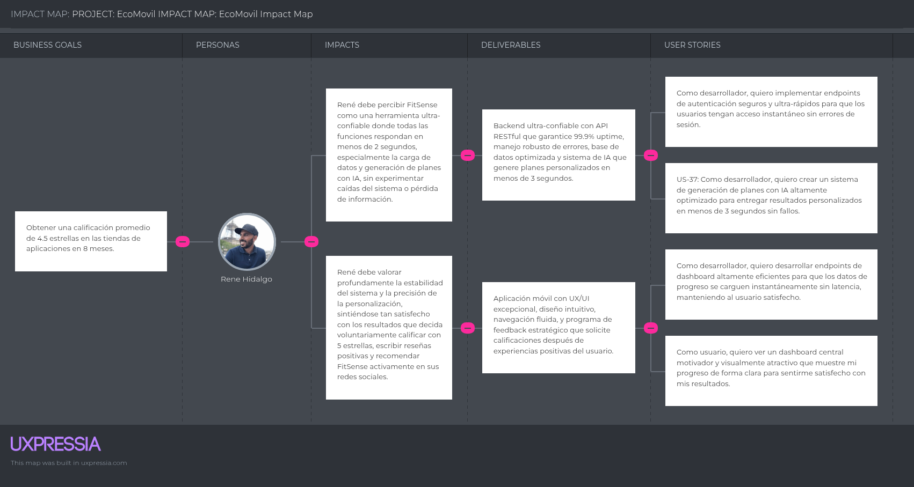

### 3.4. Product Backlog

| **Orden** | **User Story Id** | **Título** | **Descripción** | **Story Points (1/2/3/5/8)** |
|---------------------|------------|-----------------|----------------------------|-------------------------------|
| **1** | **US-33** | Crear Usuario (Sign-Up) a través de API | Como desarrollador, quiero registrar un nuevo usuario en la base de datos a través de la API para permitir la creación de cuentas. | **5** |
| **2** | **US-34** | Autenticar Usuario (Sign-In) a través de API | Como desarrollador, quiero autenticar a un usuario a través de la API para que pueda acceder a su perfil y funcionalidades. | **3** |
| **3** | **US-35** | Crear o Actualizar Perfil de Usuario | Como desarrollador, quiero un endpoint para que el usuario guarde sus datos de perfil (edad, peso, altura, objetivos) después del registro. | **5** |
| **4** | **US-36** | Obtener Perfil de Usuario | Como desarrollador, quiero obtener la información completa de un perfil de usuario para mostrarla en la aplicación. | **2** |
| **5** | **US-05** | Registro rápido en aplicación móvil | Como nuevo usuario, quiero registrarme en la aplicación de forma rápida y sencilla para comenzar mi experiencia fitness. | **3** |
| **6** | **US-06** | Inicio de sesión en aplicación móvil | Como usuario registrado, quiero iniciar sesión con mi cuenta para acceder a mis planes personalizados. | **2** |
| **7** | **US-08** | Configuración del perfil personal | Como nuevo usuario, quiero ingresar mis datos personales básicos (edad, peso, altura, género) para que la app pueda crear planes personalizados. | **3** |
| **8** | **US-09** | Definición de objetivos fitness | Como usuario, quiero establecer mis objetivos principales (perder peso, ganar músculo, mantenimiento) para recibir un plan acorde a mis metas. | **2** |
| **9** | **US-10** | Evaluación del nivel de experiencia | Como usuario, quiero indicar mi nivel de experiencia en fitness para recibir rutinas apropiadas a mi capacidad. | **2** |
| **10** | **US-11** | Configuración de equipamiento disponible | Como usuario, quiero especificar qué equipamiento tengo disponible para que mis rutinas sean realizables en mi entorno. | **3** |
| **11** | **US-37** | Generar Plan de Entrenamiento con IA | Como desarrollador, quiero un endpoint que, a partir del perfil de un usuario, genere su primer plan de entrenamiento personalizado. | **8** |
| **12** | **US-12** | Generación inicial de plan personalizado | Como usuario que completó su perfil, quiero recibir mi primer plan de entrenamiento personalizado generado por IA en menos de 3 segundos. | **5** |
| **13** | **US-38** | Registrar Actividad (Entrenamiento, Comida) | Como desarrollador, quiero endpoints para que los usuarios registren sus actividades diarias y se pueda hacer seguimiento de su progreso. | **5** |
| **14** | **US-15** | Registro rápido de entrenamientos | Como usuario activo, quiero registrar mis entrenamientos completados de forma rápida para mantener mi seguimiento actualizado. | **3** |
| **15** | **US-16** | Registro de comidas y seguimiento calórico | Como usuario, quiero registrar mis comidas de forma simple para llevar control de mi consumo calórico diario. | **5** |
| **16** | **US-39** | Obtener Datos para el Dashboard | Como desarrollador, quiero un endpoint que devuelva los datos de progreso de un usuario (historial de peso, IMC, calorías) para visualizarlos en el dashboard. | **3** |
| **17** | **US-19** | Dashboard principal de progreso | Como usuario, quiero ver un dashboard central que muestre mi progreso general de forma clara y motivadora. | **5** |
| **18** | **US-20** | Gráficos de evolución de peso | Como usuario, quiero ver gráficos de mi evolución de peso a lo largo del tiempo para monitorear mi progreso visualmente. | **3** |
| **19** | **US-21** | Seguimiento visual de IMC | Como usuario, quiero monitorear mi Índice de Masa Corporal de forma visual para entender mi condición de salud. | **3** |
| **20** | **US-22** | Balance calórico visual | Como usuario, quiero ver mi balance entre calorías consumidas y quemadas para entender mi déficit o superávit energético. | **3** |
| **21** | **US-13** | Adaptación dinámica basada en progreso | Como usuario activo, quiero que mis rutinas se adapten automáticamente basándose en mi progreso para mantener el desafío apropiado. | **8** |
| **22** | **US-14** | Recomendaciones nutricionales inteligentes | Como usuario, quiero recibir sugerencias nutricionales personalizadas que se ajusten a mis objetivos y preferencias. | **5** |
| **23** | **US-40** | Registrar Token para Notificaciones Push | Como desarrollador, quiero un endpoint para registrar el token del dispositivo de un usuario y así poder enviarle notificaciones push. | **3** |
| **24** | **US-28** | Recordatorios inteligentes de entrenamientos | Como usuario, quiero recibir notificaciones personalizadas que me recuerden mis entrenamientos para mantener constancia. | **5** |
| **25** | **US-18** | Seguimiento de hidratación diaria | Como usuario, quiero registrar mi consumo de agua para mantener una hidratación adecuada según mis objetivos. | **2** |
| **26** | **US-29** | Alertas de hidratación inteligentes | Como usuario, quiero recibir recordatorios para mantener hidratación adecuada a lo largo del día. | **3** |
| **27** | **US-23** | Sistema de logros e insignias | Como usuario, quiero ganar insignias y logros por completar entrenamientos y alcanzar metas para mantenerme motivado. | **5** |
| **28** | **US-30** | Notificaciones de progreso y celebración | Como usuario, quiero recibir alertas sobre mis logros alcanzados para mantenerme motivado. | **3** |
| **29** | **US-07** | Recuperación de contraseña | Como usuario que olvidó su contraseña, quiero poder restablecerla fácilmente para recuperar el acceso a mi cuenta. | **3** |
| **30** | **US-17** | Editar un registro de comida | Como usuario, quiero poder editar o eliminar una comida que registré por error para mantener la precisión de mi conteo de calorías. | **2** |
| **31** | **US-25** | Acceso gratuito a funciones básicas | Como usuario no premium, quiero acceder a las funciones esenciales de forma gratuita para evaluar la utilidad de FitSense. | **5** |
| **32** | **US-26** | Gestión de perfil y configuraciones | Como usuario, quiero editar mi perfil y configuraciones para mantener mi información actualizada. | **3** |
| **33** | **US-27** | Suscripción a plan premium | Como usuario interesado, quiero suscribirme a un plan premium asequible para acceder a funciones avanzadas. | **5** |
| **34** | **US-31** | Personalización de notificaciones | Como usuario, quiero controlar qué notificaciones recibo y cuándo para evitar interrupciones no deseadas. | **3** |
| **35** | **US-24** | Desafíos y competencias | Como usuario, quiero participar en desafíos grupales para hacer el fitness más divertido y competitivo. | **8** |
| **36** | **US-01** | Sección hero de landing page | Como visitante, quiero visualizar información introductoria de la aplicación para comprender los servicios ofrecidos. | **3** |
| **37** | **US-02** | Barra de navegación en landing page | Como visitante quiero una barra de navegación de landing page para tener accesos directos a la información de la aplicación | **2** |
| **38** | **US-03** | Sección de planes en landing page | Como visitante, quiero visualizar los planes que ofrece la aplicación para considerar adquirir una membresía premium. | **2** |
| **39** | **US-04** | Registro desde landing page | Como visitante interesado, quiero poder acceder a la aplicación directamente desde la landing page para empezar a usar FitSense. | **3** |
| **40** | **US-32** | Recordatorios inteligentes de entrenamientos | Como usuario, quiero recibir notificaciones personalizadas que me recuerden mis entrenamientos para mantener constancia. | **5** |

## Capítulo IV: Strategic-Level Software Design

Este capítulo documenta las decisiones estratégicas del diseño de software para FitSense. Aplicamos Attribute-Driven Design (ADD) bajo un enfoque Domain-Driven Design (DDD) para garantizar que la arquitectura soporte los objetivos de negocio (p. ej. Goal 4: 4.5 estrellas). Presentamos: propósito del diseño, entradas, drivers arquitectónicos, decisiones de diseño clave, escenarios de calidad (Quality Attribute Scenarios), identificación de bounded contexts y su mapeo, y las vistas arquitectónicas iniciales usando C4 Model (nivel Context y Container).

## 4.1. Strategic-Level Attribute-Driven Design

### 4.1.1. Design Purpose

El propósito del proceso de diseño arquitectónico para FitSense es crear una solución de software robusta, escalable y centrada en el usuario que aborde directamente las problemáticas identificadas en el mercado de aplicaciones de fitness.

### 4.1.2. Attribute-Driven Design Inputs

Esta sección documenta los insumos que guiarán el diseño arquitectónico de FitSense utilizando el enfoque Attribute-Driven Design (ADD). Incluye las funcionalidades clave (Primary User Stories), los escenarios de atributos de calidad que condicionan decisiones de diseño, y las restricciones impuestas por el negocio o el entorno tecnológico.

#### 4.1.2.1. Primary Functionality (Primary User Stories)

Las siguientes épicas y user stories fueron priorizadas por su alto impacto en la arquitectura del sistema. Se centran en los componentes críticos: adquisición de usuarios, personalización con IA, seguimiento diario, dashboard de métricas, notificaciones inteligentes y backend API.

<table>
<thead>
<tr>
<th>Epic / User Story ID</th>
<th>Título</th>
<th>Descripción</th>
<th>Criterios de Aceptación (resumen)</th>
<th>Relacionado con (Epic ID)</th>
</tr>
</thead>
<tbody>
<tr>
<td>EP01</td>
<td>Presencia Digital y Adquisición de Usuarios</td>
<td>Landing page y marketing para captar y convertir visitantes en usuarios activos.</td>
<td>Debe tener secciones de hero, beneficios, planes y CTA de registro funcional.</td>
<td>—</td>
</tr>
<tr>
<td>US-04</td>
<td>Registro desde landing page</td>
<td>Permitir que los visitantes se registren desde la landing.</td>
<td>Redirige a la app móvil, crea cuenta y comienza onboarding.</td>
<td>EP01</td>
</tr>
<tr>
<td>EP02</td>
<td>Onboarding y Configuración del Perfil Inicial</td>
<td>Registro y configuración rápida del perfil para crear un plan personalizado.</td>
<td>Captura edad, peso, altura, objetivos, nivel y equipamiento de forma segura.</td>
<td>—</td>
</tr>
<tr>
<td>US-05</td>
<td>Registro rápido en app</td>
<td>Registro con email, Google o Apple.</td>
<td>Crear cuenta en 201 y redirigir a onboarding.</td>
<td>EP02</td>
</tr>
<tr>
<td>US-08</td>
<td>Configuración del perfil personal</td>
<td>Ingreso de datos físicos y validación.</td>
<td>Guarda y valida la información de forma segura.</td>
<td>EP02</td>
</tr>
<tr>
<td>US-09</td>
<td>Definición de objetivos fitness</td>
<td>Establecer metas iniciales (perder peso, ganar músculo, etc.)</td>
<td>Prioriza planes según objetivos elegidos.</td>
<td>EP02</td>
</tr>
<tr>
<td>EP03</td>
<td>Generación y Adaptación de Planes con IA</td>
<td>Creación y ajuste dinámico de planes de entrenamiento y nutrición.</td>
<td>Genera rutinas personalizadas y las adapta al progreso.</td>
<td>—</td>
</tr>
<tr>
<td>US-12</td>
<td>Generación inicial de plan personalizado</td>
<td>Generar plan completo en menos de 3 segundos.</td>
<td>Incluye ejercicios semanales y nutrición básica.</td>
<td>EP03</td>
</tr>
<tr>
<td>US-13</td>
<td>Adaptación dinámica basada en progreso</td>
<td>Ajustar automáticamente según desempeño y feedback.</td>
<td>Incrementa dificultad o recalibra al instante.</td>
<td>EP03</td>
</tr>
<tr>
<td>EP04</td>
<td>Seguimiento y Registro Diario de Actividades</td>
<td>Registro ágil de entrenos, comidas e hidratación.</td>
<td>Captura datos diarios para retroalimentar a la IA.</td>
<td>—</td>
</tr>
<tr>
<td>US-15</td>
<td>Registro rápido de entrenamientos</td>
<td>Marcar ejercicios completados en un tap.</td>
<td>Guarda fecha, hora, duración y notas.</td>
<td>EP04</td>
</tr>
<tr>
<td>US-16</td>
<td>Registro de comidas</td>
<td>Registro manual o escaneo de código de barras.</td>
<td>Registra calorías y nutrientes.</td>
<td>EP04</td>
</tr>
<tr>
<td>EP05</td>
<td>Dashboard de Progreso y Métricas Visuales</td>
<td>Visualizar evolución y progreso del usuario.</td>
<td>Mostrar peso, IMC, calorías y logros en dashboard.</td>
<td>—</td>
</tr>
<tr>
<td>US-19</td>
<td>Dashboard principal de progreso</td>
<td>Vista central de progreso.</td>
<td>Resumen semanal de métricas y logros.</td>
<td>EP05</td>
</tr>
<tr>
<td>US-22</td>
<td>Balance calórico visual</td>
<td>Mostrar calorías ingeridas vs quemadas.</td>
<td>Vista diaria y semanal con tendencias.</td>
<td>EP05</td>
</tr>
<tr>
<td>EP08</td>
<td>Notificaciones y Recordatorios Inteligentes</td>
<td>Recordatorios personalizados para mantener constancia.</td>
<td>Recordatorios de entrenamientos, hidratación y logros.</td>
<td>—</td>
</tr>
<tr>
<td>US-28</td>
<td>Recordatorios inteligentes de entrenamientos</td>
<td>Alertas adaptativas según hábitos del usuario.</td>
<td>Ajusta horarios automáticamente y respeta “no molestar”.</td>
<td>EP08</td>
</tr>
<tr>
<td>US-31</td>
<td>Personalización de notificaciones</td>
<td>Control de qué y cuándo notificar.</td>
<td>Configuración granular por tipo y horario.</td>
<td>EP08</td>
</tr>
<tr>
<td>EP09</td>
<td>Backend y API RESTful para FitSense</td>
<td>Soporte técnico para toda la lógica de negocio y datos.</td>
<td>Servicios seguros, escalables y con alta disponibilidad.</td>
<td>—</td>
</tr>
<tr>
<td>US-33</td>
<td>Crear Usuario (API)</td>
<td>Endpoint POST para registrar usuario.</td>
<td>201 con userId y token, 400 si email en uso.</td>
<td>EP09</td>
</tr>
<tr>
<td>US-37</td>
<td>Generar Plan de Entrenamiento con IA (API)</td>
<td>Generar plan según perfil.</td>
<td>201 con plan semanal, 400 si perfil incompleto.</td>
<td>EP09</td>
</tr>
<tr>
<td>US-39</td>
<td>Obtener Datos para el Dashboard</td>
<td>Endpoint para métricas históricas.</td>
<td>Devuelve peso, IMC y calorías últimos 30 días.</td>
<td>EP09</td>
</tr>
</tbody>
</table>

---

#### 4.1.2.2. Quality Attribute Scenarios

<table>
<thead>
<tr>
<th>Atributo</th>
<th>Fuente</th>
<th>Estímulo</th>
<th>Artefacto</th>
<th>Entorno</th>
<th>Respuesta</th>
<th>Medida</th>
</tr>
</thead>
<tbody>
<tr>
<td>Escalabilidad</td>
<td>Usuario concurrente</td>
<td>Se conectan 10 000 usuarios nuevos en 24h</td>
<td>API Gateway + Microservicios Backend</td>
<td>Cloud Kubernetes con autoescalado</td>
<td>Se crean nuevas réplicas automáticamente.</td>
<td>Mantener latencia &lt; 2s con 10k usuarios</td>
</tr>
<tr>
<td>Rendimiento</td>
<td>Usuario</td>
<td>Solicitud de generación de plan IA con alta concurrencia</td>
<td>Servicio de IA</td>
<td>Backend bajo carga alta</td>
<td>Genera el plan en menos de 3 segundos.</td>
<td>Tiempo de respuesta &lt; 3s</td>
</tr>
<tr>
<td>Disponibilidad</td>
<td>Usuario</td>
<td>Acceso durante mantenimiento planificado</td>
<td>Aplicación Móvil</td>
<td>Microservicios replicados</td>
<td>Usuario redirigido a instancias saludables.</td>
<td>99.9% de uptime mensual</td>
</tr>
<tr>
<td>Seguridad</td>
<td>Atacante externo</td>
<td>10 intentos de login fallidos en 1 minuto</td>
<td>Servicio de Autenticación</td>
<td>Producción</td>
<td>Bloquea cuenta y activa MFA obligatoria.</td>
<td>Bloqueo tras 5 intentos fallidos</td>
</tr>
<tr>
<td>Privacidad</td>
<td>Usuario</td>
<td>Solicitud de eliminación de cuenta y datos personales</td>
<td>Servicio de Perfiles</td>
<td>Producción</td>
<td>Elimina toda la información personal y confirma la acción.</td>
<td>100% de datos eliminados en &lt; 48h</td>
</tr>
</tbody>
</table>

---

#### 4.1.2.3. Constraints

<table>
<thead>
<tr>
<th>Technical Story ID</th>
<th>Título</th>
<th>Descripción</th>
<th>Criterios de Aceptación</th>
<th>Relacionado con (Epic ID)</th>
</tr>
</thead>
<tbody>
<tr>
<td>CT01</td>
<td>Cumplimiento con GDPR</td>
<td>Los datos deben almacenarse y procesarse cumpliendo el GDPR.</td>
<td>Anonimiza datos personales y permite eliminación total bajo solicitud del usuario.</td>
<td>EP09</td>
</tr>
</tbody>
</table>

---

### 4.1.3. Architectural Drivers Backlog

<table>
<thead>
<tr>
<th>Driver ID</th>
<th>Título de Driver</th>
<th>Descripción</th>
<th>Importancia para Stakeholders</th>
<th>Impacto en Architecture Technical Complexity</th>
</tr>
</thead>
<tbody>
<tr>
<td>FD01</td>
<td>Registro y autenticación de usuarios</td>
<td>Base para adquirir y activar usuarios.</td>
<td>Alta</td>
<td>Alta</td>
</tr>
<tr>
<td>FD02</td>
<td>Generación de planes personalizados</td>
<td>Núcleo de valor: rutinas y dietas basadas en IA.</td>
<td>Alta</td>
<td>Alta</td>
</tr>
<tr>
<td>FD03</td>
<td>Registro y seguimiento de actividades</td>
<td>Permite capturar datos de progreso para la IA.</td>
<td>Alta</td>
<td>Alta</td>
</tr>
<tr>
<td>QD01</td>
<td>Alta disponibilidad</td>
<td>Garantizar acceso continuo sin interrupciones.</td>
<td>Alta</td>
<td>Alta</td>
</tr>
<tr>
<td>QD02</td>
<td>Alto rendimiento</td>
<td>Responde rápido incluso con alta concurrencia.</td>
<td>Alta</td>
<td>Alta</td>
</tr>
<tr>
<td>QD03</td>
<td>Escalabilidad horizontal</td>
<td>Escalar automáticamente con demanda variable.</td>
<td>Alta</td>
<td>Alta</td>
</tr>
<tr>
<td>QD04</td>
<td>Protección de datos personales</td>
<td>Manejo seguro y confidencial de datos sensibles.</td>
<td>Alta</td>
<td>Media</td>
</tr>
<tr>
<td>CT01</td>
<td>Cumplimiento con GDPR</td>
<td>Restricción legal obligatoria.</td>
<td>Alta</td>
<td>Media</td>
</tr>
<tr>
<td>CT03</td>
<td>Uso de tecnologías aprobadas</td>
<td>Limita el stack tecnológico.</td>
<td>Media</td>
<td>Media</td>
</tr>
</tbody>
</table>

---

### 4.1.4. Architectural Design Decisions

<table>
<thead>
<tr>
<th>Driver ID</th>
<th>Título de Driver</th>
<th>Pattern 1: Microservicios</th>
<th></th>
<th>Pattern 2: Monolito Modular</th>
<th></th>
</tr>
</thead>
<tbody>
<tr>
<td></td>
<td></td>
<td><b>Pro:</b> Escalabilidad, despliegue independiente</td>
<td><b>Con:</b> Mayor complejidad operativa</td>
<td><b>Pro:</b> Simplicidad inicial</td>
<td><b>Con:</b> Escalabilidad limitada</td>
</tr>
<tr>
<td>FD01</td>
<td>Registro y autenticación</td>
<td>Escalabilidad horizontal</td>
<td>Más complejidad DevOps</td>
<td>Rápido de implementar</td>
<td>Riesgo de cuellos de botella</td>
</tr>
<tr>
<td>FD02</td>
<td>Generación de planes IA</td>
<td>Aislamiento de cargas IA</td>
<td>Orquestación compleja</td>
<td>Simple para prototipo</td>
<td>Mala separación de responsabilidades</td>
</tr>
</tbody>
</table>

---

### 4.1.5. Quality Attribute Scenario Refinements

### Scenario Refinement #1
- **Scenario(s):** Escalabilidad bajo carga extrema  
- **Business Goals:** Soportar el crecimiento rápido de usuarios  
- **Relevant Quality Attributes:** Escalabilidad, Disponibilidad  
- **Stimulus:** Llegan 10 000 nuevos usuarios en 24 horas  
- **Scenario Components**  
  - **Stimulus Source:** Nuevos usuarios  
  - **Environment:** Producción  
  - **Artifact:** API Gateway, microservicios backend  
  - **Response:** Autoescalado de pods y balanceo de carga automático  
  - **Response Measure:** Mantener latencia &lt;2s  
- **Questions:** ¿Cómo se gestionarán las migraciones de BD con tráfico en vivo?  
- **Issues:** Costos elevados de infraestructura

### Scenario Refinement #2
- **Scenario(s):** Protección de datos sensibles  
- **Business Goals:** Cumplir normativa y generar confianza  
- **Relevant Quality Attributes:** Seguridad, Privacidad  
- **Stimulus:** Usuario solicita la eliminación completa de su cuenta  
- **Scenario Components**  
  - **Stimulus Source:** Usuario  
  - **Environment:** Producción  
  - **Artifact:** Servicio de Perfiles  
  - **Response:** Elimina datos personales de BD y caché, y confirma por correo  
  - **Response Measure:** 100% de datos eliminados en &lt;48h  
- **Questions:** ¿Cómo asegurar que backups no retengan datos personales?  
- **Issues:** Riesgo de datos residuales en logs o backups antiguos

## Capítulo IV: Solution Software Design
## 4.2. Strategic-Level Domain-Driven Design. 
### 4.2.1. EventStorming. 

Realizamos nuestro proceso de event storming a través de la herramienta Figma, donde trazamos todo el recorrido del sistema. Iniciamos con la fase inicial de Unstructured Exploration, en la cual discutimos y contrastamos nuestras ideas respecto a los eventos clave del dominio, guiándonos por las sugerencias recomendadas y centrandonos en el objetivo numero uno de nuestro proyecto. Asimismo, tomamos en cuenta diversos aspectos al elegir los eventos, tales como su importancia, recurrencia y momento de ocurrencia.

🔗 [Ver Figma](https://www.figma.com/design/d79XNdidl0cHYUaA9o8zsj/Figma---Emergentes?t=GWl8L6Gfl27XnxeW-1)
 

**Step 1: Unstructured Exploration**

Iniciamos con una exploración libre del dominio, donde cada integrante propuso eventos clave desde su perspectiva. Esta etapa nos permitió intercambiar ideas, descubrir puntos relevantes y construir una comprensión compartida del proceso. Para seleccionar los eventos, consideramos criterios como relevancia, frecuencia y temporalidad.

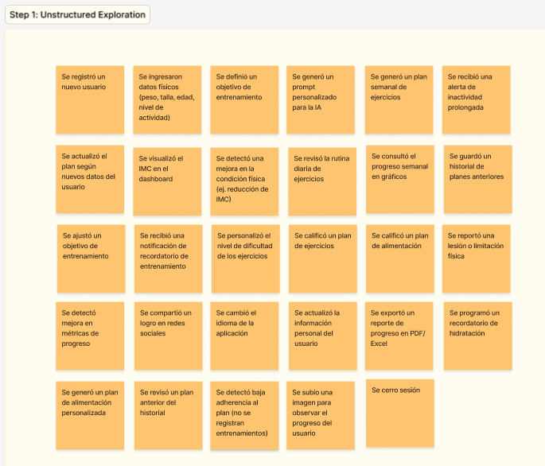

**Step 2: Timelines**

En esta fase organizamos los eventos del dominio de forma cronológica. Esto nos permitió visualizar el flujo completo del sistema, identificar el orden natural de los eventos y comprender mejor cómo interactúan los usuarios con FitSense en el proceso de registro, generación de planes, seguimiento y mejora física.

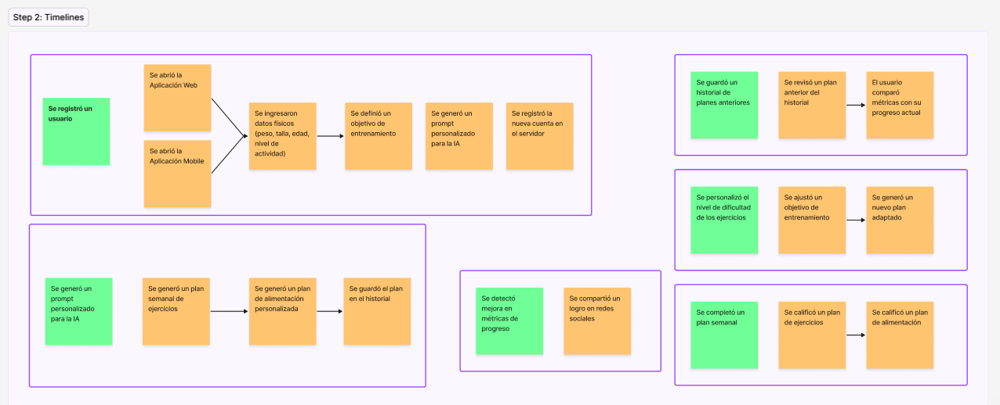

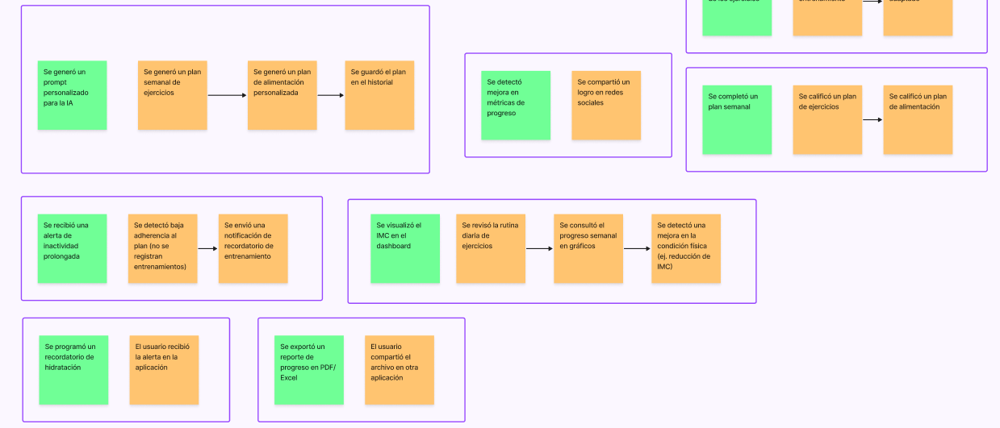

**Step 3: Pain Points**

Detectamos los puntos críticos o problemáticos que enfrentan tanto los usuarios como el sistema actual. Estos incluían desde notificaciones poco visibles que podrían ser ignoradas, hasta la dificultad de generar planes realistas cuando los datos ingresados son incompletos o inconsistentes.

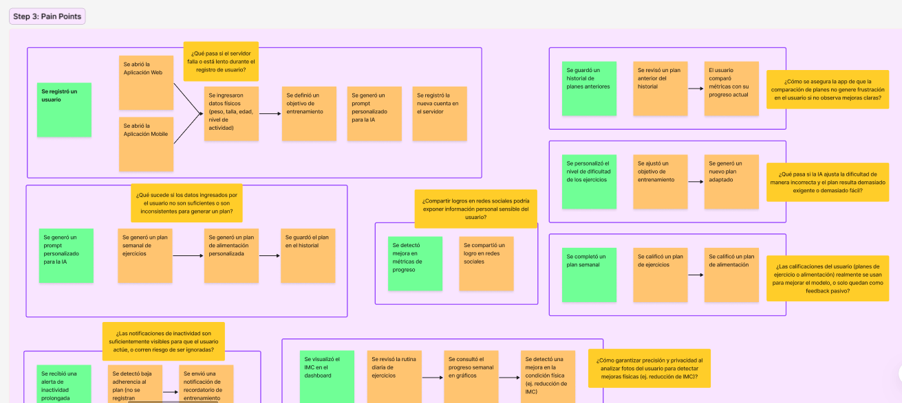
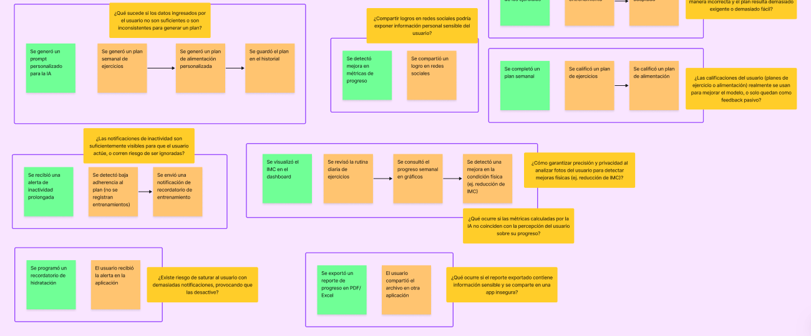
 
 
 

**Step 4: Pivotal Points**

Identificamos los momentos clave que marcan cambios importantes dentro del proceso, como cuando se genera un nuevo plan personalizado, cuando el usuario recibe una alerta de inactividad o cuando se detecta una mejora en las métricas físicas mediante IA. Estos puntos nos ayudaron a definir posibles mejoras de alto impacto en la experiencia de uso.

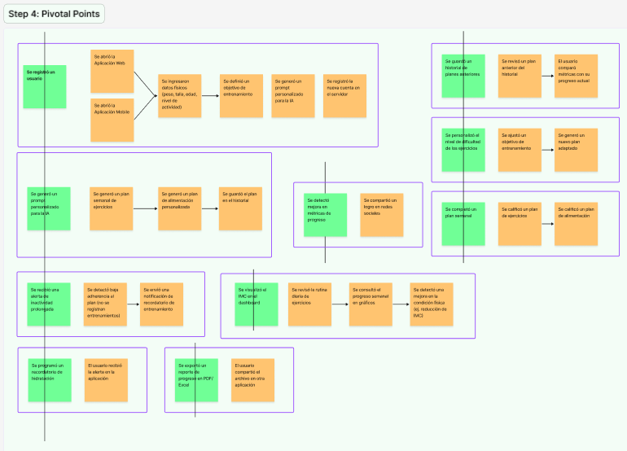
 
 
 

**Step 5: Commands**

Aquí definimos las acciones que los usuarios o el sistema pueden ejecutar, como "Registrar Usuario", "Generar Plan de Entrenamiento", "Enviar Notificación de Hidratación" o "Subir Foto de Progreso". Cada comando representa una intención concreta que da lugar a eventos dentro de FitSense.

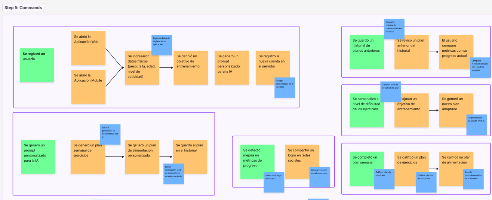
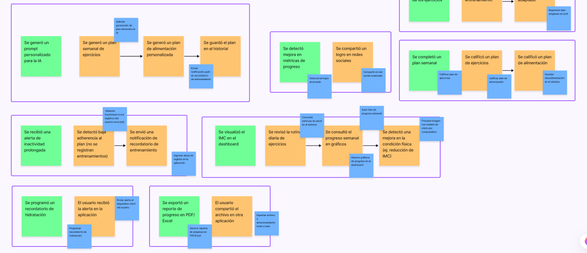
 
 
 

**Step 6: Policies**

Establecimos las reglas de negocio que deben ejecutarse de forma automática ante ciertos eventos. Por ejemplo, si el sistema detecta inactividad por más de tres días, se activa una política que genera y envía una notificación push al usuario. O si se sube una foto de progreso, se activa una política de privacidad y de procesamiento de la imagen con IA.

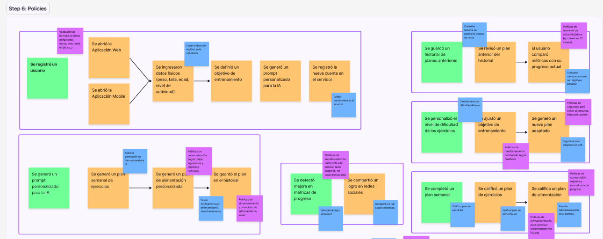
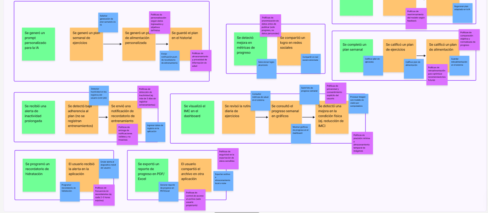
 
 
 

**Step 7: Read Models**

Diseñamos los modelos de lectura que permitirán consultar el estado del usuario, como el dashboard con métricas de IMC, calorías recomendadas, gráficos de progreso semanal, historial de planes y logros sociales. Estos modelos están optimizados para ofrecer al usuario información clara, motivadora y accesible.

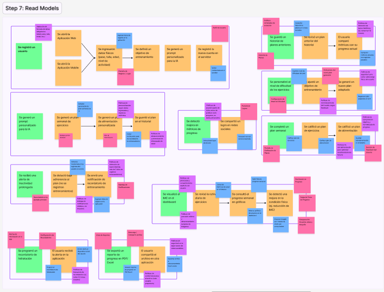
 
 
 

**Step 8: External Systems**

Identificamos los sistemas externos que interactúan con FitSense, como servicios de autenticación (Firebase Auth), APIs de notificaciones push, motores de IA de recomendación, librerías de visualización de gráficos y APIs de visión por computadora para el análisis de imágenes. También se contemplaron integraciones con redes sociales para compartir logros.

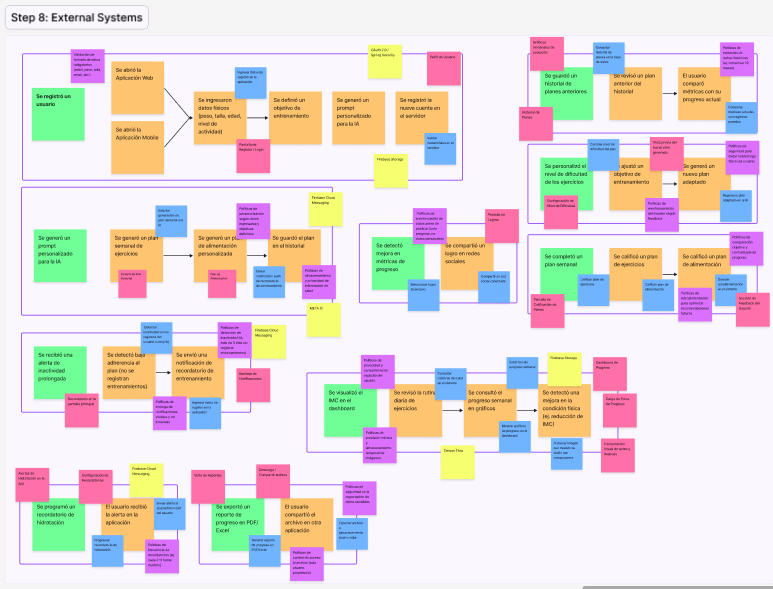
 
 
 

**Step 9: Aggregates**

Por último, definimos los aggregates, que representan los límites consistentes del dominio. Un ejemplo claro fue el aggregate de <b>Plan Personalizado</b>, que encapsula la lógica de generación y adaptación de planes de entrenamiento y alimentación. Otro aggregate clave fue <b>Monitoring</b>, que centraliza el seguimiento de métricas y la detección de mejoras físicas. Estos aggregates permiten mantener la coherencia del dominio y garantizar que cada área funcional de FitSense evolucione de manera independiente pero alineada.

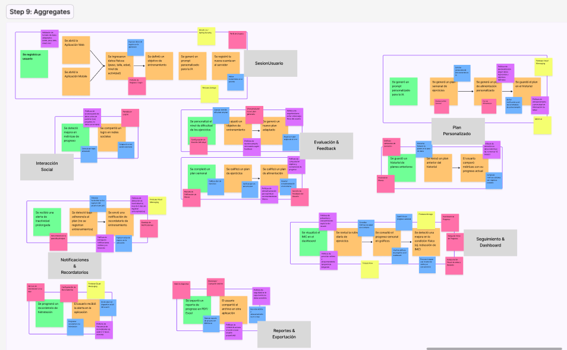

### 4.2.2 Candidate Context Discovery. 

**Identificación de Valores del Negocio:**  

Analizamos los aspectos fundamentales del negocio: la personalización de planes de ejercicio y alimentación mediante IA, el seguimiento del progreso físico con métricas de salud, la entrega de notificaciones y recordatorios oportunos, la generación de reportes y visualizaciones motivadoras, y la interacción social para compartir logros. Estos valores permiten a los usuarios entrenar de forma más eficiente, segura y personalizada, fomentando hábitos saludables y una experiencia accesible sin necesidad de un entrenador presencial.

**Identificación de Funcionalidades Clave:**  

A partir de estos valores, identificamos funcionalidades esenciales para el sistema:

- Generación de planes de entrenamiento y alimentación personalizados mediante IA.
- Seguimiento de métricas de salud (IMC, calorías, evolución física).
- Notificaciones de recordatorio de entrenamientos e hidratación.
- Detección de inactividad y alertas para mantener la adherencia al plan.
- Análisis de imágenes con IA para estimar mejoras físicas (ej. reducción de IMC).
- Exportación de reportes de progreso en PDF/Excel.
- Visualización de gráficos y dashboards semanales.
- Gestión de cuentas y perfiles de usuarios.
- Compartir logros y resultados en redes sociales.

**Priorización de Contextos:**  

La priorización de bounded contexts nos ayudó a enfocar el diseño del sistema en torno a lo que realmente sostiene el valor de FitSense. Al distinguir los núcleos del dominio, pudimos aislar lógicas críticas (como generación de planes personalizados, seguimiento de métricas y notificaciones) que deben evolucionar de forma independiente y con alta cohesión.

**Contextos Identificados:**
1. Security: gestiona la autenticación, creación de cuentas y administración de perfiles de usuario. 
2. Plan: genera, personaliza y ajusta planes de ejercicio y alimentación mediante IA, incorporando el feedback del usuario.
3. Monitoring: realiza el seguimiento de métricas de salud, evolución física y análisis comparativo mediante dashboards y procesamiento de imágenes.
4. Notification: gestiona recordatorios automáticos de entrenamiento, hidratación y alertas de inactividad.
5. Social: permite al usuario compartir logros, exportar reportes y mantener interacción en redes sociales.

**Bounded Context Security**

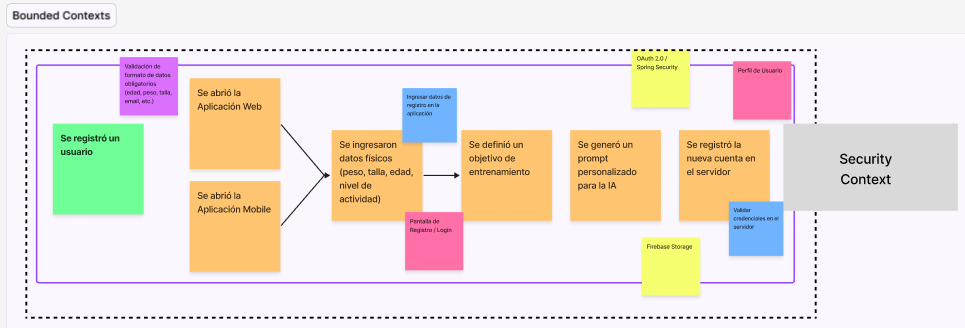

**Bounded Context Plan**

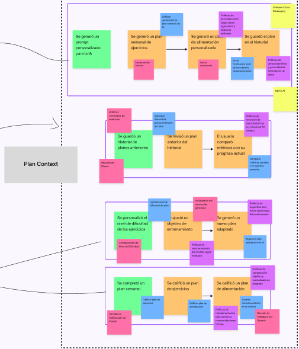

**Bounded Context Monitoring**

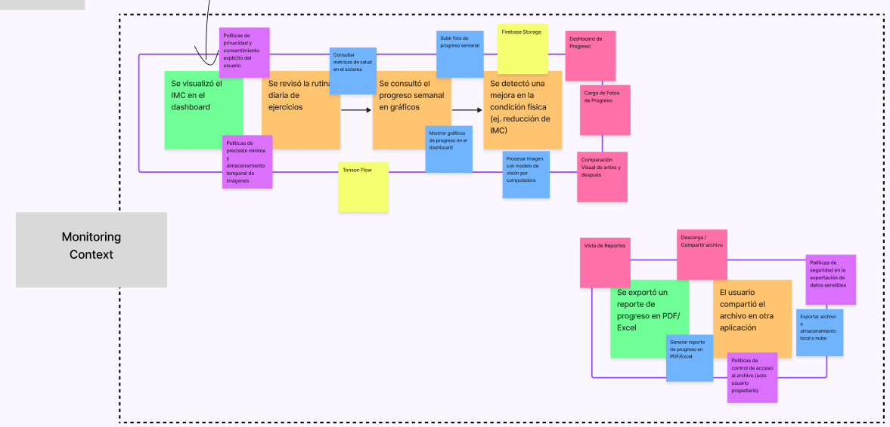

**Bounded Context Notification**

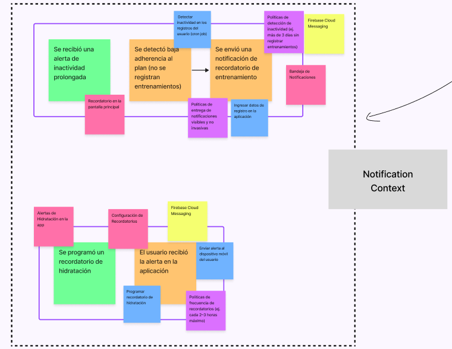

**Bounded Context Social**

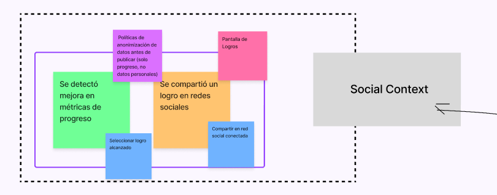
 
 
 

### **4.2.3. Domain Message Flows Modeling.** 

Estos gráfico muestra cómo el usuario interactúa con el sistema para monitorear su progreso físico. A través de la aplicación móvil, se registran datos personales y métricas de salud, que son procesados por la inteligencia artificial de FitSense. Si se detecta una desviación en el plan o un valor fuera de los rangos esperados, el sistema activa una alerta y notifica al usuario en tiempo real.

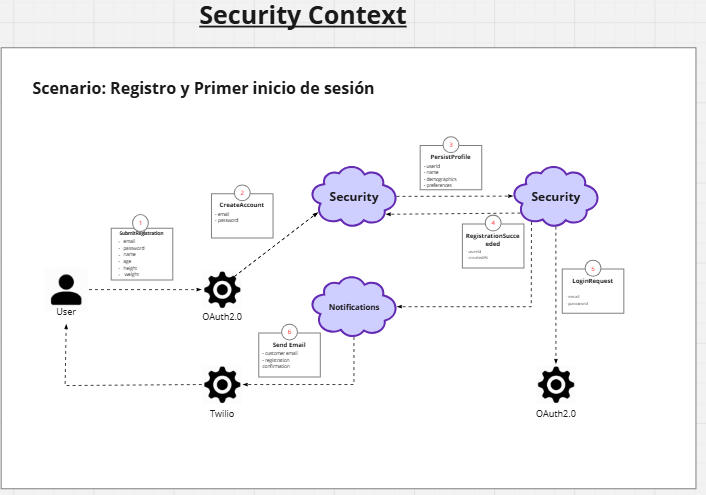

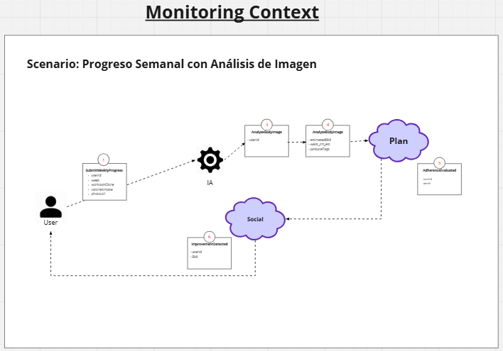

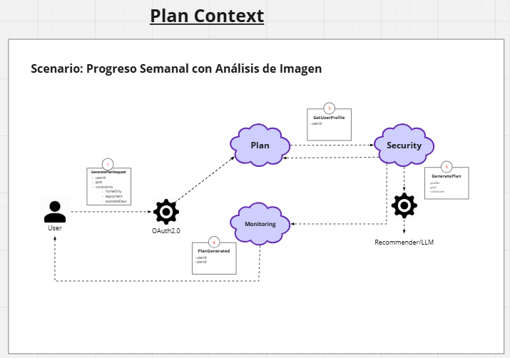

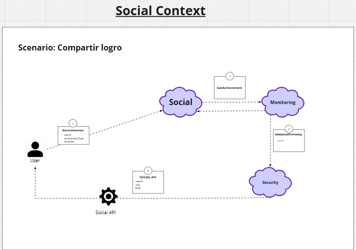

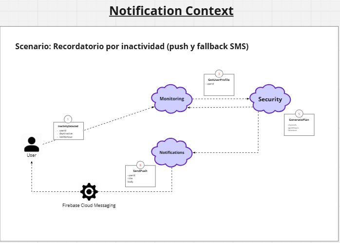

### **4.2.4. Bounded Context Canvases.**
Los Bounded Context Canvases de FitSense permiten visualizar el propósito de cada contexto, sus interacciones con usuarios y sistemas externos, el lenguaje ubicuo que los define y las decisiones clave de negocio que los guían. Con ellos se asegura que cada módulo del sistema sea coherente, independiente y alineado con los objetivos de la aplicación.

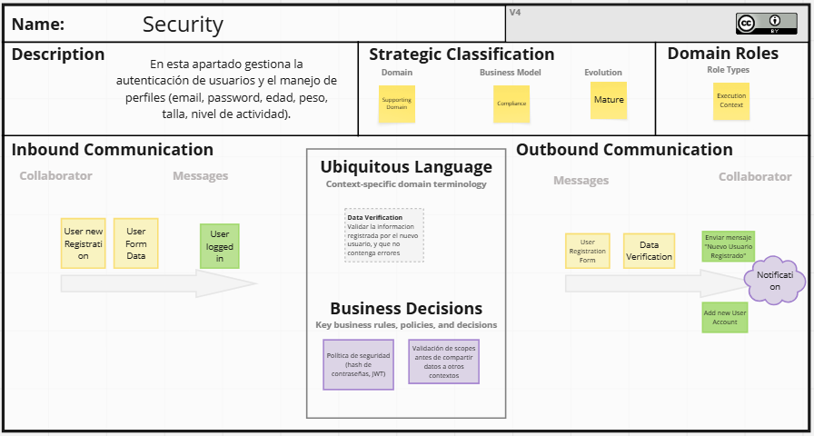

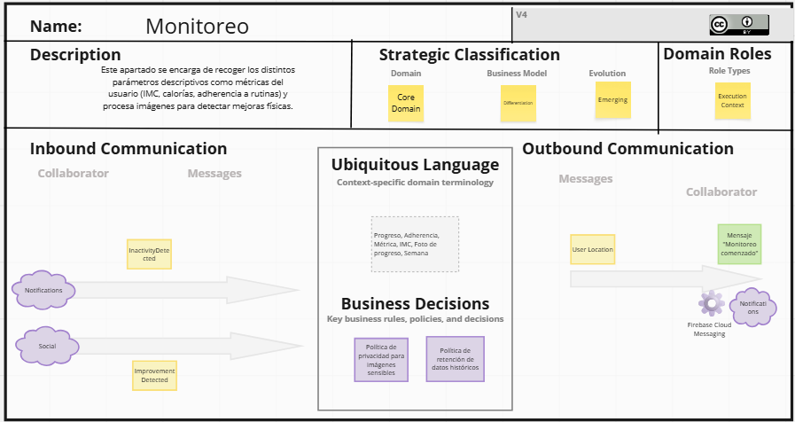

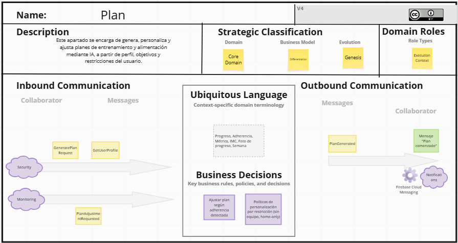

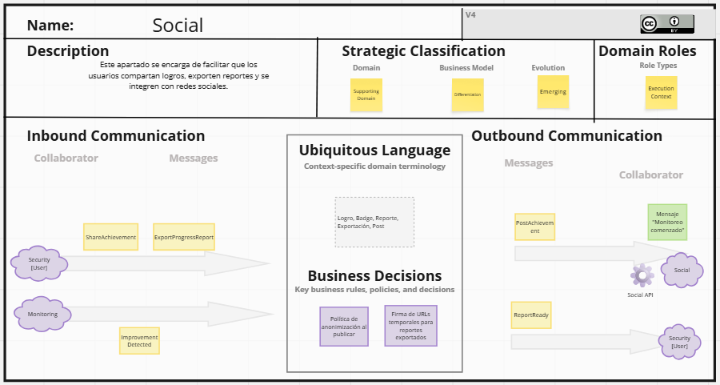

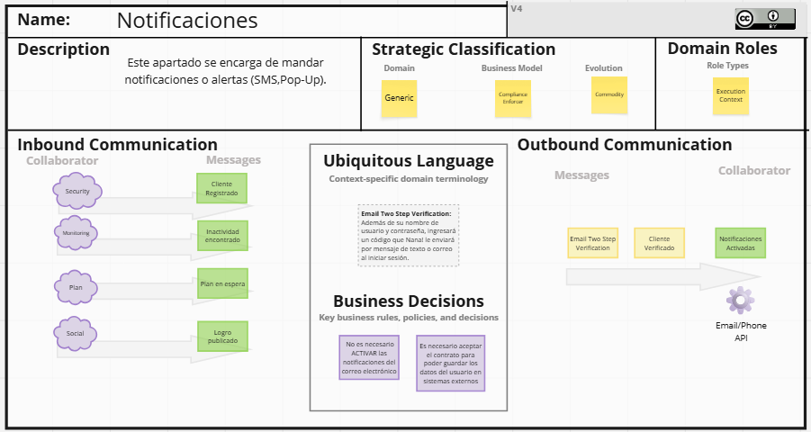

### **4.2.5. Context Mapping**
Una vez definidos nuestros Bounded Contexts, realizamos el mapeo de sus relaciones para comprender cómo se comunican dentro del sistema de FitSense y asignar los patrones adecuados según su interacción.

– Security provee autenticación y manejo de perfiles de usuario. Es utilizado por los demás contextos, pero no depende de ninguno. Esta relación fue clasificada como Shared Kernel, ya que su lógica y entidades clave (usuarios, credenciales, perfiles) deben ser consistentes y compartidas de forma controlada.

– Plan genera y personaliza los planes de entrenamiento y alimentación. Consume datos básicos del perfil del usuario desde Security, por lo que su relación sigue el patrón Customer–Supplier.

– Monitoring realiza el seguimiento de métricas, progreso y análisis de imágenes. Este contexto depende de los planes generados en el contexto Plan (para medir adherencia y progreso), por lo que su relación aplica como Conformist, ya que adopta el lenguaje de eventos de Plan.

– Notification se encarga de la gestión de recordatorios y alertas (ej. entrenamiento pendiente, hidratación). Consume datos tanto de Monitoring (ej. detectar inactividad) como de Security (ej. configuración de usuario). Sus relaciones se clasifican como Customer–Supplier, ya que Notification depende de información expuesta por esos contextos.

– Social facilita la publicación y el compartir logros del usuario. Su interacción con Security (para validar identidad del usuario) también sigue el patrón Customer–Supplier. Además, consume métricas de Monitoring para generar contenido atractivo (ej. logros de progreso), lo que refuerza un Conformist con respecto al lenguaje de progreso definido en Monitoring.

– En algunos escenarios, la comunicación entre Plan y Monitoring también puede considerarse como Published Language, ya que ambos deben interpretar métricas y eventos de forma coherente (ej. cuando se regenera un plan porque el sistema detectó falta de adherencia).

Este mapeo nos ayuda a establecer relaciones claras entre los contextos, identificar dependencias y definir una arquitectura que mantenga separadas las responsabilidades de cada módulo en FitSense.

**Bounded Context All - Vista Completa**
    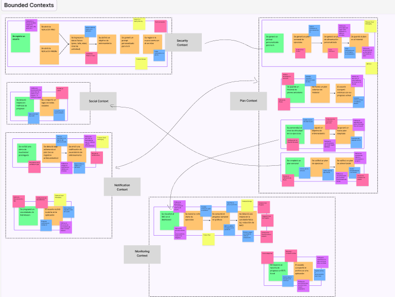

## 4.3. Software Architecture
### 4.3.1. Software Architecture System Landscape Diagram

El Diagrama de Paisaje del Sistema ofrece una visión panorámica de la cartera de software de la organización. Para el proyecto FitSense, este diagrama ubica nuestra plataforma en relación con los sistemas externos esenciales para su operación, como los servicios de inteligencia artificial y las APIs de redes sociales, definiendo el contexto más amplio en el que operará nuestro software.

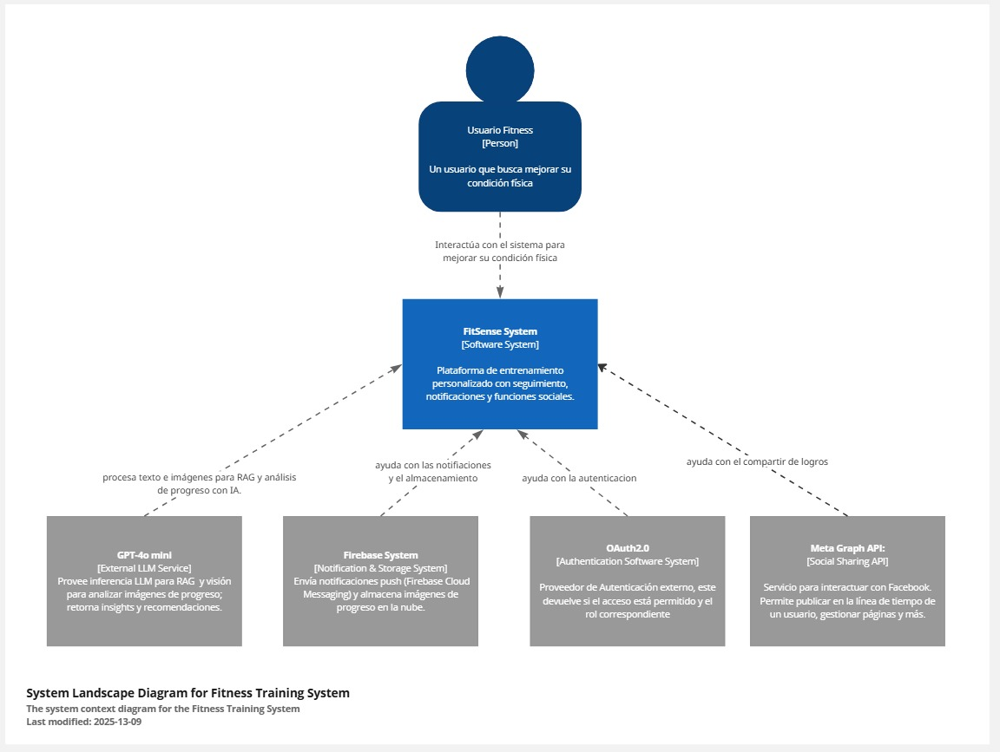

### 4.3.2. Software Architecture Context Level Diagrams 

El Diagrama de Contexto proporciona una vista de alto nivel del sistema FitSense. El propósito es mostrar cómo la plataforma interactúa con los usuarios y con los principales sistemas externos de los que depende, como los servicios de IA de Gpt 4o mini, las APIs de redes sociales, y los sistemas de autenticación y notificaciones.

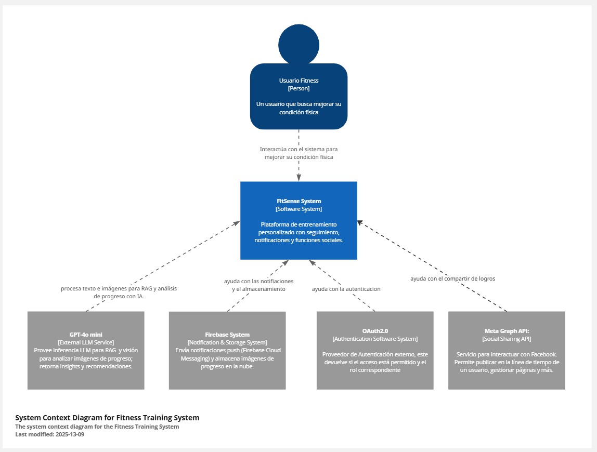

### 4.3.3. Software Architecture Container Level Diagrams

El Diagrama de Contenedores detalla la arquitectura interna del sistema FitSense. Representa las principales aplicaciones, servicios, bases de datos y sistemas externos que trabajan juntos para operar la plataforma. Este diagrama muestra las conexiones y el flujo de información entre cada uno de los componentes, ilustrando cómo se implementan decisiones arquitectónicas clave, como el uso de un API Gateway y la integración de la arquitectura RAG para la generación de planes de entrenamiento.

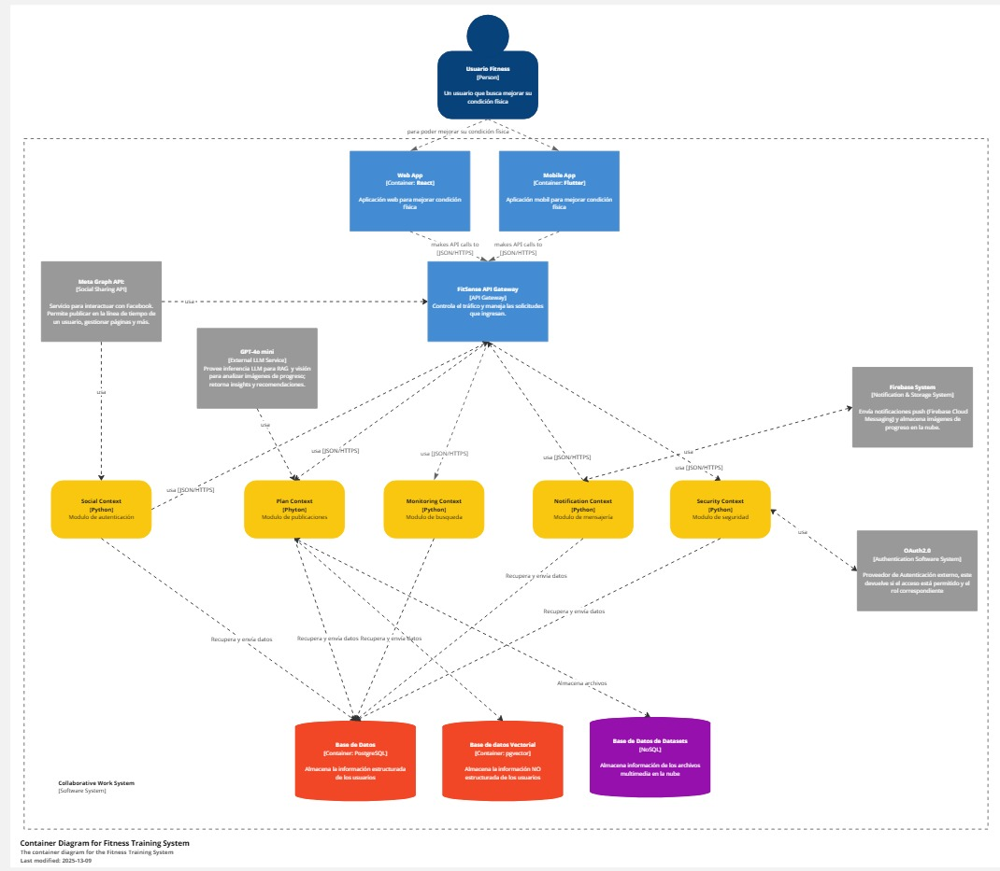

### 4.3.4. Software Architecture Deployment Diagrams 

El Diagrama de Despliegue muestra cómo la arquitectura del sistema FitSense se ejecuta en el entorno de producción. Este diagrama detalla la infraestructura física y lógica, incluyendo la plataforma de contenedores Railway que aloja la aplicación monolítica y las bases de datos, así como los servicios de terceros como Firebase y GPT-4o mini. Su propósito es visualizar las dependencias de red y los entornos de ejecución para entender cómo los componentes de software se distribuyen y se comunican entre sí.

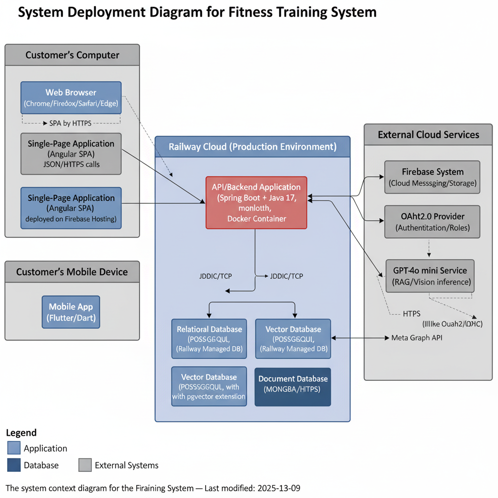

# Conclusiones 

1. El desarrollo del proyecto FitSense validó exitosamente la aplicación de metodologías modernas de diseño de software para resolver problemáticas reales del fitness digital. Los **Problem Statements** identificados —fragmentación de soluciones, falta de personalización efectiva y baja retención por desmotivación— se confirmaron como problemas críticos que FitSense aborda mediante una experiencia integrada todo-en-uno, IA personalizada y dashboards visuales motivadores.

2. La **validación metodológica** demostró la efectividad de combinar Attribute-Driven Design (ADD) con Domain-Driven Design (DDD). ADD permitió balancear atributos de calidad conflictivos (rendimiento <3s, escalabilidad 10K usuarios/día, disponibilidad 99.9%), mientras que DDD facilitó la identificación de 5 bounded contexts cohesivos que reflejan la realidad del dominio fitness. El Event Storming reveló 91 eventos críticos y pain points no detectados previamente, enriqueciendo significativamente el diseño arquitectónico.

3. La arquitectura de monolito modular resultante soporta los objetivos SMART establecidos y proporciona fundamentos evolutivos para crecimiento futuro. Este proyecto representa un caso exitoso de cómo el diseño estratégico de software, guiado por metodologías probadas y centrado en usuarios reales, puede crear soluciones técnicamente superiores en mercados competitivos.

4. La propuesta de FitSense responde a una problemática real identificada en el mercado: la falta de planes personalizados, accesibles y sostenibles para mejorar la condición física. A través del enfoque Lean UX (Cap. I) se plantearon hipótesis claras y medibles, y con el EventStorming y DDD estratégico (Cap. IV) se logró mapear los contextos clave (Plan, Monitoring, Notification, Security y Social), asegurando que la solución no solo resuelva los “pain points” de los usuarios, sino que evolucione con alta cohesión y separación de responsabilidades. Esto evidencia un alineamiento sólido entre necesidades del usuario, valor de negocio y diseño técnico

5. El conjunto de artefactos desarrollados (Lean UX Canvas, Problem & Hypothesis Statements, EventStorming, Context Mapping, C4 Diagrams) demuestra un proceso de diseño de software riguroso y centrado en el usuario, donde cada decisión arquitectónica está orientada a garantizar escalabilidad, modularidad y experiencias motivadoras. Al integrar inteligencia artificial, notificaciones oportunas y dashboards visuales, FitSense se posiciona como un coach integral accesible que combina entrenamiento, nutrición y seguimiento digital, diferenciándose claramente de soluciones genéricas o fragmentadas.

# Anexos  

**Anexo N°1: Estadística sobre uso de apps de fitness**

https://www.grandviewresearch.com/industry-analysis/fitness-app-market

**Anexo 2. User Persona – René Espinoza**  
Ficha descriptiva del cliente ideal de FitSense, incluyendo datos demográficos, objetivos, necesidades, frustraciones y motivaciones.  

**Anexo 3. Empathy Map**  
Mapa de empatía elaborado con base en las entrevistas, mostrando lo que el usuario ve, oye, piensa, siente, dice y hace.  

**Anexo 4. As-Is Scenario Mapping**  
Mapa del escenario actual que refleja la experiencia frustrante del usuario al interactuar con aplicaciones de fitness disponibles en el mercado.  

**Anexo 5. To-Be Scenario Mapping**  
Mapa del escenario ideal que muestra cómo la aplicación FitSense transformará la experiencia del usuario, permitiéndole alcanzar sus objetivos de manera más clara y motivadora.  

**Anexo 6. User Task Matrix**  
Matriz de tareas elaborada a partir de los comentarios de los usuarios entrevistados, identificando frecuencia e importancia de las principales acciones.  

**Anexo 7. Event Storming**

https://www.figma.com/design/d79XNdidl0cHYUaA9o8zsj/Figma---Emergentes?t=GWl8L6Gfl27XnxeW-1

**Anexo 8. Entrevistas realizadas TB1**  
Registro en video de las entrevistas aplicadas a los usuarios, en las cuales se identificaron necesidades, frustraciones y expectativas en el uso de aplicaciones de fitness.  
Disponible en: [Exposiciones – Validation Interviews, Arquitecturas de Software Emergentes](https://upcedupe-my.sharepoint.com/:v:/g/personal/u20221a359_upc_edu_pe/EfyO18SJkA5GpMCI1trHijUB-Mq3DxEzZBBHFZUiBMFx6g?e=mnexXe&nav=eyJyZWZlcnJhbEluZm8iOnsicmVmZXJyYWxBcHAiOiJTdHJlYW1XZWJBcHAiLCJyZWZlcnJhbFZpZXciOiJTaGFyZURpYWxvZy1MaW5rIiwicmVmZXJyYWxBcHBQbGF0Zm9ybSI6IldlYiIsInJlZmVycmFsTW9kZSI6InZpZXcifX0%3D)  

**Anexo 9. Video de Exposición TB1**

https://upcedupe-my.sharepoint.com/:v:/g/personal/u20221a359_upc_edu_pe/EWXIg6RX7VtEisGAk76mtMUBLw4EU63SbTFcSO8cAPSP7w?e=P3ePpD&nav=eyJyZWZlcnJhbEluZm8iOnsicmVmZXJyYWxBcHAiOiJTdHJlYW1XZWJBcHAiLCJyZWZlcnJhbFZpZXciOiJTaGFyZURpYWxvZy1MaW5rIiwicmVmZXJyYWxBcHBQbGF0Zm9ybSI6IldlYiIsInJlZmVycmFsTW9kZSI6InZpZXcifX0%3D

---

# Bibliografía  

Fitness App Market Size & Share. Industry Report, 2030. (s.f.). Recuperado de https://www.grandviewresearch.com/industry-analysis/fitness-app-market

Grand View Research. (2023). *Global Fitness App Market Size, Share & Trends Report 2023–2030*. Recuperado de [https://www.grandviewresearch.com/industry-analysis/fitness-app-market](https://www.grandviewresearch.com/industry-analysis/fitness-app-market)  

Nielsen, J., & Norman, D. (2020). *The definition of user experience (UX)*. Nielsen Norman Group. Recuperado de [https://www.nngroup.com/articles/definition-user-experience](https://www.nngroup.com/articles/definition-user-experience)  

UXPressia. (2022). *Customer Journey Mapping Guide*. UXPressia. Recuperado de [https://uxpressia.com](https://uxpressia.com)  

Preece, J., Rogers, Y., & Sharp, H. (2019). *Interaction Design: Beyond Human-Computer Interaction* (5.ª ed.). Wiley.  

Stickdorn, M., Hormess, M., Lawrence, A., & Schneider, J. (2018). *This is Service Design Doing: Applying Service Design Thinking in the Real World*. O’Reilly Media.  

---

