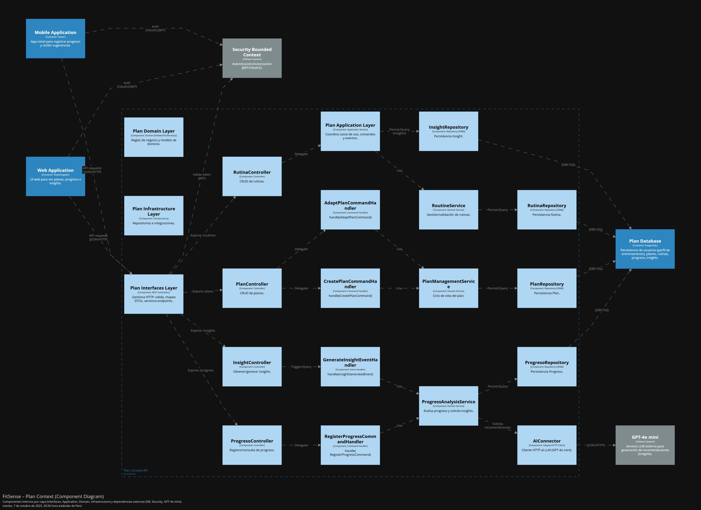
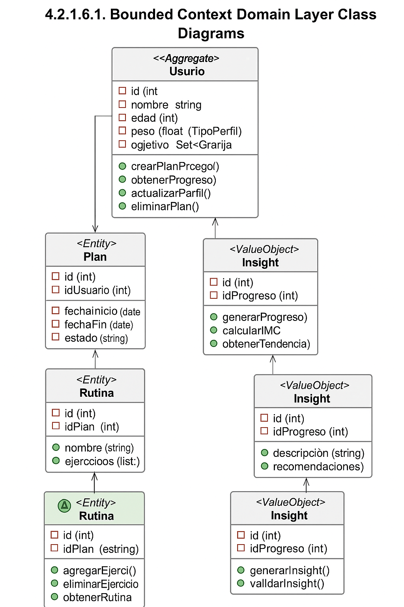
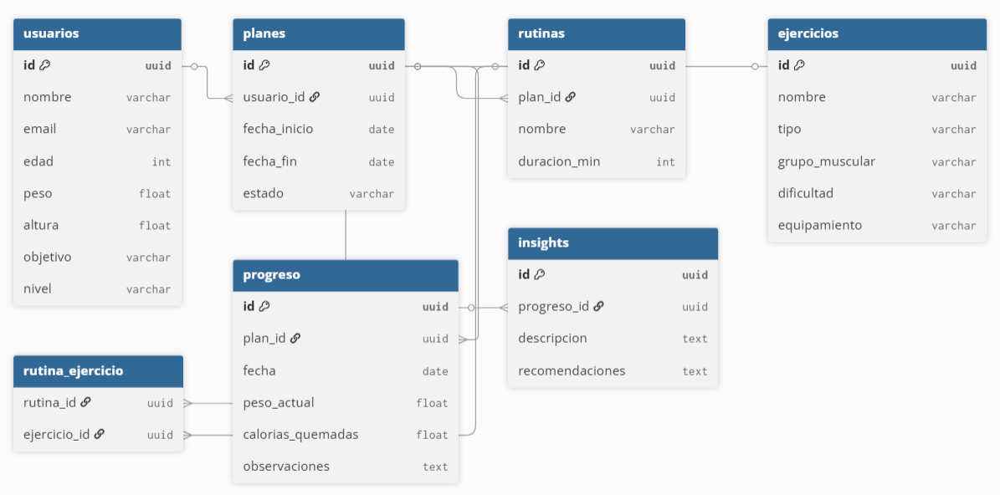
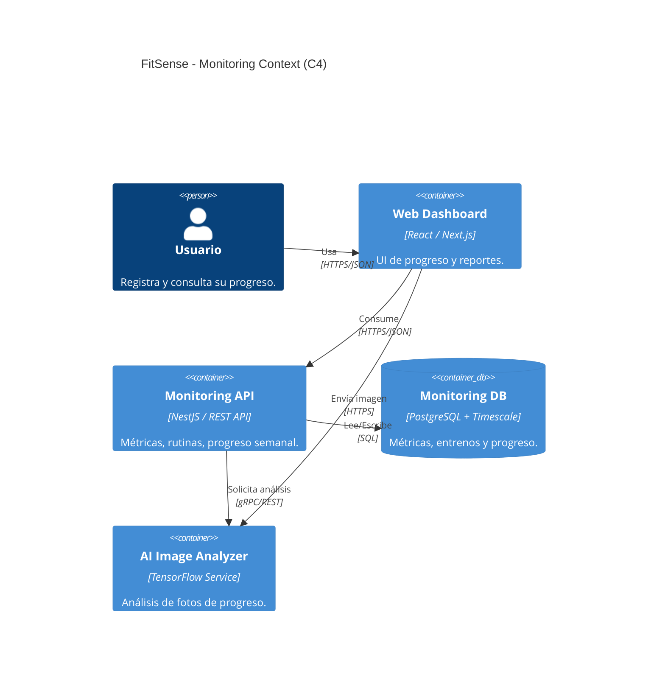
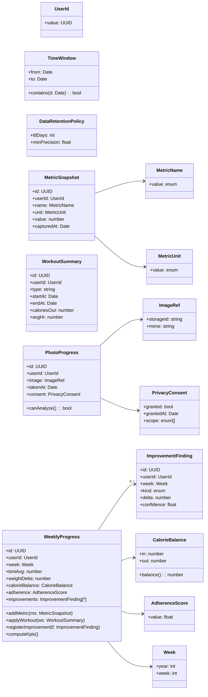
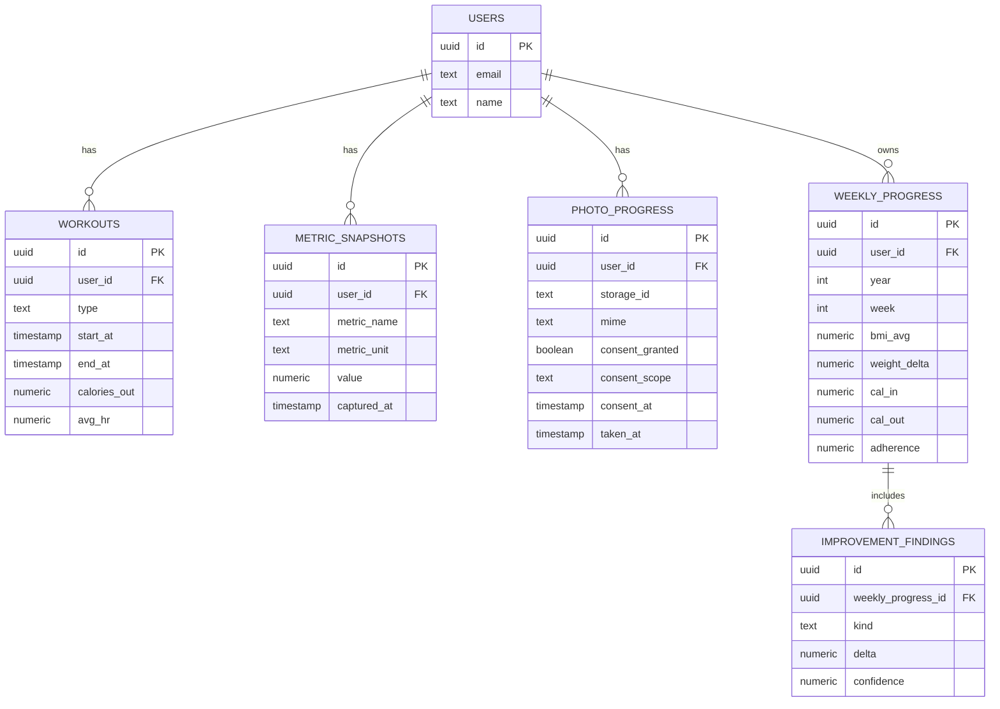
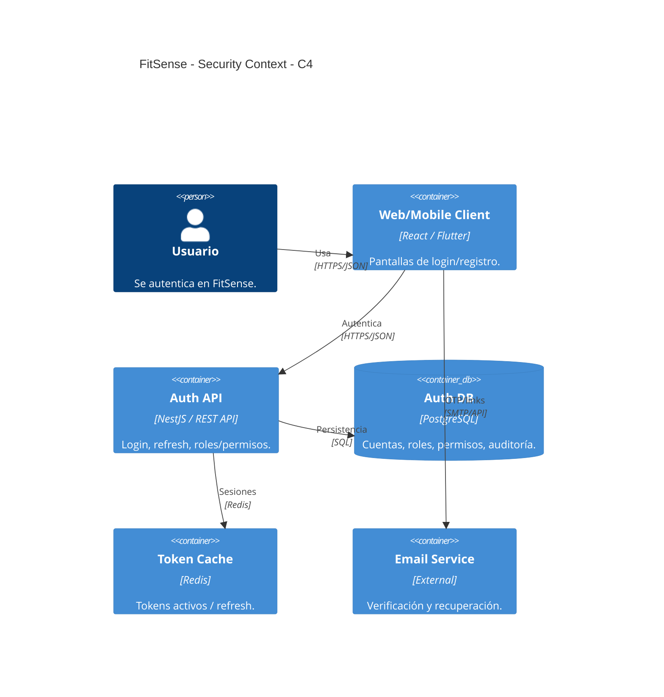
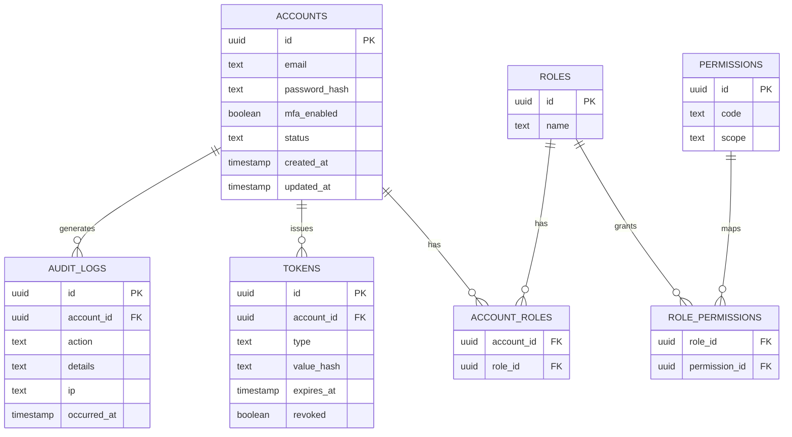

# Capítulo V: Tactical-Level Software Design

## 5.1. Bounded Context: Plan Context

### 5.1.1. Domain Layer

A continuación, se presenta la organización del Domain Layer del Bounded Context: Plan Context, siguiendo la estructura de Aggregate, Value Objects, Domain Services y Repositories, con todos los elementos organizados en tablas independientes.

Aggregate
<table> <thead> <tr><th>Entidad</th><th>Atributos Clave</th><th>Value Objects Asociados</th><th>Métodos / Reglas</th></tr> </thead> <tbody> <tr> <td>Usuario</td> <td>id, nombre, edad, peso, altura, nivel, objetivo, frecuencia</td> <td>Objetivo, PerfilEntrenamiento</td> <td> crearPlan()  actualizarProgreso()  consultarRutina()  obtenerInsight()  definirObjetivo()  validarDatosFisicos() </td> </tr> <tr> <td>Plan</td> <td>id, usuarioId, fechaInicio, fechaFin, estado</td> <td>Rutina, Objetivo</td> <td> agregarRutina()  finalizarPlan()  actualizarPlan()  validarFechas()  sincronizarConIA() </td> </tr> <tr> <td>Progreso</td> <td>id, planId, fecha, pesoActual, caloriasQuemadas</td> <td>Métricas</td> <td> registrarProgreso()  calcularIMC()  analizarTendencia()  notificarIA() </td> </tr> </tbody> </table>

Value Objects
<table> <thead> <tr><th>VO</th><th>Atributos</th><th>Descripción</th></tr> </thead> <tbody> <tr><td>Objetivo</td><td>tipo, valorMeta</td><td>Define la meta física del usuario (bajar peso, ganar masa, mantener).</td></tr> <tr><td>Rutina</td><td>nombre, duracion, ejercicios</td><td>Describe un conjunto de ejercicios estructurados dentro de un plan.</td></tr> <tr><td>Métricas</td><td>peso, imc, calorías, consistencia</td><td>Valores medidos y calculados a partir del progreso del usuario.</td></tr> <tr><td>Insight</td><td>descripcion, recomendaciones</td><td>Resultado analítico de la IA con sugerencias personalizadas.</td></tr> </tbody> </table>

Domain Services
<table> <thead> <tr><th>Servicio</th><th>Métodos</th><th>Responsabilidad</th></tr> </thead> <tbody> <tr> <td>PlanManagementService</td> <td>crearPlan(), actualizarPlan(), finalizarPlan()</td> <td>Orquesta la creación, modificación y cierre de los planes de entrenamiento del usuario.</td> </tr> <tr> <td>ProgressAnalysisService</td> <td>registrarProgreso(), generarInsight(), sincronizarIA()</td> <td>Evalúa métricas de progreso y coordina la comunicación con el modelo de IA para generar recomendaciones.</td> </tr> <tr> <td>RoutineService</td> <td>crearRutina(), actualizarEjercicio(), validarRutina()</td> <td>Administra la estructura de rutinas dentro de cada plan.</td> </tr> </tbody> </table>

Repositories
<table> <thead> <tr><th>Repositorio</th><th>Métodos</th><th>Entidad</th></tr> </thead> <tbody> <tr><td>PlanRepository</td><td>findById(), findByUsuarioId(), save(), deleteById()</td><td>Plan</td></tr> <tr><td>ProgresoRepository</td><td>findByPlanId(), save(), deleteById()</td><td>Progreso</td></tr> <tr><td>RutinaRepository</td><td>findByPlanId(), save(), deleteById()</td><td>Rutina</td></tr> <tr><td>InsightRepository</td><td>findByProgresoId(), save(), deleteById()</td><td>Insight</td></tr> </tbody> </table>

### 5.1.2. Interface Layer

En esta sección, se presenta la Capa de Interfaz (Interface Layer) de FitSense – Plan Context, que actúa como punto de entrada para las interacciones entre los usuarios (atletas o entrenadores) y el sistema.
Esta capa está compuesta por una serie de controladores REST que manejan las solicitudes entrantes del cliente (web o móvil), procesan los datos mediante los servicios de aplicación y devuelven las respuestas correspondientes.

Los controladores expuestos en este contexto permiten gestionar planes, rutinas, progreso e insights generados por IA.

El contexto de esta capa incluye cuatro controladores principales: PlanController, RutinaController, ProgresoController e InsightController.
Estos controladores son responsables de administrar la creación, consulta y actualización de los planes de entrenamiento y los registros asociados al progreso del usuario.

Controladores
<table> <thead> <tr><th>PlanController</th><th>RutinaController</th></tr> </thead> <tbody> <tr> <td> + createPlan(planDto): ResponseEntity  + updatePlan(id, planDto): PlanDto  + getPlanByUsuario(usuarioId): List&lt;PlanDto&gt;  + deletePlan(id): ResponseEntity </td> <td> + getRutinasByPlan(planId): List&lt;RutinaDto&gt;  + addRutina(rutinaDto): ResponseEntity  + updateRutina(id, rutinaDto): RutinaDto  + deleteRutina(id): ResponseEntity </td> </tr> </tbody> </table> <table> <thead> <tr><th>ProgresoController</th><th>InsightController</th></tr> </thead> <tbody> <tr> <td> + getProgresoByPlan(planId): List&lt;ProgresoDto&gt;  + addProgreso(progresoDto): ResponseEntity  + updateProgreso(id, progresoDto): ProgresoDto  + deleteProgreso(id): ResponseEntity </td> <td> + getInsightsByProgreso(progresoId): List&lt;InsightDto&gt;  + generateInsight(progresoId): InsightDto  + deleteInsight(id): ResponseEntity </td> </tr> </tbody> </table>
Descripción de la capa

Responsabilidad:
La Interface Layer traduce las peticiones HTTP del usuario en comandos o consultas internas, garantizando una comunicación desacoplada entre el cliente y la lógica de negocio.
Todos los controladores exponen endpoints REST documentados en OpenAPI (Swagger) para facilitar su integración.

Integraciones:

Se conecta con la Application Layer mediante Handlers y Services.

Se comunica con el módulo de IA para la generación de recomendaciones (GPT-4o mini Connector).

Devuelve respuestas estructuradas en formato JSON.

### 5.1.3. Application Layer

En esta sección, se presenta la Capa de Aplicación (Application Layer) del Plan Context de FitSense. Esta capa actúa como intermediaria entre la lógica de dominio y la infraestructura, orquestando operaciones como creación/actualización de planes, registro de progreso y generación de recomendaciones por IA.
Se definen Command Handlers y Event Handlers que coordinan los servicios relevantes para ejecutar acciones como crear planes, registrar avances o actualizar rutinas cuando se generan insights.

Handlers
<table> <thead> <tr> <th>CreatePlanCommandHandler</th> <th>RegisterProgressCommandHandler</th> </tr> </thead> <tbody> <tr> <td> + planService: PlanManagementService  + handle(CreatePlanCommand command): <i>Plan</i> </td> <td> + progressService: ProgressAnalysisService  + handle(RegisterProgressCommand command): <i>Progreso</i> </td> </tr> </tbody> </table>   <table> <thead> <tr> <th>GenerateInsightEventHandler</th> <th>PlanUpdatedEventHandler</th> </tr> </thead> <tbody> <tr> <td> + insightService: InsightService  + handle(InsightGeneratedEvent event): <i>Insight</i> </td> <td> + planService: PlanManagementService  + handle(PlanUpdatedEvent event): <i>void</i> </td> </tr> </tbody> </table>   <table> <thead> <tr> <th>AdaptPlanCommandHandler</th> <th>DeletePlanCommandHandler</th> </tr> </thead> <tbody> <tr> <td> + planService: PlanManagementService  + handle(AdaptPlanCommand command): <i>Plan</i> </td> <td> + planService: PlanManagementService  + handle(DeletePlanCommand command): <i>void</i> </td> </tr> </tbody> </table>   <table> <thead> <tr> <th>ProgressRegisteredEventHandler</th> <th>InsightPersistedEventHandler</th> </tr> </thead> <tbody> <tr> <td> + progressService: ProgressAnalysisService  + handle(ProgressRegisteredEvent event): <i>Insight</i> </td> <td> + insightService: InsightService  + handle(InsightPersistedEvent event): <i>void</i> </td> </tr> </tbody> </table>

### 5.1.4. Infrastructure Layer

En esta sección se presenta la Capa de Infraestructura (Infrastructure Layer) dentro del contexto de Planificación de FitSense. Esta capa proporciona los componentes técnicos y de soporte que permiten la interacción con la base de datos, los servicios de almacenamiento y el módulo de IA, responsable de generar y adaptar los planes personalizados.

Su función principal es implementar los contratos definidos en el dominio y garantizar la persistencia de los datos relacionados con planes, rutinas, progreso e insights.
Además, esta capa maneja la comunicación con el motor GPT-4o mini, responsable de las recomendaciones automáticas y del análisis de rendimiento.

Los repositorios definidos en esta capa usan frameworks como Spring Data JPA o Hibernate, representando el puente entre la lógica de negocio y el almacenamiento físico de los datos.

Repositorios
<table> <thead> <tr> <th>PlanRepository</th> <th>RutinaRepository</th> </tr> </thead> <tbody> <tr> <td> + findById(planId: UUID): <i>Plan</i>  + findByUsuarioId(usuarioId: UUID): List&lt;Plan&gt;  + save(plan: Plan): void  + deleteById(planId: UUID): void </td> <td> + findByPlanId(planId: UUID): List&lt;Rutina&gt;  + findByNombre(nombre: String): <i>Rutina</i>  + save(rutina: Rutina): void  + deleteById(rutinaId: UUID): void </td> </tr> </tbody> </table>   <table> <thead> <tr> <th>ProgresoRepository</th> <th>InsightRepository</th> </tr> </thead> <tbody> <tr> <td> + findByPlanId(planId: UUID): List&lt;Progreso&gt;  + findByFecha(fecha: Date): <i>Progreso</i>  + save(progreso: Progreso): void  + deleteById(progresoId: UUID): void </td> <td> + findByProgresoId(progresoId: UUID): List&lt;Insight&gt;  + findByDescripcionContaining(texto: String): List&lt;Insight&gt;  + save(insight: Insight): void  + deleteById(insightId: UUID): void </td> </tr> </tbody> </table>
Componentes de soporte

AIConnectorService
Servicio responsable de la comunicación con el modelo GPT-4o mini para la generación de insights y recomendaciones.
Expone endpoints REST y controla los tiempos de respuesta y manejo de errores.

DTO Mappers / Converters
Transforman las entidades del dominio a DTOs usados en la capa de aplicación e interfaz, asegurando un transporte de datos limpio y desacoplado.

PersistenceAdapter
Implementa el patrón Repository Adapter, traduciendo las entidades del dominio a entidades de persistencia (JPA Entities) y viceversa.

Integraciones tecnológicas

Base de datos: PostgreSQL / MySQL

Framework ORM: Spring Data JPA / Hibernate

Conector de IA: RESTful API → GPT-4o mini

Seguridad y despliegue: GitHub Actions + CI/CD

Formato de almacenamiento: JSON para planes y recomendaciones generadas por IA

### 5.1.6. Bounded Context Software Architecture Component Level Diagrams

### 5.1.7. Bounded Context Software Architecture Code Level Diagrams

#### 5.1.7.1. Bounded Context Domain Layer Class Diagrams

En esta sección se presenta el diagrama de clases del dominio para el Plan Context de FitSense.
El modelo refleja la estructura de agregados, entidades y objetos de valor y sus relaciones (cardinalidades) usadas por la lógica de negocio para crear, adaptar y evaluar planes de entrenamiento.
Este diseño asegura consistencia dentro del agregado (Usuario → Plan) y trazabilidad del progreso y de los insights generados por la IA.

#### 5.1.7.2. Bounded Context Database Design Diagram

En esta sección se presenta el diseño de base de datos correspondiente al Plan Context de FitSense.
El modelo de datos refleja la estructura de las entidades y sus relaciones mediante claves primarias y foráneas, garantizando la integridad referencial entre los usuarios, sus planes de entrenamiento, rutinas, progreso e insights generados por IA.

## 5.2. Bounded Context: Social Context

### 5.2.1. Domain Layer

### 5.2.2. Interface Layer

### 5.2.3. Application Layer

### 5.2.4. Infrastructure Layer

### 5.2.6. Bounded Context Software Architecture Component Level Diagrams

### 5.2.7. Bounded Context Software Architecture Code Level Diagrams

#### 5.2.7.1. Bounded Context Domain Layer Class Diagrams

#### 5.2.7.2. Bounded Context Database Design Diagram

## 5.3. Bounded Context: Notification Context

### 5.3.1. Domain Layer

### 5.3.2. Interface Layer

### 5.3.3. Application Layer

### 5.3.4. Infrastructure Layer

### 5.3.6. Bounded Context Software Architecture Component Level Diagrams

### 5.3.7. Bounded Context Software Architecture Code Level Diagrams

#### 5.3.7.1. Bounded Context Domain Layer Class Diagrams

#### 5.3.7.2. Bounded Context Database Design Diagram

## 5.4. Bounded Context: Monitoring Context

### 5.4.1. Domain Layer

El Domain Layer del contexto de <b>Monitoreo</b> representa el núcleo de la aplicación FitSense. Su objetivo es modelar las entidades, objetos de valor, agregados y servicios que permiten registrar, procesar y analizar la información de progreso físico del usuario (IMC, peso, adherencia, calorías, fotos de progreso, etc.) cumpliendo con las políticas de privacidad y precisión definidas por el sistema.

---

<b>Entidades de dominio</b>

<li>
    <b>MetricSnapshot:</b> Representa un registro individual de una métrica del usuario (peso, IMC, calorías, pasos, frecuencia cardíaca).
</li>

<li>
    <b>WorkoutSummary:</b> Registra el resumen de un entrenamiento completado, incluyendo duración, tipo y calorías quemadas.
</li>

<li>
    <b>PhotoProgress:</b> Representa una foto de progreso subida por el usuario con su respectivo consentimiento de privacidad. Permite posteriormente ejecutar análisis de imagen con IA.
</li>

<li>
    <b>ImprovementFinding:</b> Registra las mejoras detectadas por el sistema en base a la comparación de métricas o resultados visuales, como la reducción del IMC o cambios en la silueta corporal.
</li>  

<b>Objetos de valor (Value Objects)</b>

<li>
    <b>UserId:</b> Identificador único e inmutable de un usuario.
</li>

<li>
    <b>MetricName:</b> Define el tipo de métrica registrada (IMC, peso, calorías, pasos, HR, etc.).
</li>

<li>
    <b>MetricUnit:</b> Representa la unidad de medida asociada a una métrica.
</li>

<li>
    <b>AdherenceScore:</b> Representa el nivel de cumplimiento semanal de rutinas del usuario (escala 0–1).
</li>

<li>
    <b>CalorieBalance:</b> Modela el balance energético (calorías ingeridas – calorías quemadas).
</li>

<li>
    <b>PrivacyConsent:</b> Registra el consentimiento del usuario para el uso, análisis o almacenamiento de imágenes personales.
</li>

<li>
    <b>DataRetentionPolicy:</b> Define la duración y condiciones de almacenamiento de datos sensibles.
</li>

<li>
    <b>TimeWindow:</b> Intervalo de tiempo usado para agregaciones y cálculos.
</li>

<li>
    <b>Week:</b> Representa una semana ISO (año + número de semana).
</li>  

<b>Agregados</b>

<li>
    <b>WeeklyProgress:</b> Agregado raíz que consolida el progreso semanal del usuario (IMC, peso, adherencia, balance calórico, mejoras detectadas). Se actualiza automáticamente al final de cada semana.
</li>  

<b>Servicios de dominio</b>

<li>
    <b>ProgressComputationService:</b> Calcula indicadores clave del progreso semanal (IMC promedio, peso variado, adherencia, balance calórico) a partir de métricas y entrenamientos registrados.
</li>

<li>
    <b>ImprovementDetectionService:</b> Detecta mejoras físicas en base a comparaciones de métricas o resultados de visión computacional. Utiliza TensorFlow como analizador de imágenes.
</li>

<li>
    <b>ReportFactory:</b> Fábrica encargada de generar reportes semanales en formatos PDF o Excel utilizando los datos consolidados en WeeklyProgress.
</li>  

<b>Repositorios</b>

<li>
    <b>MetricsRepository:</b> Maneja la persistencia y consulta de las métricas del usuario en la base de datos de series temporales.
</li>

<li>
    <b>WorkoutsRepository:</b> Gestiona la persistencia de los entrenamientos registrados.
</li>

<li>
    <b>WeeklyProgressRepository:</b> Persiste los datos consolidados del progreso semanal.
</li>

<li>
    <b>PhotoProgressRepository:</b> Maneja las referencias a las fotos de progreso en el almacenamiento en la nube.
</li>  

<b>Interfaces (Ports)</b>

<li>
    <b>ImageAnalyzer:</b> Define la interfaz para servicios de análisis de imagen (visión por computadora). La implementación concreta se realiza en la capa de infraestructura mediante TensorFlow.
</li>

---

### 5.4.2. Interface Layer

En esta capa se definen los puntos de entrada del contexto de Monitoreo. Los <b>Controllers</b> y <b>Consumers</b> permiten que los usuarios y servicios externos interactúen con las funcionalidades de monitoreo a través de APIs REST o mensajería.

<li>
    <b>MetricsController:</b> Gestiona las operaciones de consulta de métricas del usuario, permitiendo visualizar series y promedios de IMC, peso y calorías. 
</li>

<li>
    <b>WorkoutsController:</b> Maneja el registro y consulta de entrenamientos. Interactúa con el <i>Application Layer</i> para emitir eventos al contexto de Planificación.
</li>

<li>
    <b>ProgressController:</b> Permite subir fotos de progreso, consultar el resumen semanal y solicitar análisis de imagen.
</li>

<li>
    <b>ReportsController:</b> Genera y exporta reportes de progreso en PDF o Excel.
</li>

<li>
    <b>WearableIngestConsumer:</b> Consume datos enviados por dispositivos wearables (pasos, ritmo cardíaco, calorías) para incorporarlos al sistema.
</li>

<li>
    <b>PlanEventsConsumer:</b> Escucha eventos provenientes del contexto de Planificación (por ejemplo, “AdherenceCalculated”) para actualizar el progreso semanal.
</li>  

---

### 5.4.3. Application Layer

El Application Layer del contexto de Monitoreo se encarga de orquestar los procesos de negocio y coordinar las transacciones entre el dominio y la infraestructura. Aplica el patrón CQRS y maneja tanto comandos como eventos relacionados con el progreso del usuario.

<b>Command Handlers:</b>

<li>
    <b>RecordWorkoutCommandHandler:</b> Procesa la creación de un nuevo entrenamiento. Valida los datos, guarda el resumen y emite el evento <i>WorkoutRecorded</i>.
</li>

<li>
    <b>IngestMetricCommandHandler:</b> Procesa el registro de una nueva métrica (IMC, peso, calorías). Emite el evento <i>MetricRecorded</i>.
</li>

<li>
    <b>SubmitProgressPhotoCommandHandler:</b> Valida el consentimiento de privacidad, guarda la referencia de imagen y emite el evento <i>PhotoSubmitted</i>.
</li>

<li>
    <b>AnalyzePhotoCommandHandler:</b> Invoca el servicio de análisis de imagen (TensorFlow) si el usuario otorgó permiso.
</li>

<li>
    <b>ComputeWeeklyProgressCommandHandler:</b> Calcula y consolida el progreso semanal usando los servicios de dominio, emitiendo <i>WeeklyProgressComputed</i>.
</li>

<li>
    <b>ExportWeeklyReportCommandHandler:</b> Genera un reporte PDF/Excel utilizando la <i>ReportFactory</i>.
</li>  

<b>Event Handlers:</b>

<li>
    <b>OnMetricRecordedProjector:</b> Actualiza los dashboards con las métricas más recientes.
</li>

<li>
    <b>OnWorkoutRecordedProjector:</b> Actualiza los totales de calorías y adherencia de la semana.
</li>

<li>
    <b>OnImageAnalyzedDetector:</b> Ejecuta el servicio de detección de mejoras físicas y emite <i>ImprovementDetected</i>.
</li>

<li>
    <b>OnAdherenceCalculatedUpdater:</b> Escucha el evento <i>AdherenceCalculated</i> desde el contexto de Plan y actualiza la adherencia semanal.
</li>  

---

### 5.4.4. Infrastructure Layer

La capa de infraestructura implementa los repositorios, adaptadores y servicios externos que apoyan al dominio del contexto de Monitoreo. Se encarga de la persistencia de datos, análisis de imágenes y comunicación asincrónica entre contextos.

<b>Bases de datos:</b>

<li>
    <b>Relacional (PostgreSQL):</b> Almacena entidades principales como <i>workouts</i>, <i>weekly_progress</i> y <i>photo_progress</i>.
</li>

<li>
    <b>Time-Series (TimescaleDB):</b> Registra las métricas históricas (IMC, calorías, pasos) para análisis longitudinales.
</li>

<li>
    <b>Blob Storage (Firebase Storage / AWS S3):</b> Contiene las imágenes de progreso. Solo se almacenan referencias opacas (ImageRef).
</li>  

<b>Repositorios implementados:</b>

<li>
    <b>MetricsRepositorySql:</b> Implementa <i>MetricsRepository</i> usando SQL sobre una base de datos de series temporales.
</li>

<li>
    <b>WorkoutsRepositorySql:</b> Implementa <i>WorkoutsRepository</i> con ORM (TypeORM o Prisma).
</li>

<li>
    <b>WeeklyProgressRepositorySql:</b> Persiste los agregados semanales.
</li>

<li>
    <b>PhotoProgressRepositorySql:</b> Guarda los metadatos de fotos de progreso, delegando el archivo binario al Blob Storage.
</li>  

<b>Servicios externos:</b>

<li>
    <b>ImageAnalyzerTensorFlow:</b> Implementación concreta del puerto <i>ImageAnalyzer</i>. Utiliza modelos de visión computacional (TensorFlow) para detectar cambios físicos y calcular el nivel de confianza.
</li>

<li>
    <b>MessageBrokerAdapter:</b> Gestiona la comunicación asincrónica mediante colas (Kafka o RabbitMQ) para eventos de progreso.
</li>

<li>
    <b>NotificationAdapter:</b> Envía notificaciones push al usuario cuando se detectan mejoras físicas o recordatorios de rutina.
</li>

<li>
    <b>Scheduler:</b> Automatiza la ejecución semanal de procesos de consolidación y generación de reportes.
</li>  

### 5.4.6. Bounded Context Software Architecture Component Level Diagrams

### 5.4.7. Bounded Context Software Architecture Code Level Diagrams

#### 5.4.7.1. Bounded Context Domain Layer Class Diagrams

#### 5.4.7.2. Bounded Context Database Design Diagram

## 5.5. Bounded Context: Security Context

### 5.5.1. Domain Layer

El Domain Layer del contexto de <b>Seguridad</b> define las clases que representan las reglas de negocio relacionadas con la autenticación, autorización y gestión de roles de los usuarios dentro del sistema FitSense. Este dominio garantiza el control de acceso, la integridad de las credenciales y la trazabilidad de acciones mediante auditorías.

<b>Entidades de dominio</b>

<li>
    <b>Account:</b> Representa una cuenta de usuario. Contiene credenciales, estado de verificación y configuración de autenticación multifactor (MFA).
</li>

<li>
    <b>Role:</b> Define un rol dentro del sistema (por ejemplo, “User”, “Coach”, “Admin”) y sus permisos asociados.
</li>

<li>
    <b>Permission:</b> Representa una acción o recurso al cual puede acceder un rol (por ejemplo, <i>metrics:read</i> o <i>progress:write</i>).
</li>

<li>
    <b>Token:</b> Representa los tokens emitidos durante el proceso de autenticación (access y refresh tokens).
</li>

<li>
    <b>AuditLog:</b> Entidad encargada de registrar los eventos de seguridad relevantes como inicio de sesión, cambio de contraseña o asignación de roles.
</li>  

<b>Objetos de valor (Value Objects)</b>

<li>
    <b>AccountId:</b> Identificador único de una cuenta de usuario.
</li>

<li>
    <b>RoleName:</b> Valor inmutable que representa el nombre de un rol.
</li>

<li>
    <b>TokenType:</b> Define el tipo de token (ACCESS o REFRESH).
</li>

<li>
    <b>HashedPassword:</b> Valor protegido que representa la contraseña encriptada del usuario.
</li>  

<b>Agregados</b>

<li>
    <b>Authenticator:</b> Agregado raíz responsable de verificar credenciales, emitir tokens y gestionar la validez de las sesiones.
</li>

<li>
    <b>Authorizer:</b> Valida que un usuario tenga los permisos necesarios para acceder a un recurso, según su rol y estado.
</li>  

<b>Servicios de dominio</b>

<li>
    <b>AuthService:</b> Encargado de emitir y validar tokens JWT. Implementa las políticas de expiración y rotación definidas en <i>AuthPolicy</i>.
</li>

<li>
    <b>PasswordHasher:</b> Servicio responsable del cifrado y verificación de contraseñas usando algoritmos seguros (bcrypt o Argon2).
</li>

<li>
    <b>AuditService:</b> Encargado de registrar acciones críticas de seguridad (inicio de sesión, cambio de roles, fallos de autenticación).
</li>

<li>
    <b>AuthPolicy:</b> Define la configuración de tiempo de vida (TTL), reglas de rotación y alcance de los tokens.
</li>  

<b>Repositorios</b>

<li>
    <b>AccountRepository:</b> Gestiona la persistencia de las cuentas de usuario.
</li>

<li>
    <b>RoleRepository:</b> Administra la persistencia y consulta de roles y permisos.
</li>

<li>
    <b>TokenRepository:</b> Maneja los tokens activos y sus estados (revocado, expirado, vigente).
</li>

<li>
    <b>AuditLogRepository:</b> Persiste los registros de auditoría.
</li>  

---

### 5.5.2. Interface Layer

En esta capa se definen los puntos de entrada al contexto IAM. Los controladores manejan las solicitudes REST relacionadas con autenticación, registro y administración de roles. También se incluyen consumidores de eventos externos y callbacks de OAuth.

<li>
    <b>AuthController:</b> Administra las rutas de autenticación de usuarios:
    <ul>
        <li><i>POST /auth/register</i>: registro de nueva cuenta.</li>
        <li><i>POST /auth/login</i>: inicio de sesión con credenciales.</li>
        <li><i>POST /auth/refresh</i>: renovación del token de acceso.</li>
        <li><i>POST /auth/logout</i>: cierre de sesión y revocación de tokens.</li>
    </ul>
</li>

<li>
    <b>MfaController:</b> Gestiona la activación y verificación de autenticación multifactor.
</li>

<li>
    <b>RoleController:</b> Controla las operaciones CRUD de roles y asignaciones de permisos.
</li>

<li>
    <b>OAuthCallbackController:</b> Recibe las respuestas de los proveedores externos (Google, Apple, Facebook) y crea cuentas federadas.
</li>

---

### 5.5.3. Application Layer

El <b>Application Layer</b> orquesta los flujos de autenticación y autorización, manejando comandos y eventos que coordinan las operaciones entre las capas de dominio e infraestructura. Implementa los patrones <i>CQRS</i> y <i>Event-Driven</i> para separar responsabilidades y garantizar trazabilidad.

<b>Command Handlers:</b>

<li>
    <b>RegisterUserCommandHandler:</b> Procesa la creación de una nueva cuenta, encripta la contraseña y emite <i>AccountCreated</i>.
</li>

<li>
    <b>AuthenticateUserCommandHandler:</b> Valida credenciales, genera tokens y emite <i>UserAuthenticated</i>.
</li>

<li>
    <b>RefreshTokenCommandHandler:</b> Valida un token de refresco y emite nuevos tokens según la política.
</li>

<li>
    <b>ChangePasswordCommandHandler:</b> Actualiza la contraseña del usuario tras verificar las credenciales.
</li>

<li>
    <b>AssignRoleCommandHandler:</b> Asocia roles a una cuenta y emite <i>RoleAssigned</i>.
</li>  

<b>Event Handlers:</b>

<li>
    <b>OnAccountCreatedHandler:</b> Registra la creación de cuentas en <i>AuditLog</i>.
</li>

<li>
    <b>OnUserAuthenticatedHandler:</b> Emite eventos de sesión iniciada y registra auditoría.
</li>

<li>
    <b>OnRoleAssignedHandler:</b> Actualiza permisos y genera logs de seguridad.
</li>  

---

### 5.5.4. Infrastructure Layer

La capa de infraestructura implementa las interfaces de repositorios y adaptadores que permiten la comunicación con bases de datos, servicios externos de identidad y notificaciones de seguridad.

<b>Bases de datos:</b>

<li>
    <b>PostgreSQL:</b> Base de datos relacional para almacenar cuentas, roles, permisos y logs de auditoría.
</li>

<li>
    <b>Redis:</b> Almacenamiento temporal para tokens de acceso (blacklist y TTL).
</li>  

<b>Implementaciones de repositorios:</b>

<li>
    <b>AccountRepositorySql:</b> Implementa la persistencia de cuentas en PostgreSQL.
</li>

<li>
    <b>RoleRepositorySql:</b> Gestiona roles y permisos con relaciones N:M.
</li>

<li>
    <b>TokenRepositoryRedis:</b> Controla tokens activos en memoria (Redis).
</li>

<li>
    <b>AuditLogRepositorySql:</b> Guarda los eventos de auditoría en tabla append-only.
</li>  

<b>Adaptadores y servicios externos:</b>

<li>
    <b>PasswordHasherAdapter:</b> Implementación de <i>PasswordHasher</i> usando bcrypt o Argon2.
</li>

<li>
    <b>TokenProvider:</b> Generación y validación de JWTs (firma HMAC o RSA).
</li>

<li>
    <b>OAuthProviderAdapter:</b> Integración con Google o Apple mediante OAuth 2.0.
</li>

<li>
    <b>EmailNotificationAdapter:</b> Envía correos de recuperación de contraseña y alertas de inicio de sesión.
</li>

### 5.5.6. Bounded Context Software Architecture Component Level Diagrams

### 5.5.7. Bounded Context Software Architecture Code Level Diagrams

#### 5.5.7.1. Bounded Context Domain Layer Class Diagrams

#### 5.5.7.2. Bounded Context Database Design Diagram

