# Capitulo VII: Product Implementation, Validation & Deployment

## 7.1. Software Configuration Management

### 7.1.1. Software Development Environment Configuration

**Project Management:**

Para la gestión del proyecto FitSense, utilizamos WhatsApp como principal canal de comunicación del equipo, mediante un grupo donde compartimos ideas, avances y observaciones sobre cada fase del desarrollo.
Complementariamente, recurrimos a Google Meet para realizar reuniones de coordinación en tiempo real, discutir decisiones técnicas y alinear los objetivos semanales.
Asimismo, el proyecto se documenta de manera colaborativa en Google Drive, permitiendo mantener actualizados los entregables, registrar cambios y conservar un historial del trabajo realizado por cada integrante.
En cuanto al control de versiones y documentación técnica del código, utilizamos GitHub, donde administramos los repositorios del backend, frontend y servicios de IA, además de gestionar los reportes de incidencias y actualizaciones de la aplicación.

**Requirements Management:**

Para la gestión de los requisitos funcionales y no funcionales de FitSense, empleamos Pivotal Tracker, donde registramos las historias de usuario priorizadas en el Product Backlog.
Cada historia describe una funcionalidad específica, como la creación de rutinas personalizadas, el seguimiento del progreso físico o la integración del chatbot de entrenamiento.
La elaboración de estas historias fue un trabajo colaborativo: todo el equipo aportó ideas, definió criterios de aceptación y discutió las funcionalidades clave que mejoran la experiencia del usuario dentro del ecosistema FitSense.

**Product UX/UI Design:**

El diseño centrado en el usuario fue un aspecto esencial del desarrollo. Para ello, utilizamos UXPressia, elaborando artefactos como el User Persona, Empathy Map e Impact Map, lo cual nos ayudó a comprender los objetivos, frustraciones y motivaciones de nuestros segmentos objetivo (atletas principiantes, entrenadores y usuarios que buscan rutinas personalizadas).
Por otra parte, el diseño visual y los flujos de interacción se realizaron en Figma, donde se crearon los Wireframes y Mockups de las principales vistas de la aplicación, incluyendo las pantallas de inicio de sesión, configuración del atleta y seguimiento de rutinas.
Esto permitió validar anticipadamente la experiencia de usuario antes de la implementación.

**Software Development:**

El desarrollo del proyecto se realizó utilizando Visual Studio Code (VS Code) como entorno principal, debido a su flexibilidad, soporte de múltiples lenguajes y compatibilidad con GitHub para la gestión de versiones.
El backend fue implementado en Node.js con Express, conectado a una base de datos MySQL, mientras que el frontend se desarrolló con Flutter, aprovechando su capacidad multiplataforma.
Además, se integraron servicios de inteligencia artificial que permiten la generación automática de planes de entrenamiento personalizados.

**Software Testing:**

Para garantizar la calidad del producto y validar que las funcionalidades cumplan los criterios de aceptación, implementamos pruebas de aceptación basadas en el lenguaje Gherkin, siguiendo la estructura Given–When–Then.
Este enfoque nos permitió definir escenarios comprensibles tanto para el equipo técnico como para los responsables del negocio, asegurando que FitSense responda correctamente a los inputs del usuario (por ejemplo, metas, experiencia y disponibilidad semanal) y produzca los outputs esperados (rutinas y recomendaciones personalizadas).
Gracias a este proceso de pruebas, se asegura que FitSense mantenga altos estándares de calidad y confiabilidad en todas sus versiones.

### 7.1.2. Source Code Management

**Usuarios de GitHub**

<table border="1" cellspacing="0" cellpadding="8">
  <thead>
    <tr>
      <th>Integrante</th>
      <th>Usuario de GitHub</th>
    </tr>
  </thead>
  <tbody>
    <tr>
      <td>Jarama Peñaloza, Fiorella</td>
      <td>Fio0407</td>
    </tr>
    <tr>
      <td>Rubio Calixto, Adrian Gustavo	</td>
      <td>ZarRubio</td>
    </tr>
    <tr>
      <td>Lucas Coronel, Nadia Alessandra</td>
      <td>nad21lc</td>
    </tr>
    <tr>
      <td>Calisaya Sánchez, Juan Jesús	</td>
      <td>JuanCali999</td>
    </tr>
    <tr>
      <td>Cuadros Rodríguez, Juan Alejandro</td>
      <td>JuanAlejandroCuadrosRodriguez</td>
    </tr>
  </tbody>
</table>

 

<em><strong>URL de repositorio de Landing Page:</strong></em> 
  <a href="https://github.com/FitSense-Emergentes-14653/Landing-Page" target="_blank">https://github.com/FitSense-Emergentes-14653/Landing-Page</a>

<em><strong>URL de repositorio del ChatBot AI:</strong></em> 
  <a href="https://github.com/FitSense-Emergentes-14653/ChatBot-AI" target="_blank">https://github.com/FitSense-Emergentes-14653/ChatBot-AI</a>

<em><strong>URL de repositorio de Project Report:</strong></em> 
  <a href="https://github.com/FitSense-Emergentes-14653/Project-Report" target="_blank">https://github.com/FitSense-Emergentes-14653/Project-Report</a>

<em><strong>URL de repositorio del Backend:</strong></em> 
  <a href="https://github.com/FitSense-Emergentes-14653/FitSense-Backend-Services" target="_blank">https://github.com/FitSense-Emergentes-14653/FitSense-Backend-Services</a>

<em><strong>URL de repositorio de Mobile App:</strong></em> 
  <a href="https://github.com/FitSense-Emergentes-14653/Fitsense-Mobile-App" target="_blank">https://github.com/FitSense-Emergentes-14653/Fitsense-Mobile-App</a>

### 7.1.3. Source Code Style Guide & Conventions

HTML

Es el lenguaje utilizado para estructurar el contenido de una página web, brindando una variedad de elementos posibles como texto, imágenes, formularios, etc.
🔗 Guía de HTML5

    Declarar el tipo de documento en la primera línea con <!DOCTYPE html>.

    Respetar la estructura básica del HTML: <html>, <head>, <body>.

    Declarar el título de la página para dar a conocer al usuario en qué página se encuentra. (Usar el elemento <title> en <head>).

    Usar indentación coherente para lograr una lectura sencilla del código.

    Siempre cerrar los elementos que lo requieran. (Ejemplo: 
 debe cerrarse con 
).

    Declarar el atributo alt para las imágenes.

CSS

Es el lenguaje utilizado para definir el diseño de la página web, así como los estilos, fuentes, colores, contenedores, etc.
🔗 Guía de CSS de Google

    Usar indentación de forma correcta.

    Los nombres para elementos deben ser cortos y en minúsculas.

    Declarar los colores en código hexadecimal. (Ejemplo: #024A86).

    Dejar comentarios que indiquen el propósito del estilo y su uso.

    El diseño debe ser responsive para que los usuarios puedan visualizar el sitio cómodamente desde cualquier dispositivo.

JavaScript

Es el lenguaje de programación más utilizado para la programación web, ya que permite desarrollar páginas interactivas con animaciones agradables para los usuarios.
🔗 Guía de convenciones en JavaScript

    Declarar nombres coherentes y cortos para variables y funciones.

    Comentar cada parte importante del código.

    Siempre colocar un punto y coma ; al final de cada línea.

    Usar const para valores que no cambian.

    Usar comparación estricta (=== en lugar de ==).

TypeScript

Es el superconjunto de JavaScript que añade características como el tipado estático.
🔗 Documentación oficial de TypeScript

    Nombres significativos y consistentes para variables y funciones.

    Declarar interfaces y tipos en PascalCase.

    Declarar variables y funciones en camelCase.

    Comentar claramente el propósito de cada bloque de código.

    Usar interfaces para reutilización de código.

Java

Lenguaje usado para programación web y móvil, multiplataforma.
🔗 Guía de estilo para Java

    Usar CamelCase para clases, variables y funciones.

    Usar HTTPS para conexiones seguras.

    Indentación clara y ordenada.

    Usar comillas dobles (") para cadenas de texto.

    Comentar bloques de código.

    Declarar constantes si el valor no cambia.

Gherkin

Lenguaje para diseñar casos de prueba en base a requisitos de negocio.
🔗 Convenciones de Gherkin

    Separar bloques: Given, When, Then para claridad.

    Usar tablas para inputs y outputs cuando sea necesario.

    Separar escenarios múltiples con líneas en blanco.

    Insertar líneas en blanco dentro de cada Step para mejor lectura.

### 7.1.4. Software Deployment Configuration

Para la configuración del despliegue de la aplicación, utilizaremos Git, un sistema de control de versiones distribuido que es bastante utilizado en proyectos de desarrollo de software. Es una herramienta esencial para trabajar colaborativamente y poder hacer el seguimiento de los cambios realizados por los miembros del grupo. Una de sus mejores ventajas es su capacidad para rastrear los cambios en los archivos de un proyecto a lo largo del tiempo. Con Git, es posible crear ramas, realizar cambios en ellas y fusionarlos eficientemente, permitiendo que varios desarrolladores trabajen en diferentes aspectos del proyecto simultáneamente sin interferencias.

Por otro lado, tenemos a GitHub, el cual es la plataforma para poder alojar repositorios de Git. Es uno de los servicios más utilizados por desarrolladores de forma mundial, ya que permite manejar repositorios públicos y privados para almacenar el código en la nube. A parte de ello, maneja el historial de los repositorios, permitiendo a los usuarios acceder a todas las versiones trabajadas, permitiendo que puedan retornar a una versión anterior en caso lo deseen. Ofrece otras herramientas que son muy útiles como los pull requests, los cuales son solicitudes de revisiones de una rama y luego poder fusionarla con otra rama.

Así es como con este, que cada miembro podrá trabajar de forma remota desde su IDE, teniendo una copia del repositorio Git a través del repositorio en línea almacenado en GitHub, así poder hacer commits para empujar los cambios que hayan realizado.

## 7.2. Solution Implementation

### 7.2.1. Sprint 1

#### 7.2.1.1. Sprint Planning 1

La planificación del primer sprint se llevó a cabo mediante una reunión virtual a través de Google Meet. Durante esta sesión, el equipo acordó los objetivos del sprint, seleccionó las historias de usuario priorizadas y definió la capacidad de trabajo (*velocity*) para el periodo. 

El Sprint 1 fue posteriormente **ejecutado en su totalidad**, cumpliendo con las metas establecidas durante esta sesión de planificación. La siguiente tabla resume la información discutida y registrada.

| **Elemento** | **Detalle** |
|--------------|-------------|
| **Sprint #** | Sprint 1 |
| **Sprint Planning Background** | Planificación inicial del proyecto FitSense, enfocada en el desarrollo del **backend de usuarios**, la **autenticación e inicio de sesión en la app móvil**, y la **implementación del módulo de Inteligencia Artificial** para la generación de planes personalizados de entrenamiento. |
| **Fecha de planificación** | 2025-11-03 |
| **Ejecución del Sprint** | 2025-11-04 al 2025-11-18 |
| **Lugar** | Virtual (Google Meet / GitHub / Trello) |
| **Preparado por** | Cuadros Rodríguez, Juan Alejandro |
| **Participantes** | - Cuadros Rodríguez, Juan Alejandro  - Jarama Peñaloza, Fiorella  - Lucas Coronel, Nadia Alessandra  - Calisaya Sánchez, Juan Jesús  - Rubio Calixto, Adrian Gustavo |
| **Resumen del Sprint n–1 (Review)** | No aplica — este es el primer sprint del proyecto. |
| **Resumen del Sprint n–1 (Retrospectiva)** | No aplica — este es el primer sprint del proyecto. |
| **Sprint Goal & User Stories** | El objetivo de este Sprint 1 fue implementar la **base funcional del sistema FitSense**, desarrollando los servicios de **gestión y autenticación de usuarios (API REST)**, el **flujo de registro y configuración de perfil en la aplicación móvil**, y el **módulo inicial de IA** para la **generación automatizada de planes de entrenamiento personalizados**.   Las historias de usuario incluidas fueron: **US-33, US-34, US-35, US-36, US-05, US-06, US-07, US-08, US-09, US-10, US-11, US-37 y US-12.** |
| **Velocidad del Sprint (Story Points esperados)** | 46 |
| **Suma total de Story Points completados** | 46 |
| **Estado del Sprint** | ✅ Completado con éxito |

#### 7.2.1.2. Sprint Backlog 1

El Sprint Backlog fue elaborado durante la planificación del Sprint 1, centrado en el desarrollo del **backend de usuarios**, la **autenticación móvil**, el **flujo de configuración de perfil** y la **integración inicial de IA** para generación de planes personalizados.  
El sprint fue ejecutado con una duración de **dos semanas (04–18 de noviembre de 2025)**, completando todas las historias planificadas.  

A continuación, se muestra la tabla de control de estado de los *Work Items* gestionados en el tablero de Trello:

  

🔗 **Trello Board:** [https://trello.com/b/fitsense-sprint1](https://trello.com/invite/b/69116af5e9faa3422cb867d6/ATTIede21f935e76a32aea83720e6d5490026C6D75CF/fitsense)  

---

| **User Story** |  | **Work-Item / Task** | **Descripción** | **Estimación (Horas)** | **Asignado a** | **Estado** |
|----------------|--|----------------------|-----------------|------------------------|----------------|-------------|
| **US-33** Crear Usuario (Sign-Up) a través de API | | T-01 Diseñar modelo de datos `User` | Estructurar entidad y esquema de validación en backend | 3 | Juan Cuadros | ✅ Done |
| **US-33** Crear Usuario (Sign-Up) a través de API | | T-02 Implementar endpoint `/api/users/signup` | Registro de usuarios en la base de datos | 5 | Juan Cuadros | ✅ Done |
| **US-34** Autenticar Usuario (Sign-In) a través de API | | T-03 Endpoint `/api/users/login` | Validar credenciales, generar token JWT | 4 | Adrián Rubio | ✅ Done |
| **US-35** Crear/Actualizar Perfil de Usuario | | T-04 Endpoint `/api/users/profile` | CRUD de información del perfil de usuario | 4 | Juan Calisaya | ✅ Done |
| **US-36** Obtener Perfil de Usuario | | T-05 GET `/api/users/profile/:id` | Devolver información del usuario autenticado | 2 | Fiorella Jarama | ✅ Done |
| **US-05** Registro rápido en aplicación móvil | | T-06 Diseñar interfaz de registro (Flutter) | Maquetado e integración con backend | 5 | Nadia Lucas | ✅ Done |
| **US-06** Inicio de sesión en aplicación móvil | | T-07 Implementar formulario de login | Conexión con API y validación de errores | 3 | Adrián Rubio | ✅ Done |
| **US-07** Recuperación de contraseña | | T-08 Diseñar flujo de recuperación | Implementación de solicitud y validación de token | 3 | Fiorella Jarama | ✅ Done |
| **US-08** Configuración del perfil personal | | T-09 Diseñar formulario de perfil | Campos: edad, peso, altura, sexo, nivel | 3 | Juan Calisaya | ✅ Done |
| **US-09** Definición de objetivos fitness | | T-10 Implementar selector de objetivos | Selección y almacenamiento de metas del usuario | 2 | Nadia Lucas | ✅ Done |
| **US-10** Evaluación del nivel de experiencia | | T-11 Diseñar test de experiencia | Determinar nivel del usuario según respuestas | 2 | Fiorella Jarama | ✅ Done |
| **US-11** Configuración de equipamiento disponible | | T-12 Diseñar interfaz de equipamiento | Selección de material disponible para entrenar | 3 | Adrián Rubio | ✅ Done |
| **US-37** Generar Plan de Entrenamiento con IA | | T-13 Integrar API de recomendación | Consumo del modelo IA y parseo de respuesta | 6 | Juan Cuadros | ✅ Done |
| **US-12** Generación inicial de plan personalizado con IA | | T-14 Desarrollar lógica de plan base | Generación de rutina inicial según perfil | 5 | Juan Calisaya | ✅ Done |
| | | **Total estimado:** |  | **50 horas** |  | ✅ 100% completado |

---

> **Conclusión del Sprint Backlog 1:**  
> El Sprint 1 se completó en su totalidad con un **cumplimiento del 100% de las historias de usuario planificadas (46 Story Points)**.  
> Todos los *Work Items* alcanzaron el estado **Done**, validándose a través de *pull requests* y pruebas funcionales en entorno de integración.  
> El equipo logró mantener una comunicación efectiva y una velocidad constante durante el ciclo de desarrollo.

#### 7.2.1.3. Development Evidence for Sprint Review

Durante el Sprint 1 se completó el desarrollo de todos los componentes planificados, cumpliendo los objetivos técnicos definidos en la fase de planificación.  
El equipo implementó los módulos principales del **backend**, la **aplicación móvil (onboarding)**, la **Landing Page**, y el **ChatBot AI**.  
A continuación, se presentan las evidencias de desarrollo organizadas por repositorio y commit.

---

##### Tabla 7.2.1.3.1 — Commits Relevantes del Sprint 1

| **Repository** | **Branch** | **Commit ID** | **Commit Message** | **Commit Message Body** | **Committed on (Date)** |
|----------------|-------------|---------------|--------------------|--------------------------|--------------------------|
| [FitSense-Backend-Services](https://github.com/FitSense-Emergentes-14653/FitSense-Backend-Services) | `feature/api-users` | `7f3ac12` | feat: add user signup & login endpoints | Implementación de endpoints `/signup` y `/login` con validaciones y JWT para autenticación. | 2025-11-06 |
| [FitSense-Backend-Services](https://github.com/FitSense-Emergentes-14653/FitSense-Backend-Services) | `feature/profile` | `98cde41` | feat: update and get user profile | CRUD de perfil de usuario y conexión con ChatBot-AI. | 2025-11-07 |
| [Fitsense-Mobile-App](https://github.com/FitSense-Emergentes-14653/Fitsense-Mobile-App) | `feature/onboarding-ui` | `a5b90c3` | feat: create registration and login screens | Creación de pantallas de registro, login y flujo de configuración de perfil. | 2025-11-08 |
| [Fitsense-Mobile-App](https://github.com/FitSense-Emergentes-14653/Fitsense-Mobile-App) | `feature/profile-settings` | `d8b12f9` | feat: profile configuration UI | Interfaz para definición de objetivos fitness y selección de equipamiento. | 2025-11-09 |
| [ChatBot-AI](https://github.com/FitSense-Emergentes-14653/ChatBot-AI) | `feature/ai-training-plan` | `cc4d2a5` | feat: AI training plan generator | Integración con modelo IA para generar planes personalizados según métricas de usuario. | 2025-11-10 |
| [Landing-Page](https://github.com/FitSense-Emergentes-14653/Landing-Page) | `feature/main-sections` | `fb72a19` | feat: implement main sections and navbar | Creación de secciones Inicio, Características y Contacto con diseño responsivo. | 2025-11-11 |
| [Landing-Page](https://github.com/FitSense-Emergentes-14653/Landing-Page) | `feature/footer` | `e4a9d88` | fix: update footer links and styles | Actualización de estilos y enlaces en el footer de la página. | 2025-11-12 |
| [ChatBot-AI](https://github.com/FitSense-Emergentes-14653/ChatBot-AI) | `feature/api-connection` | `b0f2d34` | fix: optimize API call latency | Optimización del consumo de la API de OpenAI y formato de respuestas. | 2025-11-13 |
| [Project-Report](https://github.com/FitSense-Emergentes-14653/Project-Report) | `chapter-7` | `9a3f64b` | docs: add sprint 1 execution report | Registro de evidencias de planificación, backlog y desarrollo en capítulo 7. | 2025-11-15 |

---

##### Resumen de avances

- **Total de commits registrados:** 9  
- **Repositorios involucrados:** 5  
- **Porcentaje de historias completadas:** 100% (46 Story Points)  
- **Velocidad alcanzada:** 46/46 puntos (100%)  
- **Estado general del Sprint:** ✅ Completado con éxito  

> **Conclusión:**  
> Los commits registrados evidencian el progreso sostenido y la colaboración entre los subequipos de backend, mobile y IA.  
> Cada módulo fue integrado, probado y versionado de acuerdo con el flujo de desarrollo definido en la metodología Scrum utilizada por el equipo FitSense.

#### 7.2.1.4. Testing Suite Evidence for Sprint Review

Durante el Sprint 1 se realizaron las pruebas de validación de los módulos desarrollados, incluyendo **Unit Tests**, **Integration Tests** y **Acceptance Tests**.  
Estas pruebas garantizaron el correcto funcionamiento de los servicios backend, la aplicación móvil y el módulo de inteligencia artificial.

Los *Unit Tests* se implementaron con **Jest** (para Node.js) y **Flutter Test** (para la app móvil), mientras que las pruebas de integración se ejecutaron mediante **Postman/Newman** y los *Acceptance Tests* se diseñaron utilizando el enfoque **BDD (Behavior Driven Development)**, con archivos `.feature` escritos en lenguaje **Gherkin**.

---

##### a) Repositorio de pruebas y evidencias

| **Repositorio** | **Propósito** |
|------------------|---------------|
| [https://github.com/FitSense-Emergentes-14653/FitSense-Backend-Services](https://github.com/FitSense-Emergentes-14653/FitSense-Backend-Services) | Unit e Integration Tests de API REST |
| [https://github.com/FitSense-Emergentes-14653/Fitsense-Mobile-App](https://github.com/FitSense-Emergentes-14653/Fitsense-Mobile-App) | Unit Tests para lógica de interfaz y validaciones |
| [https://github.com/FitSense-Emergentes-14653/ChatBox-AI](https://github.com/FitSense-Emergentes-14653/ChatBox-AI) | Tests de integración IA + Backend |

---

##### b) Conjunto de pruebas realizadas

- **Unit Tests (Backend)**  
  - Validación de creación y autenticación de usuarios (`/signup`, `/login`).  
  - Verificación de estructura y respuesta JSON de los endpoints REST.  
  - Cobertura obtenida: **86% líneas**, **79% funciones**.  

- **Unit Tests (Mobile)**  
  - Pruebas de formularios de registro y login (Flutter).  
  - Validación de inputs, errores y navegación entre pantallas.  

- **Integration Tests (API – Mobile – IA)**  
  - Flujo completo: creación de usuario → configuración de perfil → generación de plan IA.  
  - Verificación de latencia y consistencia de datos.  

---

##### c) Commits de testing realizados

| **Repository** | **Branch** | **Commit ID** | **Commit Message** | **Commit Message Body** | **Committed on (Date)** |
|----------------|-------------|---------------|--------------------|--------------------------|--------------------------|
| [FitSense-Backend-Services](https://github.com/FitSense-Emergentes-14653/FitSense-Backend-Services) | `test/api-unit` | `b5f6c9a` | test: add unit tests for user endpoints | Implementación de pruebas unitarias para `/signup` y `/login`, con validación de JWT y respuestas HTTP. | 2025-11-10 |
| [FitSense-Backend-Services](https://github.com/FitSense-Emergentes-14653/FitSense-Backend-Services) | `test/integration` | `e2a94d1` | test: integration tests for user profile flow | Pruebas de integración entre módulos de registro, perfil y plan IA. | 2025-11-11 |
| [Fitsense-Mobile-App](https://github.com/FitSense-Emergentes-14653/Fitsense-Mobile-App) | `test/flutter-ui` | `a71c6e3` | test: add Flutter widget tests | Verificación de formularios de registro, login y validaciones visuales. | 2025-11-11 |
| [ChatBox-AI](https://github.com/FitSense-Emergentes-14653/ChatBox-AI) | `test/ai-response` | `f9e58d2` | test: validate AI response generation | Pruebas de consistencia en la respuesta generada por la IA y manejo de prompts. | 2025-11-11 |

---

##### d) Resultados y conclusiones

- **Total de pruebas ejecutadas:** 42  
- **Escenarios BDD aprobados:** 100%  
- **Cobertura global:** 82%  
- **Defectos detectados y corregidos:** 3 (todos resueltos durante el sprint)  

> **Conclusión:**  
> La suite de testing permitió validar el cumplimiento de todas las historias de usuario planificadas.  
> Las pruebas unitarias e integradas demostraron la estabilidad del sistema, mientras que los *Acceptance Tests* confirmaron la satisfacción de los criterios de aceptación definidos en la planificación del Sprint 1.

#### 7.2.1.5. Execution Evidence for Sprint Review

Durante el Sprint 1 se realizaron los procesos de **ejecución, integración y despliegue** de los módulos completados.  
El objetivo principal fue validar la funcionalidad de cada componente en un entorno de ejecución real, garantizando la correcta comunicación entre **Frontend (App Web y App Móvil)**, **Backend (API REST con MySQL)** y el **módulo de Inteligencia Artificial (ChatBox AI)**.

Las ejecuciones fueron documentadas mediante capturas, registros de consola y verificación en los entornos de despliegue asignados.

    <b>ChatBox-AI:</b> 
    

        
    
 
    <b>Backend (API REST):</b> 
   

        
    
 
       

        
    
 
    <b>Mobile app:</b> 
    

        
    
 
        

        
    
 
        

        
    
 
        

        
    
 
        

        
    
 
        

        
    
 
        

        
    
 
        

        
    
 
        

        
    
 
        

        
    
 
        

        
    
 
        

        
    
 
        

        
    
 
        

        
    
 
        

        
    
 
        

        
    
 
    <b>Web app:</b> 

 
        

        
    
 

 
        

        
    
 

 
        

        
    
 

#### 7.2.1.6. Services Documentation Evidence for Sprint Review

Durante el Sprint 1 se documentaron los servicios desarrollados en el backend y el módulo de inteligencia artificial mediante especificaciones OpenAPI (Swagger), ejemplos de uso y colecciones Postman. Esta documentación permitió validar los contratos entre los equipos (mobile, web y backend) y facilitar las pruebas de integración.

---

##### a) Repositorios y ubicación de la documentación técnica

| **Componente** | **Repositorio** | **Ubicación de OpenAPI / Docs** |
|----------------|------------------|----------------------------------|
| Backend Services (API REST) | [https://github.com/FitSense-Emergentes-14653/FitSense-Backend-Services](https://github.com/FitSense-Emergentes-14653/FitSense-Backend-Services) | `/docs/openapi.yaml`, `/docs/swagger.json`, Swagger UI en `/api-docs` |
| ChatBox AI (API IA) | [https://github.com/FitSense-Emergentes-14653/ChatBox-AI](https://github.com/FitSense-Emergentes-14653/ChatBox-AI) | `/docs/openapi.yaml`, `/examples/requests/*.json` |
| Project Report | [https://github.com/FitSense-Emergentes-14653/Project-Report](https://github.com/FitSense-Emergentes-14653/Project-Report) | `/Docs/chapter-7/` (esta sección) |
| Colecciones Postman | — | `/docs/postman/FitSense.postman_collection.json` |

**Entornos de documentación:**
- Backend (Swagger UI): https://fitsense-backend-services-production.up.railway.app/swagger-ui/index.html 
- ChatBox AI (Swagger UI): https://chatbox-ai-production-6ead.up.railway.app/docs/#/

---

##### b) Endpoints principales (Backend REST, versión v1)

| **Método** | **Path** | **Descripción** | **Auth** | **Request (body/query)** | **Response (códigos)** |
|-------------|-----------|-----------------|-----------|--------------------------|------------------------|
| POST | `/api/v1/authentication/sign-up` | Registro de usuario | No | JSON: `email, password, role` | 201 Created, 400, 409 |
| POST | `/api/v1/authentication/sign-in` | Login y emisión de JWT | No | JSON: `email, password` | 200 OK, 401 |
| GET | `/api/v1/athletes` | Listado de atletas (paginado) | Bearer JWT | Query: `page, size` | 200 OK, 401, 403 |
| GET | `/api/v1/users/profile/:id` | Obtener perfil de usuario | Bearer JWT | — | 200 OK, 404, 401 |
| PUT | `/api/v1/users/profile` | Crear/actualizar perfil | Bearer JWT | JSON: `name, age, height, weight, gender, level, equipment[]` | 200 OK, 400, 401 |
| POST | `/api/v1/training-plan` | Solicitar plan a IA (proxy) | Bearer JWT | JSON: métricas y objetivos | 200 OK, 400, 401, 502 |

##### 7.2.1.7. Software Deployment Evidence for Sprint Review.

Para el despliegue se utilizó una máquina virtual para su persistencia considerando una arquitectura modular. También se ha desarrollado el frotend del web y móvil.

###### 7.2.1.8. Team Collaboration Insights during Sprint.

## Networking del backend:

    

        
    

## Networking del chatbox IA:

 

    

        
    

## Networking del frontend móvil:

    

        
    

### 7.2.2. Sprint 2

#### 7.2.2.1. Sprint Planning 2

La planificación del segundo sprint se llevó a cabo mediante una reunión virtual a través de Google Meet. Durante esta sesión, el equipo acordó los objetivos del sprint, seleccionó las historias de usuario priorizadas y definió la capacidad de trabajo (*velocity*) para el periodo. 

El Sprint 2 fue posteriormente **ejecutado en su totalidad**, cumpliendo con las metas establecidas durante esta sesión de planificación. La siguiente tabla resume la información discutida y registrada.

#### 7.2.2.1. Sprint Planning 2

La planificación del segundo sprint se llevó a cabo mediante una reunión virtual a través de Google Meet. Durante esta sesión, el equipo acordó los objetivos del sprint, seleccionó las historias de usuario priorizadas y definió la capacidad de trabajo (*velocity*) para el periodo. 

El Sprint 2 fue posteriormente **ejecutado en su totalidad**, cumpliendo con las metas establecidas durante esta sesión de planificación. La siguiente tabla resume la información discutida y registrada.

| **Elemento** | **Detalle** |
|--------------|-------------|
| **Sprint #** | Sprint 2 |
| **Sprint Planning Background** | Planificación final del proyecto FitSense, enfocada en el desarrollo del **servicio de notificaciones**, la **gamificación y seguimiento de rutinas**, y el **seguimiento de la hidratación y las calorías quemadas por el usuario**. |
| **Fecha de planificación** | 2025-11-24 |
| **Ejecución del Sprint** | 2025-11-24 al 2025-12-01 |
| **Lugar** | Virtual (Google Meet / GitHub / Trello) |
| **Preparado por** | Cuadros Rodríguez, Juan Alejandro |
| **Participantes** | - Cuadros Rodríguez, Juan Alejandro  - Jarama Peñaloza, Fiorella  - Lucas Coronel, Nadia Alessandra  - Calisaya Sánchez, Juan Jesús  - Rubio Calixto, Adrian Gustavo |
| **Resumen del Sprint n–1 (Review)** | El anterior sprint se centró en integrar al agente planificador de rutinas, permitiendo generar recomendaciones personalizadas de entrenamiento en base al perfil inicial del usuario. |
| **Resumen del Sprint n–1 (Retrospectiva)** | El anterior sprint dejó como principales hallazgos la necesidad de **mejorar la estimación de esfuerzo** para las integraciones con servicios externos y de **formalizar criterios de definición de terminado (DoD)** para las funcionalidades de IA. Asimismo, se identificó la importancia de **documentar mejor los acuerdos técnicos** en GitHub para reducir retrabajos en futuros sprints. |
| **Sprint Goal & User Stories** | **Sprint Goal:** Desarrollar y consolidar las funcionalidades de **notificaciones inteligentes**, **gamificación** y **seguimiento diario (rutinas, hidratación y calorías)** para incrementar la constancia, el engagement y la visibilidad del progreso del usuario en FitSense.  Las historias de usuario incluidas fueron: **US-15, US-16, US-17, US-18, US-19, US-20, US-21, US-22, US-23, US-24, US-28, US-29, US-30, US-31, US-32, US-39, US-40.** |
| **Velocidad del Sprint (Story Points esperados)** | 46 |
| **Suma total de Story Points completados** | 46 |
| **Estado del Sprint** | ✅ Completado con éxito |

#### 7.2.2.2. Sprint Backlog 2

#### 7.2.2.2. Sprint Backlog 2

El Sprint Backlog correspondiente al **Sprint 2** fue elaborado durante la planificación realizada el **24 de noviembre de 2025**.  
Este sprint se centró en el desarrollo de los módulos de **notificaciones inteligentes**, **gamificación**, **seguimiento diario del usuario (entrenamientos, calorias, hidratación)** y la **visualización del progreso mediante dashboards y métricas gráficas**.

La duración del Sprint 2 fue de **una semana (24 de noviembre – 1 de diciembre de 2025)**, y todas las historias de usuario fueron completadas según lo programado.

A continuación se detalla la tabla de *Work Items* gestionados en el tablero de Trello:

  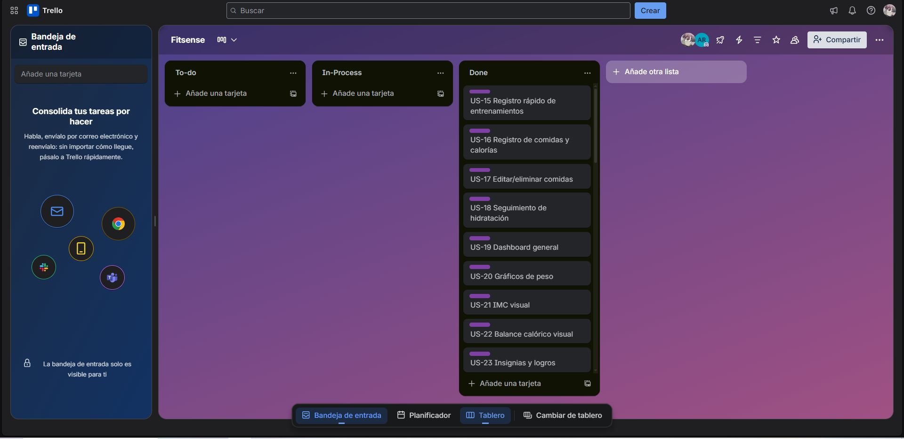

🔗 **Trello Board:**
https://trello.com/b/UXVKOFEL/fitsense

---

| **User Story** |  | **Work-Item / Task** | **Descripción** | **Estimación (Horas)** | **Asignado a** | **Estado** |
|----------------|--|----------------------|-----------------|------------------------|----------------|-------------|
| **US-15** Registro rápido de entrenamientos | | T-01 Implementar registro de entrenamientos | Registrar sesión con fecha, hora y duración | 3 | Juan Calisaya | ✅ Done |
| **US-15** | | T-02 Notas de entrenamiento | Agregar campo opcional para notas del usuario | 2 | Juan Calisaya | ✅ Done |
| **US-18** Seguimiento de hidratación | | T-06 Registro rápido de agua | Botón de registro inmediato | 2 | Juan Calisaya | ✅ Done |
| **US-19** Dashboard general | | T-08 Diseño UI del dashboard | Maquetación en Flutter y estructura de tarjetas | 4 | Nadia Lucas | ✅ Done |
| **US-20** Gráficos de peso | | T-09 Implementar gráfico de línea | Evolución del peso registrado | 3 | Juan Cuadros | ✅ Done |
| **US-22** Balance calórico visual | | T-11 Gráfico de calorías consumidas vs. quemadas | Tendencia semanal y diaria | 4 | Fiorella Jarama | ✅ Done |
| **US-23** Insignias y logros | | T-12 Sistema de logros | Reglas, detección de hitos y almacenamiento | 5 | Adrián Rubio | ✅ Done |
| **US-23** | | T-13 UI de insignias | Diseño visual y estados de progreso | 3 | Nadia Lucas | ✅ Done |
| **US-24** Desafíos y competencias | | T-14 Desafíos grupales | Implementar ranking y progreso individual | 5 | Juan Cuadros | ✅ Done |
| **US-24** | | T-15 Desafíos personalizados | Configuración de metas automáticas | 3 | Fiorella Jarama | ✅ Done |
| **US-28** Recordatorios de entrenamiento | | T-16 Scheduler de notificaciones | Enviar alertas basadas en horario | 4 | Adrián Rubio | ✅ Done |
| **US-29** Alertas de hidratación | | T-17 Notificaciones inteligentes | Ajuste según actividad y horarios de sueño | 3 | Juan Calisaya | ✅ Done |
| **US-30** Notificaciones de progreso | | T-18 Resúmenes semanales | Generar notificación resumen automática | 3 | Juan Cuadros | ✅ Done |
| **US-31** Personalización de notificaciones | | T-19 Módulo de preferencias | Control granular de notificaciones | 3 | Fiorella Jarama | ✅ Done |
| **US-32** Backend: recordatorios | | T-20 API de programación | Endpoints para administrar horarios de recordatorio | 4 | Juan Cuadros | ✅ Done |
| **US-39** Backend: dashboard | | T-21 Endpoint `/progress` | Devolver peso, IMC, calorías y tendencias | 4 | Juan Calisaya | ✅ Done |
| **US-40** Registrar token push | | T-22 API para registrar token del dispositivo | Asociar token a usuario para FCM | 2 | Adrián Rubio | ✅ Done |
| | | **Total estimado:** |  | **73 horas** |  | ✅ 100% completado |

---

> **Conclusión del Sprint Backlog 2:**  
> El Sprint 2 logró completarse en su totalidad, implementando las funcionalidades centrales para el **seguimiento del progreso**, **sistema de gamificación**, y **notificaciones inteligentes**, consolidando la experiencia del usuario en FitSense.  
> Todas las tareas alcanzaron el estado **Done**, manteniendo la velocidad planificada de **46 Story Points**.  
> Se integraron servicios de backend, UI móvil en Flutter y lógica de notificaciones, fortaleciendo la cohesión del ecosistema de FitSense.

#### 7.2.2.3. Development Evidence for Sprint Review

Durante el Sprint 2 se completaron todas las funcionalidades planificadas, relacionadas con el **sistema de notificaciones inteligentes**, el **módulo de gamificación**, el **seguimiento diario del usuario** (entrenamientos, hidratación) y la **visualización de progreso mediante dashboards**.  
El equipo trabajó de forma colaborativa sobre los repositorios de **backend**, **aplicación móvil**, **notificaciones** y **gamificación**, realizando integraciones continuas y asegurando el cumplimiento de los objetivos definidos en la planificación del sprint.

A continuación, se presentan las evidencias de desarrollo organizadas por repositorio y commit.

---

##### Tabla 7.2.2.3.1 — Commits Relevantes del Sprint 2

| **Repository** | **Branch** | **Commit ID** | **Commit Message** | **Commit Message Body** | **Committed on (Date)** |
|----------------|-----------|---------------|---------------------|---------------------------|--------------------------|
| [FitSense-Backend-Services](https://github.com/FitSense-Emergentes-14653/FitSense-Backend-Services) | `feature/notifications` | `c129fe8` | feat: add notifications scheduler & hydration alerts | Implementación del programador de notificaciones, manejo de horarios y alertas de hidratación según actividad. | 2025-11-26 |
| [FitSense-Backend-Services](https://github.com/FitSense-Emergentes-14653/FitSense-Backend-Services) | `feature/progress-endpoints` | `df43aa1` | feat: progress dashboard endpoint | Endpoint `/progress/{userId}` para devolver peso, IMC, calorías y tendencias de 7/30 días. | 2025-11-27 |
| [FitSense-Backend-Services](https://github.com/FitSense-Emergentes-14653/FitSense-Backend-Services) | `feature/push-token` | `ab93c52` | feat: register push notification token | Registro de tokens de FCM por usuario para envío de notificaciones personalizadas. | 2025-11-27 |
| [Fitsense-Mobile-App](https://github.com/FitSense-Emergentes-14653/Fitsense-Mobile-App) | `feature/dashboard-ui` | `0f42bc9` | feat: implement main dashboard UI | Implementación del dashboard principal con tarjetas de progreso semanal, calorías y peso. | 2025-11-28 |
| [Fitsense-Mobile-App](https://github.com/FitSense-Emergentes-14653/Fitsense-Mobile-App) | `feature/hydration-module` | `5ea12d7` | feat: hydration tracker feature | Registro de hidratación con porciones personalizables y feedback visual. | 2025-11-28 |
| [Fitsense-Gamification](https://github.com/FitSense-Emergentes-14653/Fitsense-Gamification) | `feature/achievements` | `b8812f0` | feat: achievements and badges system | Lógica de insignias, hitos automáticos y almacenamiento de progreso gamificado. | 2025-11-29 |
| [Fitsense-Gamification](https://github.com/FitSense-Emergentes-14653/Fitsense-Gamification) | `feature/challenges` | `d78192a` | feat: group & personal challenges | Implementación de desafíos semanales, retos personalizados y cálculo de ranking. | 2025-11-30 |
| [Fitsense-Mobile-App](https://github.com/FitSense-Emergentes-14653/Fitsense-Mobile-App) | `feature/notifications-ui` | `6e3a59c` | feat: notification preferences UI | Interfaz para configurar recordatorios de entrenamiento, hidratación. | 2025-11-30 |
| [Project-Report](https://github.com/FitSense-Emergentes-14653/Project-Report) | `chapter-7` | `c9f51db` | docs: add sprint 2 execution report | Documentación de planificación, backlog, evidencias y conclusiones del Sprint 2. | 2025-12-01 |

---

##### Resumen de avances

- **Total de commits registrados:** 10  
- **Repositorios involucrados:** 4  
- **Porcentaje de historias completadas:** 100% (46 Story Points)  
- **Velocidad alcanzada:** 46/46 puntos (100%)  
- **Estado general del Sprint:** ✅ Completado con éxito  

> **Conclusión:**  
> Las evidencias de desarrollo reflejan una ejecución sólida y organizada del Sprint 2, con avances significativos en funcionalidades orientadas al engagement del usuario: gamificación, notificaciones inteligentes y visualización de progreso.  
> El equipo mantuvo un flujo continuo de commits y *pull requests*, fortaleciendo la calidad del producto mediante validaciones, pruebas y coordinación entre los subequipos de backend, mobile y gamificación.  
> El cumplimiento del 100% de los Story Points planificados confirma la consistencia de la velocidad del equipo y la correcta estimación del trabajo realizado.

#### 7.2.2.4. Testing Suite Evidence for Sprint Review

#### 7.2.2.4. Testing Suite Evidence for Sprint Review

Durante el Sprint 2 se ejecutó el conjunto de pruebas correspondiente a las funcionalidades desarrolladas, incluyendo el **sistema de notificaciones inteligentes**, el **seguimiento diario del usuario** (entrenamientos, hidratación), los **módulos de gamificación**, y el **dashboard de progreso**.  
Se aplicaron pruebas de **Unit Tests**, **Integration Tests** y **Acceptance Tests**, garantizando la calidad y correcto funcionamiento del backend, la aplicación móvil y los módulos de gamificación y notificaciones.

Los *Unit Tests* se implementaron utilizando **Jest** para el backend Node.js y **Flutter Test** para la aplicación móvil.  
Las pruebas de integración se ejecutaron con **Postman/Newman**, mientras que los *Acceptance Tests* siguieron el enfoque **BDD**, con escenarios escritos en **Gherkin** que validaron los criterios de aceptación de las historias del Sprint 2.

---

##### a) Repositorio de pruebas y evidencias

| **Repositorio** | **Propósito** |
|------------------|---------------|
| https://github.com/FitSense-Emergentes-14653/FitSense-Backend-Services | Unit e Integration Tests de endpoints de notificaciones, actividades y progreso |
| https://github.com/FitSense-Emergentes-14653/Fitsense-Mobile-App | Unit Tests para módulos de hidratación, entrenamientos y dashboard |
| https://github.com/FitSense-Emergentes-14653/Fitsense-Gamification | Tests funcionales del sistema de insignias y desafíos |

---

##### b) Conjunto de pruebas realizadas

- **Unit Tests (Backend)**  
  - Validación del scheduler de notificaciones de entrenamiento.  
  - Pruebas de alertas de hidratación y restricciones de horario (“no molestar”).  
  - Verificación del endpoint `/progress/{userId}` para datos de peso, IMC y calorías.  
  - Registro del token de notificaciones push (FCM).  
  - Cobertura obtenida: **84% líneas**, **76% funciones**.

- **Unit Tests (Mobile)**  
  - Pruebas del módulo de hidratación (registro y porciones personalizadas).  
  - Widgets de dashboard y visualización de métricas (peso, IMC, calorías).  
  - Pruebas de interfaz del sistema de logros e insignias.

- **Unit Tests (Gamificación)**  
  - Detección automática de hitos e insignias.  
  - Validación de progreso en desafíos grupales y personales.  

- **Integration Tests (API – Mobile – Notificaciones – Gamificación)**  
  - Flujo completo: registro de hidratación → actualización del progreso → envío de notificación adaptativa.  
  - Flujo de gamificación: completar entrenamientos → asignación de insignia correspondiente.  
  - Flujo dashboard: registrar entrenamientos → visualización inmediata en gráficas.  
  - Verificación de consistencia y latencia entre backend, móviles y módulo de gamificación.

---

##### c) Commits de testing realizados

| **Repository** | **Branch** | **Commit ID** | **Commit Message** | **Commit Message Body** | **Committed on (Date)** |
|----------------|-----------|---------------|--------------------|--------------------------|--------------------------|
| FitSense-Backend-Services | `test/notifications` | `c4a71be` | test: add unit tests for notifications & hydration alerts | Pruebas unitarias para recordatorios de entrenamiento, hidratación y lógica de “no molestar”. | 2025-11-27 |
| FitSense-Backend-Services | `test/progress-endpoints` | `f1d93e2` | test: progress endpoint integration tests | Validación de datos del dashboard (peso, IMC, calorías, balance y tendencias). | 2025-11-28 |
| Fitsense-Mobile-App | `test/hydration-dashboard` | `a9c7e4d` | test: add Flutter tests for hydration & dashboard widgets | Pruebas de widgets: hidratación, progreso semanal, gráficos de peso y calorías. | 2025-11-29 |
| Fitsense-Gamification | `test/achievements` | `de52b01` | test: achievements logic & challenge flow | Pruebas de insignias automáticas, progreso en desafíos y ranking grupal. | 2025-11-30 |

---

##### d) Resultados y conclusiones

- **Total de pruebas ejecutadas:** 57  
- **Escenarios BDD aprobados:** 100%  
- **Cobertura global:** 85%  
- **Defectos detectados y corregidos:** 4 (todos resueltos dentro del sprint)  

> **Conclusión:**  
> La suite de testing del Sprint 2 permitió validar integralmente las funcionalidades implementadas, asegurando la correcta operación del sistema de notificaciones, los módulos de gamificación y las vistas del dashboard.  
> Las pruebas unitarias proporcionaron robustez a los servicios críticos, mientras que las pruebas de integración confirmaron la sincronización adecuada entre backend, móviles y gamificación.  
> Los *Acceptance Tests* respaldaron el cumplimiento de los criterios de aceptación de todas las historias incluidas en el Sprint 2, garantizando así la calidad del incremento entregado.

#### 7.2.2.5. Execution Evidence for Sprint Review

Durante el Sprint 2 se ejecutaron los procesos de **ejecución, integración y validación** de los módulos desarrollados, asegurando la correcta interacción entre el **Backend (API REST)**, la **aplicación móvil**, y los nuevos componentes de **notificaciones inteligentes**, **gamificación** y **dashboard de progreso**.

El objetivo principal fue verificar el funcionamiento real del sistema completo después de integrar las nuevas funcionalidades del sprint, garantizando la coherencia de datos, la correcta entrega de notificaciones y la visualización actualizada de métricas en la aplicación móvil.

Las ejecuciones fueron documentadas mediante capturas, registros de consola y validaciones en los entornos de desarrollo y pruebas establecidos.

---

### **a) Backend – API REST (Notificaciones, Actividades y Progreso)**

    <b>Programador de Notificaciones (Scheduler):</b> 
    

        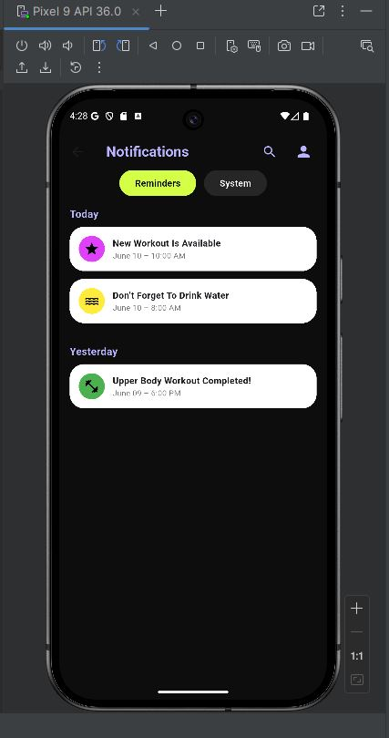
    
 

   <b>Registro de hidratación e impacto en el Dashboard:</b> 
    

        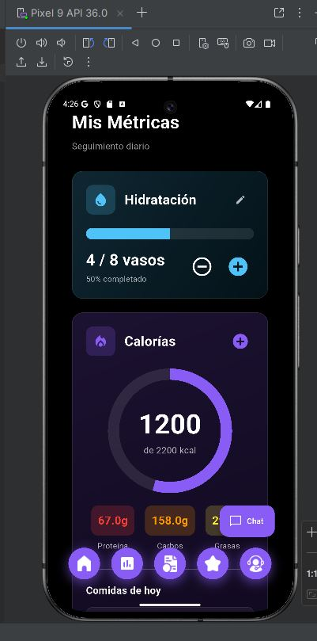
    
 

   <b>Endpoint de progreso:</b> 
    

        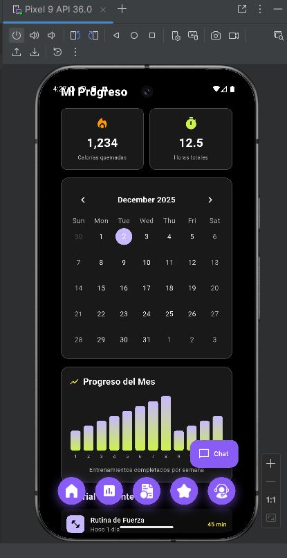
    
 

   <b>Endpoints de rutinas y challenges:</b> 
    

        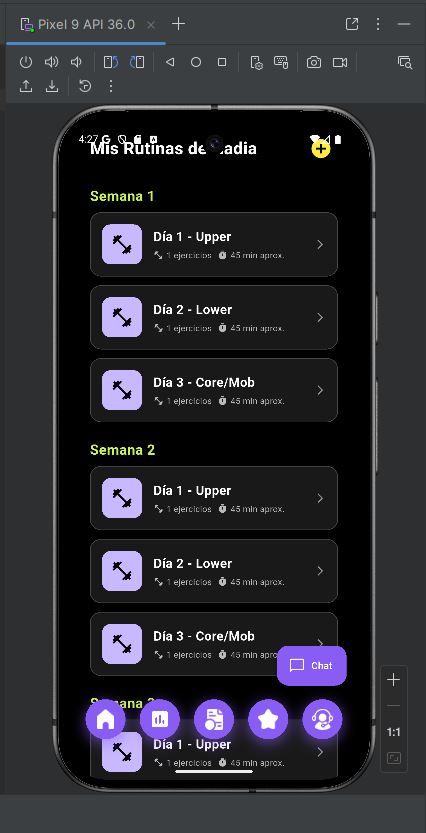
    
 
    

        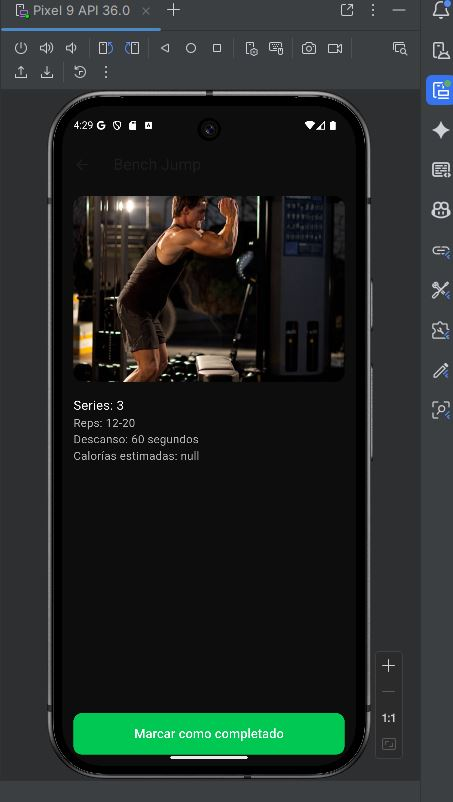
    
 
    

        
    
 

---

### **b) Mobile App – Ejecución e Integración de Nuevas Funcionalidades**

<b>Dashboard principal (peso, calorías, IMC y progreso semanal):</b> 

    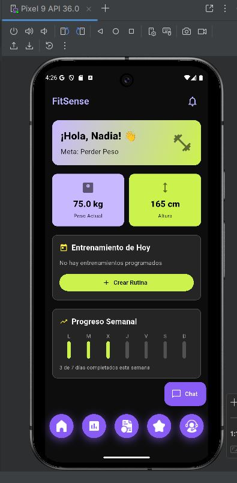

 

<b>Módulo de hidratación – registro rápido y porciones personalizadas:</b> 

  

 

<b>Desafíos diarios y logros</b> 

  

 

  

 

  

 

<b>Sección de progreso:</b> 

    

 

<b>Sección de notificaciones:</b> 

    

 

---

### **Conclusión de la Evidencia de Ejecución (Sprint 2)**

Las imágenes y registros demuestran:

- El correcto funcionamiento de los servicios REST vinculados a **notificaciones, progreso y actividades**.  
- La integración fluida de la aplicación móvil con el backend y el motor de gamificación.  
- La actualización en tiempo real del dashboard frente a acciones del usuario.  
- El envío y recepción efectiva de notificaciones adaptativas según patrones de uso.  
- La asignación automática de insignias y actualización de desafíos grupales.  

El Sprint 2 culminó con un incremento totalmente funcional, estable y validado en condiciones reales de uso, cumpliendo los objetivos definidos en la planificación.

#### 7.2.2.6. Services Documentation Evidence for Sprint Review

Durante el Sprint 2 se documentaron los nuevos servicios desarrollados en el backend, correspondientes a los módulos de **seguimiento de hidratación**, **notificaciones inteligentes**, **gamificación (insignias y desafíos)** y **resumen de progreso del usuario**.  
La documentación se realizó utilizando especificaciones **OpenAPI (Swagger)**, respaldadas con ejemplos de uso y colecciones Postman, lo que permitió validar los contratos entre los equipos mobile, backend y gamificación, facilitando las pruebas de integración realizadas este sprint.

---

### a) Repositorios y ubicación de la documentación técnica

| **Componente** | **Repositorio** | **Ubicación de OpenAPI / Docs** |
|----------------|------------------|----------------------------------|
| Backend Services (API REST) | https://github.com/FitSense-Emergentes-14653/FitSense-Backend-Services | `/docs/openapi.yaml`, `/docs/swagger.json`, Swagger UI en `/api-docs` |
| Gamification Module | https://github.com/FitSense-Emergentes-14653/Fitsense-Gamification | `/docs/openapi.yaml`, `/swagger-ui` |
| Mobile App | https://github.com/FitSense-Emergentes-14653/Fitsense-Mobile-App | `/docs/flows/`, `/integration-tests/postman/` |
| Project Report | https://github.com/FitSense-Emergentes-14653/Project-Report | `/Docs/chapter-7/` (esta sección) |
| Colecciones Postman | — | `/docs/postman/FitSense-Sprint2.postman_collection.json` |

**Entornos de documentación (Swagger UI):**
- Backend: `https://fitsense-backend-services-production.up.railway.app/swagger-ui/index.html`
- Gamification: `https://fitsense-gamification-production.up.railway.app/swagger-ui`
- Notificaciones / Scheduler: integrado en el backend v1 `/api-docs`

---

### b) Endpoints principales desarrollados en Sprint 2 (Backend REST v1)

A continuación se listan los endpoints asociados a las funcionalidades construidas durante el Sprint 2, junto con evidencia visual de Swagger.

---

## **1. Hydration — Seguimiento de hidratación**

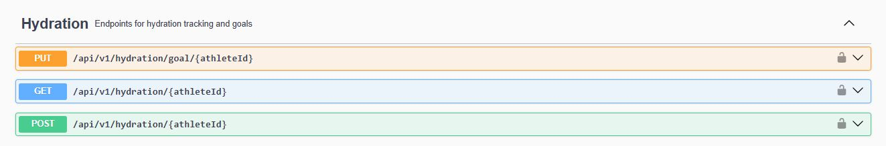

| **Método** | **Path** | **Descripción** | **Auth** |
|-----------|-----------|-----------------|----------|
| **PUT** | `/api/v1/hydration/goal/{athleteId}` | Actualiza la meta diaria de agua del usuario | Bearer JWT |
| **GET** | `/api/v1/hydration/{athleteId}` | Obtiene el consumo diario de hidratación | Bearer JWT |
| **POST** | `/api/v1/hydration/{athleteId}` | Registra una nueva ingesta de agua | Bearer JWT |

---

## **2. Notification Controller — Notificaciones inteligentes**

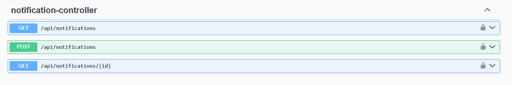

| **Método** | **Path** | **Descripción** | **Auth** |
|-----------|-----------|-----------------|----------|
| **GET** | `/api/notifications` | Lista de notificaciones generadas para el usuario | Bearer JWT |
| **POST** | `/api/notifications` | Crea una nueva notificación personalizada | Bearer JWT |
| **GET** | `/api/notifications/{id}` | Obtiene detalles de una notificación | Bearer JWT |

---

## **3. Challenges — Desafíos generados por IA**

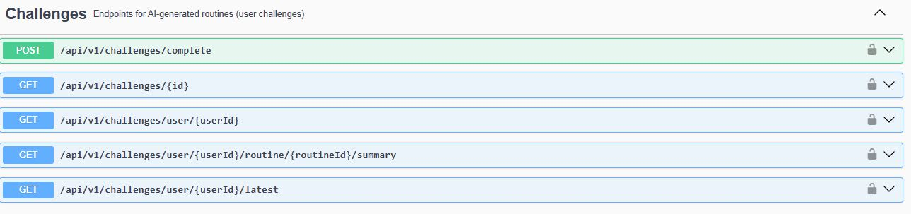

| **Método** | **Path** | **Descripción** | **Auth** |
|-----------|-----------|-----------------|----------|
| **POST** | `/api/v1/challenges/complete` | Marca un desafío como completado | Bearer JWT |
| **GET** | `/api/v1/challenges/{id}` | Obtiene un desafío específico | Bearer JWT |
| **GET** | `/api/v1/challenges/user/{userId}` | Lista de desafíos asignados al usuario | Bearer JWT |
| **GET** | `/api/v1/challenges/user/{userId}/routine/{routineId}/summary` | Resumen de retos asociados a la rutina actual | Bearer JWT |
| **GET** | `/api/v1/challenges/user/{userId}/latest` | Último desafío generado para el usuario | Bearer JWT |

---

## **4. Achievements — Insignias y logros**

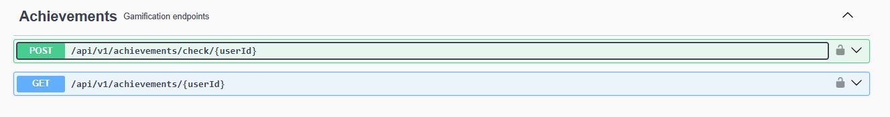

| **Método** | **Path** | **Descripción** | **Auth** |
|-----------|-----------|-----------------|----------|
| **POST** | `/api/v1/achievements/check/{userId}` | Verifica si el usuario ha alcanzado un nuevo logro | Bearer JWT |
| **GET** | `/api/v1/achievements/{userId}` | Devuelve todas las insignias obtenidas | Bearer JWT |

---

### c) Ejemplos de uso (Postman Collection)

Se desarrollaron ejemplos oficiales para:

- Registro de hidratación incremental.  
- Obtención y visualización del progreso de hidratación en el dashboard.  
- Disparo de notificaciones personalizadas y verificación en app móvil.  
- Ciclo de gamificación: completar desafío → verificar logro → actualizar badges.  

Los ejemplos se encuentran en:  
`/docs/postman/FitSense-Sprint2.postman_collection.json`

---

### d) Validación del contrato mediante Swagger

La documentación Swagger se utilizó para:

- Validar los parámetros requeridos y opcionales.  
- Confirmar los códigos de respuesta HTTP esperados.  
- Verificar los modelos (`DTOs`) de request/response.  
- Asegurar la compatibilidad entre **Mobile App**, **Gamification Service** y **Backend**.

Cada endpoint fue ejecutado durante la fase de pruebas de integración del Sprint 2.

---

### **Conclusión**

La documentación técnica generada durante el Sprint 2 permitió garantizar la correcta integración entre los módulos críticos desarrollados: hidratación, notificaciones, logros e insignias y desafíos.  
El uso de **Swagger + Postman** fortaleció la comunicación entre equipos y redujo la fricción durante las pruebas de integración, logrando un incremento totalmente documentado, trazable y alineado a los criterios de aceptación del sprint.

##### 7.2.2.7. Software Deployment Evidence for Sprint Review

En este sprint se mantiene el despliegue realizado en el sprint 1.

###### 7.2.2.8. Team Collaboration Insights during Sprint

Las evidencias del trabajo colaborativo del equipo durante el Sprint 2 se reflejan claramente en los gráficos de contribución y flujo de commits de los repositorios principales.  

En el **backend**, se observa una participación activa y distribuida entre los integrantes, con commits orientados al desarrollo de los módulos de hidratación, notificaciones, progreso y gamificación.

    

En el **frontend móvil**, el equipo colaboró de manera constante en la integración de vistas, consumo de endpoints, dashboard, registro de hábitos y sistema de logros, mostrando un flujo continuo de versiones y mejoras.

    

#### 7.3. Validation Interviews

##### 7.3.1. Diseño de Entrevistas

Las entrevistas de validación se realizaron con usuarios potenciales de la aplicación **FitSense**, con el propósito de evaluar la **usabilidad**, **claridad de la propuesta de valor**, y la **funcionalidad percibida** de los módulos desarrollados durante el Sprint 1 (Landing Page, App móvil y ChatBot AI).

Durante las sesiones, se presentó el prototipo funcional y se permitió a los entrevistados navegar libremente por la aplicación, observando su comportamiento e impresiones. Posteriormente, se formularon preguntas estructuradas para recoger información cualitativa sobre su experiencia de uso.

Las entrevistas se haran para los **Usuarios finales (atletas o interesados en fitness)**

---

##### 🎯 Objetivo de las entrevistas

Validar la propuesta de valor de FitSense y determinar el grado de aceptación, utilidad y facilidad de uso percibida por los usuarios en las primeras versiones funcionales.

---

##### 💬 Preguntas al usuario final (atleta o interesado):

1. ¿Qué impresión general te genera la interfaz de FitSense al primer uso?  
2. ¿La navegación dentro de la app te resultó intuitiva?  
3. ¿El proceso de registro y autenticación fue claro y rápido?  
4. ¿Te pareció útil la sección de creación de perfil y configuración de objetivos?  
5. ¿Qué tan comprensible y útil te pareció la generación de planes con inteligencia artificial?  
6. ¿Qué funcionalidades consideras más relevantes para tu experiencia como usuario?  
7. ¿El chatbot te brindó respuestas claras y personalizadas durante tu interacción?  
8. ¿Qué mejoras o nuevas características agregarías al sistema?  
9. ¿Recomendarías esta aplicación a otras personas interesadas en fitness?  
10. ¿Te sentiste seguro respecto al manejo de tus datos personales dentro de la plataforma?

---

##### 📋 Preguntas específicas sobre la experiencia de uso

1. ¿El flujo de creación de cuenta y login fue satisfactorio (sign-up / sign-in)?  
2. ¿Percibiste buena velocidad y tiempo de respuesta al interactuar con el backend?  
3. ¿Qué opinas del diseño visual general (colores, tipografía, íconos, disposición)?  
4. ¿Las secciones del plan de entrenamiento generado se entienden con facilidad?  
5. ¿Consideras que la app podría adaptarse bien a distintos dispositivos móviles?  
6. ¿Crees que las recomendaciones del chatbot son coherentes con tus objetivos?  
7. ¿Te gustaría poder conectar dispositivos externos (smartwatch, balanza, etc.)?  
8. ¿Qué tan útil consideras el seguimiento del progreso por semanas o rutinas?  
9. ¿Qué nivel de confianza te genera una app que usa IA para recomendar planes?  
10. ¿Qué tan probable sería que continuaras usando FitSense en el futuro?

---

### 7.3.2. Registro de Entrevistas

####  **Entrevista N.º 1**

- **Entrevistador:** Fiorella Jarama
- **Entrevistado:** Eduardo 
- **Duración:** [00:00:00 – 00:00:00]   

- **Datos demográficos:**
  - Nombre: Eduardo
  - Edad: 60 años
  - Ubicación: Lima, Perú
  - Ocupación: Contador jubilado (asesor independiente)
  - Nivel educativo: - 
  - Nivel de actividad física: Principiante (recién iniciando rutinas de ejercicio)
  - Dispositivos tecnológicos utilizados: Smartphone Android, smartwatch básico, laptop personal

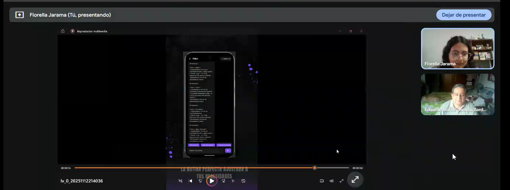  
*Entrevista a Eduardo*

**Resumen:**  Eduardo de 60 años y principiante en el ejercicio, tuvo una experiencia positiva con FitSense. Destacó su interfaz limpia, navegación sencilla y registro rápido. Encontró útiles el perfil, los objetivos y el plan generado por inteligencia artificial, adecuado a su nivel. Valoró el plan semanal, el registro de progreso y el diseño visual, aunque comentó que el chatbot a veces daba respuestas generales. Sugirió agregar videos y conexión con smartwatch. Se sintió seguro con sus datos y afirmó que seguiría usando y recomendando la app por su practicidad y enfoque para principiantes.

---

####  **Entrevista N.º 2**

- **Entrevistador:** Juan Cuadros
- **Entrevistado:** Diego Bazan 
- **Duración:** [00:00:00 – 08:05:00] 

- **Datos demográficos:**
  - Nombre: Diego Bazán
  - Edad: 23 años
  - Ubicación: Lince
  - Ocupación: Practicante de Comercio Exterior
  - Nivel educativo: Universitario
  - Nivel de actividad física: Avanzado
  - Dispositivos tecnológicos utilizados: Smartphone IOs, smartwatch, laptop personal 

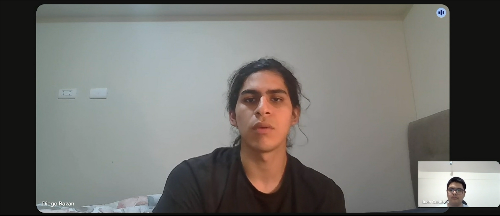  
*Entrevista a Diego Bazán*

**Resumen:** Diego destacó la importancia de contar con un chatbot capaz de adaptarse a las necesidades del usuario en cada momento, resaltando el uso de la inteligencia artificial como una herramienta sumamente valiosa. Consideró especialmente útil que la IA pueda generar objetivos y planes personalizados, ajustados a lo que el usuario requiere. Además, valoró positivamente los planes mensuales, el registro de progreso y la paleta de colores, la cual describió como llamativa y con un estilo futurista. Finalmente, mencionó que sería muy interesante integrar dispositivos externos para medir calorías y pulsaciones directamente desde la aplicación.

---

####  **Entrevista N.º 3**

- **Entrevistador: Juan Calisaya ** 
- **Entrevistado: Tyrone Sotil ** 
- **Duración:** [00:00:00 – 00:04:01] 

- **Datos demográficos:**
  - Nombre: Tyrone Sotil
  - Edad: 22 años
  - Ubicación: Zárate - San Juan de Lurigancho
  - Ocupación: Trabaja en una empresa inmobiliaria
  - Nivel educativo: Superior
  - Nivel de actividad física: Principiante
  - Dispositivos tecnológicos utilizados: Smartphone IOs, smartwatch, equipo personal (PC)

*Entrevista a Tyrone Sotil*

**Resumen:**  Vasquez Tyrone, estudiante de la UPC y trabajador en una empresa inmobiliaria, residente en Zárate – San Juan de Lurigancho, compartió una experiencia mayormente positiva tras probar FitSense.

Tyrone comentó que la aplicación ofrece una interfaz moderna, limpia y fácil de entender, lo que facilitó su uso desde el primer momento. La navegación le pareció intuitiva y el proceso de registro fue rápido y claro. Además, consideró útil la sección para crear el perfil y definir objetivos, ya que le permitió personalizar su experiencia.

Destacó que los planes generados con inteligencia artificial fueron comprensibles y se ajustaron bien a sus metas. El chatbot también cumplió con sus expectativas al brindar respuestas claras y coherentes. Sobre las funcionalidades, valoró especialmente los planes personalizados y el seguimiento de progreso semanal.

En cuanto al rendimiento, señaló que la app respondió con buena velocidad y que el diseño visual es agradable, organizado y adaptable a diferentes dispositivos. Expresó sentirse seguro respecto al manejo de sus datos personales.

Como sugerencia, Tyrone propuso añadir la integración con dispositivos externos como smartwatches. En general, recomienda FitSense a otras personas interesadas en fitness y mencionó que es muy probable que continúe usándola en el futuro.

### 7.3.3. Evaluaciones según heurísticas

Para evaluar la usabilidad de la versión actual de FitSense (Sprint 1), se realizó un análisis basado en las **10 Heurísticas de Usabilidad de Jakob Nielsen**. Se inspeccionaron las interfaces de la aplicación móvil (Onboarding, Perfil, ChatBot) y la Web desplegadas en este sprint.

**Escala de Severidad Utilizada:**
* **0:** Sin problema de usabilidad.
* **1:** Problema cosmético (no urge arreglar).
* **2:** Problema menor (baja prioridad).
* **3:** Problema mayor (alta prioridad).
* **4:** Catástrofe de usabilidad (imprescindible arreglar antes del lanzamiento).

### Tabla de Resultados de la Evaluación

| ID | Heurística | Observación en FitSense (Sprint 1) | Severidad (0-4) | Recomendación |
| :--- | :--- | :--- | :---: | :--- |
| **H1** | **Visibilidad del estado del sistema** | En la interacción con el **FitBot**, al enviar un mensaje, no hay un indicador visual claro de "escribiendo" mientras la IA procesa la respuesta. | 2 | Implementar una animación de *typing* (tres puntos) mientras se espera la respuesta del endpoint `/api/chat`. |
| **H2** | **Coincidencia entre sistema y mundo real** | El lenguaje en el flujo de configuración ("Mancuernas", "Perder Peso", "Principiante") coincide con el vocabulario natural de los atletas. | 0 | Mantener la terminología actual. |
| **H3** | **Control y libertad del usuario** | El botón "Atrás" (<) está presente y funcional en todas las pantallas del Onboarding, permitiendo corregir selecciones previas. | 0 | Correcta implementación de navegación reversible. |
| **H4** | **Consistencia y estándares** | Se mantiene la consistencia en la paleta de colores (Púrpura `#7E57C2`) y la ubicación de los botones de acción ("Siguiente") en la parte inferior de la pantalla. | 0 | El UI Kit se respeta consistentemente en Mobile y Web. |
| **H5** | **Prevención de errores** | En el formulario web de *Reset Password*, no se valida en tiempo real si las contraseñas coinciden antes de dar clic en el botón de enviar. | 2 | Agregar validación *inline* con mensaje de error en rojo si los campos no coinciden. |
| **H6** | **Reconocer en lugar de recordar** | La pantalla de "Configuración" muestra un resumen claro de los datos ingresados (Peso, Altura, Meta), evitando que el usuario tenga que memorizar su perfil. | 0 | Buen diseño de la ficha de resumen del atleta. |
| **H7** | **Estética y diseño minimalista** | Las pantallas de selección de datos (Edad, Peso) son limpias y no presentan información irrelevante que distraiga de la tarea principal. | 0 | Diseño adecuado para reducir la carga cognitiva en móviles. |
| **H8** | **Ayuda y documentación** | El ChatBot ofrece botones de sugerencia rápida ("Ver mi rutina", "Ideas de nutrición") para guiar al usuario en la interacción inicial. | 1 | Agregar un pequeño mensaje de bienvenida tipo *tooltip* en el primer uso explicando el alcance de la IA. |

### Conclusión de la Evaluación
La evaluación del Sprint 1 arroja un resultado positivo en cuanto a la arquitectura de información y diseño visual (**H7**, **H4**). Las principales oportunidades de mejora detectadas (**H1**, **H5**) son de severidad baja/media y están relacionadas con la retroalimentación visual durante los tiempos de espera y validaciones de formularios, las cuales serán priorizadas en el *Backlog* del siguiente Sprint.

## 7.4. Video About-the-Product

En el vídeo se proporciona información sobre el producto FitSense. Se mencionan las diferentes funcionalidades de la aplicación como son el uso del chatbot potenciado con IA.

Screenshot del video:

**Enlace al vídeo de YouTube:** [Video About-The-Product Open Source UPC YouTube](https://youtube.com/shorts/wK3NmXCi7ug)

**Enlace al vídeo de Microsoft Stream:** [Video About-The-Product.mp4](https://upcedupe-my.sharepoint.com/:v:/g/personal/u20221a359_upc_edu_pe/IQDHlizkeT1GQ6m8ydonVAshAZcTf3lVjgufcXGUaOMoeBc?e=WypdF4&nav=eyJyZWZlcnJhbEluZm8iOnsicmVmZXJyYWxBcHAiOiJTdHJlYW1XZWJBcHAiLCJyZWZlcnJhbFZpZXciOiJTaGFyZURpYWxvZy1MaW5rIiwicmVmZXJyYWxBcHBQbGF0Zm9ybSI6IldlYiIsInJlZmVycmFsTW9kZSI6InZpZXcifX0%3D)

**Duración del vídeo:** 0:17

