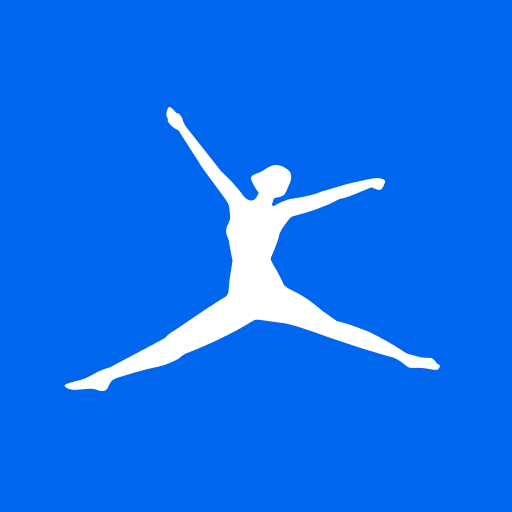
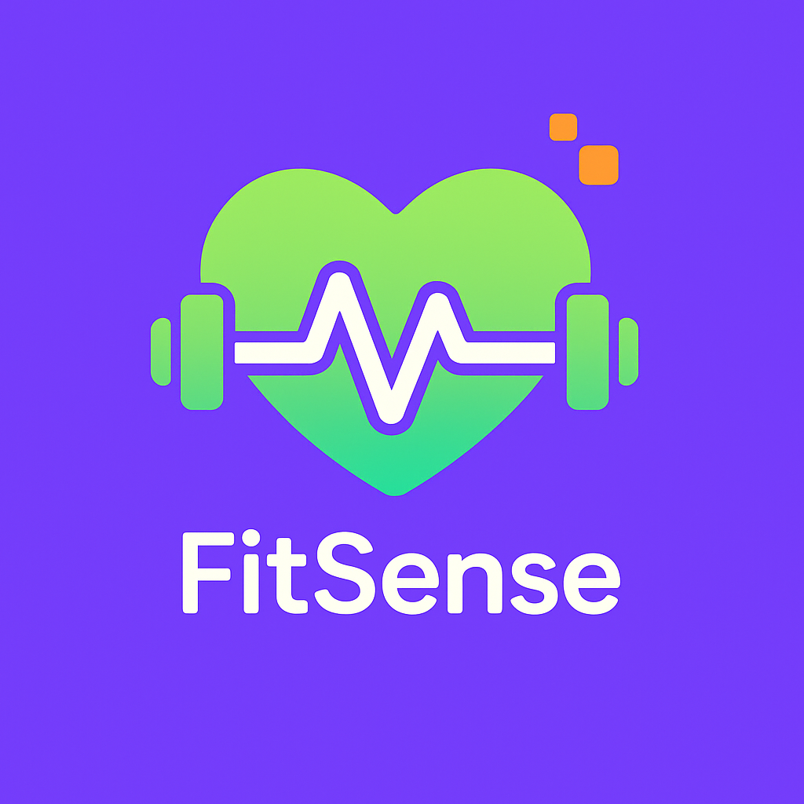

# Capítulo II Requirements Elicitation & Analysis

## 2.1. Competidores

### 2.1.1. Análisis competitivo

| **Competitive Analysis Landscape** |  |
|----------------------------------|--|
| **¿Por qué llevar a cabo este análisis?** | Objetivo 1: Conocer las propuestas ofrecidas por competidores en apps de fitness/nutrición y aprender de sus fortalezas y limitaciones. Objetivo 2: Identificar puntos fuertes y áreas de mejora de los competidores para definir una estrategia competitiva sólida para FitSense. |

| Empresa/App | MyFitnessPal | Nike Training Club | Fitbit | FitSense |
|-------------|--------------|-----------------|--------|----------|
| Logo |  |  |  |  |

**Perfil**

| Perfil | Overview |
|--------|---------|
| MyFitnessPal | Plataforma integral de tracking nutricional y de ejercicio con base de datos de alimentos y seguimiento de calorías. |
| Nike Training Club | App enfocada en entrenamiento guiado y rutinas personalizadas para diferentes niveles y objetivos. |
| Fitbit | App vinculada a dispositivos wearables para medir actividad física, sueño y salud general. |
| FitSense | Aplicación móvil AI-powered que combina seguimiento de ejercicios, nutrición personalizada y recomendaciones inteligentes basadas en datos y objetivos del usuario. |

**Ventaja competitiva**

| Perfil | Ventaja competitiva / Valor para el usuario |
|--------|--------------------------------------------|
| MyFitnessPal | Amplia base de datos de alimentos y facilidad para registrar ingesta, útil para control nutricional. |
| Nike Training Club | Entrenamientos guiados de alta calidad con enfoque en motivación y progreso físico. |
| Fitbit | Integración con dispositivos y seguimiento en tiempo real de actividad, sueño y salud general. |
| FitSense | Combina AI para recomendaciones personalizadas, seguimiento integral y análisis de progreso con gamificación para aumentar adherencia y motivación. |

**Perfil de Marketing**

| Perfil | Mercado objetivo | Estrategias de marketing |
|--------|----------------|------------------------|
| MyFitnessPal | Personas interesadas en controlar su nutrición y pérdida de peso. | Marketing de contenido, colaboración con influencers fitness, presencia en redes sociales. |
| Nike Training Club | Usuarios que buscan entrenamientos guiados y motivación física. | Campañas de marca Nike, promoción de entrenamientos específicos, contenido digital. |
| Fitbit | Personas con interés en salud, fitness y uso de dispositivos wearables. | Promoción de wearables, campañas de salud y bienestar, publicidad en línea. |
| FitSense | Personas interesadas en fitness y nutrición con enfoque en AI para personalización y progreso medible. | Marketing digital basado en contenido educativo, redes sociales, colaboraciones con gimnasios y nutricionistas. |

**Perfil de Producto**

| Perfil | Productos & Servicios | Precios & Costos | Canales de distribución |
|--------|--------------------|----------------|----------------------|
| MyFitnessPal | Tracking de alimentos y ejercicio, comunidad online, integraciones con otras apps y dispositivos. | Freemium con planes premium (mensual/anual). | Web y móvil (iOS/Android). |
| Nike Training Club | Rutinas de entrenamiento, videos guiados, planes de entrenamiento. | Gratis con opción premium en algunos programas. | Móvil (iOS/Android). |
| Fitbit | Tracking de actividad, sueño, métricas de salud, retos y comunidad. | Freemium con planes premium. | Móvil (iOS/Android) y dispositivos wearables. |
| FitSense | Seguimiento de ejercicios, nutrición personalizada, recomendaciones AI, gamificación y dashboards de progreso. | Modelo de suscripción mensual o anual. | Móvil (iOS/Android), con integración opcional web para dashboards. |

**Análisis SWOT**

| Perfil | Fortalezas | Debilidades | Oportunidades | Amenazas |
|--------|------------|-------------|---------------|----------|
| MyFitnessPal | Base de datos de alimentos extensa, comunidad activa, integraciones múltiples. | Interfaz poco personalizada, foco limitado en entrenamiento guiado. | Creciente interés en apps de nutrición y bienestar. | Competencia creciente de apps de nutrición y fitness personalizadas. |
| Nike Training Club | Entrenamientos de alta calidad, branding fuerte, motivación. | Limitado a rutinas, poco seguimiento nutricional, no personalizado por AI. | Colaboración con influencers y expansión de entrenamientos premium. | Competencia de apps integrales con AI. |
| Fitbit | Integración con dispositivos, métricas de salud completas. | Requiere wearable para máximo provecho, costo de hardware. | Expansión en salud digital y monitoreo remoto. | Competencia de apps móviles que no requieren dispositivos. |
| FitSense | Personalización AI, seguimiento integral, gamificación, insights accionables. | Nuevo en el mercado, requiere marketing agresivo y adopción. | Expansión de mercado en wellness y AI-driven apps. | Competidores consolidados y apps gratuitas con alta adopción. |

### 2.1.2. Estrategias y tácticas frente a competidores

**Estrategias:**

- **Diferenciación del producto:** Destacar la personalización mediante AI, gamificación y dashboards de progreso, diferenciándose de apps con funciones parciales.  
- **Enfoque en valor agregado:** Resaltar cómo FitSense mejora adherencia, resultados y experiencia de usuario en fitness y nutrición, no solo tracking básico.  

**Tácticas:**

- **Marketing de contenido:** Crear artículos, videos y publicaciones educativas sobre nutrición, fitness y uso de AI para mejorar resultados.  
- **Programas de prueba y demostraciones:** Ofrecer pruebas gratuitas, retos y simuladores para que los usuarios experimenten beneficios.  
- **Alianzas estratégicas:** Colaborar con gimnasios, entrenadores, nutricionistas y eventos de bienestar.  
- **Servicio al cliente excepcional:** Soporte rápido, tutoriales y comunidad interactiva para fidelización de usuarios.  

## 2.2. Entrevistas

### 2.2.1. Diseño de entrevistas

#### 2.2.1.1. Usuario objetivo

**Datos demográficos:**
- Nombre
- Edad
- Ubicación
- Ocupación
- Nivel educativo
- Nivel de actividad física (sedentario, principiante, intermedio, avanzado)
- Dispositivos tecnológicos utilizados (smartphone, smartwatch, apps de fitness)

**Preguntas principales**

1. ¿Qué medio utilizas actualmente para planificar tus entrenamientos o rutinas de alimentación? ¿Por qué?

2. ¿Has utilizado antes alguna aplicación de fitness o nutrición? ¿Qué problemas encontraste?

3. ¿Qué tan importante es para ti que un plan de entrenamiento o nutrición esté personalizado según tus metas y características?

4. ¿Qué factores te motivan a continuar usando una aplicación de salud o ejercicio?

5. ¿Qué hace que abandones una aplicación o dejes de seguir un plan fitness?

6. ¿Cómo te gustaría que una aplicación como FitSense te ayude a alcanzar tus objetivos?

7. ¿Qué características consideras indispensables en una app de fitness (ejemplo: recordatorios, dashboard de progreso, recetas, integración con wearables)?

8. ¿Qué tan importante es para ti poder visualizar tu progreso (peso, IMC, calorías quemadas, etc.) en gráficos o reportes dentro de la app?

9. ¿Qué opinas sobre recibir recordatorios o notificaciones inteligentes que te motiven a no abandonar tu plan?

10. Si pudieras diseñar tu aplicación de fitness ideal, ¿qué funcionalidades incluirías?

### 2.2.2 Registro de entrevistas

**Usuario cliente**

### 2.2.3. Análisis de entrevistas

## 2.3 Needfinding

A continuación, se mostrará los artefactos realizados de acuerdo a la retroalimentación de las necesidades de los usuarios a través de las entrevistas. Estos artefactos creados son para los dos tipos de segmentos objetivos: cliente. Estos son user personas, user tax matrix, empathy mapping y el as-is escenario mapping.

### 2.3.1 User personas

#### 2.3.1.1 Cliente

<image
  src="../img/user-persona-cliente.png"
  alt="User persona cliente">

### 2.3.2 User Task Matrix

Se realiza un análisis de las principales funciones detectadas en la problemática. Esto se elaboró a partir de los comentarios obtenidos en las entrevistas realizadas al único segmento de usuario definido: personas que buscan crear su propio plan fitness.

<table>
  <tr>
    <th rowspan="2">Task Matrix</th>
    <th colspan="2">Usuario</th>
  </tr>
  <tr>
    <td>Frecuencia</td>
    <td>Importancia</td>
  </tr>
  <tr>
    <td>Planificar entrenamientos semanales</td>
    <td>Siempre</td>
    <td>Alta</td>
  </tr>
  <tr>
    <td>Registrar comidas</td>
    <td>Frecuente</td>
    <td>Media</td>
  </tr>
  <tr>
    <td>Visualizar métricas de progreso (peso, IMC, calorías)</td>
    <td>A veces</td>
    <td>Alta</td>
  </tr>
  <tr>
    <td>Recibir recordatorios o notificaciones</td>
    <td>A veces</td>
    <td>Alta</td>
  </tr>
  <tr>
    <td>Consultar recomendaciones de suplementos</td>
    <td>Rara vez</td>
    <td>Media</td>
  </tr>
</table>

### 2.3.3 Empathy mapping

#### 2.3.3.1 cliente

El siguiente mapa de empatía representa al segmento objetivo identificado: personas que desean mejorar su condición física mediante un plan integral de entrenamiento y nutrición personalizado a través de la aplicación <b>FitSense</b>.

<table>
  <tr>
    <td colspan="2" align="center"><b>1. WHO are we empathizing with?</b></td>
  </tr>
  <tr>
    <td colspan="2" align="justify">
      Usuarios entre 16 y 55 años que desean mejorar su condición física (bajar de peso, ganar masa muscular, mantenerse saludables) y buscan una aplicación accesible, motivadora y fácil de usar.
    </td>
  </tr>

  <tr>
    <td width="50%" align="justify"><b>2. What do they NEED to DO?</b> 
      - Seguir un plan de entrenamiento y nutrición adaptado a sus objetivos. 
      - Mantener constancia y motivación en el tiempo. 
      - Registrar comidas, entrenamientos y métricas de forma sencilla. 
    </td>
    <td width="50%" align="justify"><b>3. What do they SEE?</b> 
      - Muchas apps de fitness genéricas y poco personalizadas. 
      - Soluciones que requieren pagar planes premium costosos. 
      - Influencers en redes sociales con planes difíciles de seguir. 
    </td>
  </tr>

  <tr>
    <td width="50%" align="justify"><b>4. What do they SAY?</b> 
      - “He probado varias apps, pero ninguna me mantiene motivado.” 
      - “Quiero ver resultados claros de mi esfuerzo.” 
      - “Necesito una aplicación que me acompañe día a día, no solo que me dé una rutina genérica.” 
    </td>
    <td width="50%" align="justify"><b>5. What do they DO?</b> 
      - Descargan múltiples aplicaciones de entrenamiento y nutrición. 
      - Intentan seguir planes gratuitos de internet. 
      - Abandonan rutinas tras pocas semanas por falta de motivación. 
    </td>
  </tr>

  <tr>
    <td width="50%" align="justify"><b>6. What do they HEAR?</b> 
      - Recomendaciones de amigos sobre rutinas y dietas. 
      - Mensajes de “fitness rápido” en redes sociales. 
      - Opiniones sobre apps conocidas pero difíciles de usar. 
    </td>
    <td width="50%" align="justify"><b>7. What do they THINK and FEEL?</b> 
      - Quieren mejorar su salud y verse mejor, pero sienten frustración. 
      - Les preocupa no tener tiempo suficiente para entrenar. 
      - Buscan confianza en una app que les muestre resultados medibles. 
    </td>
  </tr>

  <tr>
    <td width="50%" align="justify"><b>PAINS</b> 
      - Falta de motivación y constancia. 
      - Planes genéricos que no se adaptan a sus necesidades. 
      - Costos elevados de entrenadores y nutricionistas. 
      - Uso de varias apps desconectadas (entrenamiento, dieta, suplementos). 
    </td>
    <td width="50%" align="justify"><b>GAINS</b> 
      - Tener un plan integral y accesible en un solo lugar. 
      - Ver resultados claros en su progreso físico. 
      - Recibir recordatorios inteligentes que aumenten su motivación. 
      - Ahorrar tiempo y dinero con una alternativa digital confiable. 
    </td>
  </tr>
</table>

#### 2.3.3.1 cliente

<image
  src="../images/empathy-mapping-cliente.png"
  alt="Emapthy mapping de cliente">

### 2.3.4 As-is scenario mapping
#### 2.3.4.1 cliente

El siguiente mapa representa el escenario actual del usuario objetivo, mostrando las fases, pensamientos, acciones y emociones que atraviesa cuando intenta mejorar su condición física con ayuda de aplicaciones de fitness existentes.

<table>
  <tr>
    <th>Phases</th>
    <th>Doing</th>
    <th>Thinking</th>
    <th>Feeling</th>
  </tr>
  <tr>
    <td><b>Búsqueda de soluciones</b></td>
    <td>Descarga varias aplicaciones de fitness y busca rutinas en internet.</td>
    <td>“Será difícil encontrar una app que realmente se adapte a mí.”</td>
    <td>Frustración y dudas por la gran cantidad de apps poco claras.</td>
  </tr>
  <tr>
    <td><b>Primeros intentos</b></td>
    <td>Prueba planes gratuitos de apps o rutinas en YouTube.</td>
    <td>“Ojalá esta rutina me ayude a lograr mis objetivos.”</td>
    <td>Esperanza inicial, pero también incertidumbre por falta de personalización.</td>
  </tr>
  <tr>
    <td><b>Uso constante</b></td>
    <td>Registra entrenamientos y comidas durante algunas semanas.</td>
    <td>“¿Realmente estoy progresando o perdiendo el tiempo?”</td>
    <td>Ansiedad por no ver resultados claros y dificultad en mantener la motivación.</td>
  </tr>
  <tr>
    <td><b>Desmotivación</b></td>
    <td>Deja de registrar datos o abandona la aplicación.</td>
    <td>“Tal vez necesito un entrenador personal, estas apps no me ayudan lo suficiente.”</td>
    <td>Desánimo y sensación de fracaso por no alcanzar metas.</td>
  </tr>
  <tr>
    <td><b>Reinicio del ciclo</b></td>
    <td>Descarga otra app o vuelve a buscar nuevas rutinas en internet.</td>
    <td>“Debe haber una app que realmente funcione para mí.”</td>
    <td>Mezcla de esperanza y escepticismo.</td>
  </tr>
</table>

#### 2.3.4.1 cliente

<image
  src="../images/as-is-scenario-mapping-cliente.png"
  alt="As-is scenario mapping cliente">

>

### 2.3.5 Ubiquitous Language

El lenguaje ubicuo es un conjunto de términos definidos que permiten al equipo de desarrollo y a los usuarios mantener una comunicación clara y sin ambigüedades. A continuación, se presentan los principales términos adoptados en el proyecto <b>FitSense</b>:

<table>
  <tr>
    <th>Término</th>
    <th>Definición</th>
  </tr>
  <tr>
    <td>Plan</td>
    <td>Conjunto de rutinas de entrenamiento y pautas de alimentación personalizadas para el usuario.</td>
  </tr>
  <tr>
    <td>Rutina</td>
    <td>Serie de ejercicios programados para un día específico, adaptados al nivel y objetivos del usuario.</td>
  </tr>
  <tr>
    <td>Dashboard</td>
    <td>Vista central de la aplicación donde el usuario puede monitorear métricas de progreso (peso, IMC, calorías, etc.).</td>
  </tr>
  <tr>
    <td>Recordatorio</td>
    <td>Notificación inteligente enviada al usuario para mantener la motivación y la constancia en su plan.</td>
  </tr>
  <tr>
    <td>Progreso</td>
    <td>Evolución de las métricas del usuario (peso, IMC, calorías consumidas/quemadas) a lo largo del tiempo.</td>
  </tr>
  <tr>
    <td>Suplemento</td>
    <td>Producto recomendado que complementa la dieta del usuario para alcanzar sus metas de forma más eficiente.</td>
  </tr>
</table>

### 2.3.5 To-Be Scenario Mapping

#### 2.3.5.1 cliente
