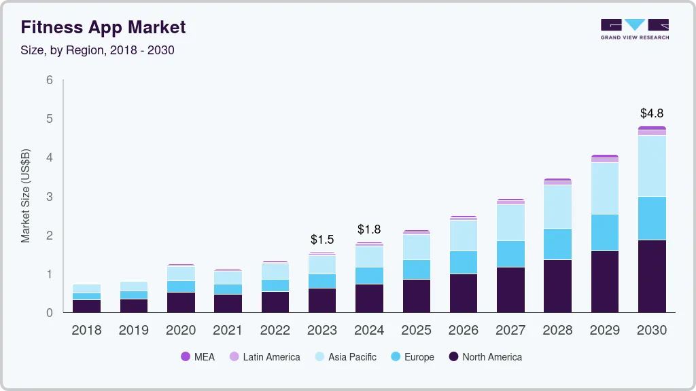



  

# **Universidad Peruana de Ciencias Aplicadas**
## Carrera de Ingeniería de Software

Ciclo: 2025 - 20

Curso: Arquitecturas De Software Emergentes

NRC: 14653

Profesor: Berrocal Navarro, Richard Leonardo

“Informe de Trabajo Final"

Startup: TechSolutions

Producto: FitSense

Grupo: 2

|          Integrantes          |      Código      |
|:-----------------------------:|:-------------------:|
|   Calisaya Sánchez, Juan Jesús    |    u202121935    |
|   Cuadros Rodríguez, Juan Alejandro  |    u20221a359    |
|   Jarama Peñaloza, Fiorella    |   u202120418  |
|  Lucas Coronel, Nadia Alessandra   |    U202120430    |
|  Rubio Calixto, Adrian    |    u202017622    |

Setiembre 2025 

---

## Registro de Versiones Del Informe

<table>
  <thead>
    <tr>
        <th>Versión</th>
        <th>Fecha</th>
        <th>Autor</th>
        <th>Descripción de modificación</th>
    </tr>
  </thead>
  <tbody>
  <tr>
      <td><strong>TB1</strong></td>
      <td>Sábado 16 de Setiembre</td>
      <td>
        <ul>
            <li>Calisaya Sánchez, Juan Jesús</li>
            <li>Cuadros RodriguVz, Juan Alejandro</li>
            <li>Jarama Peñaloza, Fiorella</li>
            <li>Lucas Coronel, Nadia Alessandra</li>
            <li>Rubio Calixto, Adrian</li>
        </ul>
      </td>
      <td>
        Se han incluído los siguientes capítulos:
        <ul>
          <li>Capítulo I: Introducción</li>
          <li>Capítulo II: Requirements Elicitation & Analysis</li>
          <li>Capítulo III: Requirements Specification</li>
          <li>Capítulo IV: Strategic-Level Software Design</li>
          <li>Avance de Conclusiones, Bibliografía y Anexos</li>
        </ul>
      </td>
  </tr>
  </tbody>
</table>

## Project Report Collaboration Insights

URL Project Report (Github): https://github.com/FitSense-Emergentes-14653/Project-Report

------

# Contenido

## [Capítulo I: Introducción](#capítulo-i-introducción)
- [1.1. Startup Profile](#11-startup-profile)
  - [1.1.1. Descripción de la Startup](#111-descripción-de-la-startup)
  - [1.1.2. Perfiles de integrantes del equipo](#112-perfiles-de-integrantes-del-equipo)
- [1.2. Solution Profile](#12-solution-profile)
  - [1.2.1. Antecedentes y problemática](#121-antecedentes-y-problemática)
  - [1.2.2. Lean UX Process](#122-lean-ux-process)
    - [1.2.2.1. Lean UX Problem Statements](#1221-lean-ux-problem-statements)
    - [1.2.2.2. Lean UX Assumptions](#1222-lean-ux-assumptions)
    - [1.2.2.3. Lean UX Hypothesis Statements](#1223-lean-ux-hypothesis-statements)
    - [1.2.2.4. Lean UX Canvas](#1224-lean-ux-canvas)
- [1.3. Segmentos objetivo](#13-segmentos-objetivo)

## [Capítulo II: Requirements Elicitation & Analysis](#capítulo-ii-requirements-elicitation--analysis)
- [2.1. Competidores](#21-competidores)
  - [2.1.1. Análisis competitivo](#211-análisis-competitivo)
  - [2.1.2. Estrategias y tácticas frente a competidores](#212-estrategias-y-tácticas-frente-a-competidores)
- [2.2. Entrevistas](#22-entrevistas)
  - [2.2.1. Diseño de entrevistas](#221-diseño-de-entrevistas)
  - [2.2.2. Registro de entrevistas](#222-registro-de-entrevistas)
  - [2.2.3. Análisis de entrevistas](#223-análisis-de-entrevistas)
- [2.3. Needfinding](#23-needfinding)
  - [2.3.1. User Personas](#231-user-personas)
  - [2.3.2. User Task Matrix](#232-user-task-matrix)
  - [2.3.3. User Journey Mapping](#233-user-journey-mapping)
  - [2.3.4. Empathy Mapping](#234-empathy-mapping)
  - [2.3.5. As-is Scenario Mapping](#235-as-is-scenario-mapping)
- [2.4. Ubiquitous Language](#24-ubiquitous-language)

## [Capítulo III: Requirements Specification](#capítulo-iii-requirements-specification)
- [3.1. To-Be Scenario Mapping](#31-to-be-scenario-mapping)
- [3.2. User Stories](#32-user-stories)
- [3.3. Impact Mapping](#33-impact-mapping)
- [3.4. Product Backlog](#34-product-backlog)

## [Capítulo IV: Solution Software Design](#capítulo-iv-solution-software-design)
- [4.1. Strategic-Level Domain-Driven Design](#41-strategic-level-domain-driven-design)
  - [4.1.1. Design Purpose](#411-eventstorming)
  - [4.1.2. Attribute-Driven Design Inputs](#412-context-mapping)
    - [4.1.2.1. Primary Functionality (Primary User Stories)](#4131-system-landscape-diagram)
    - [4.1.2.2. Quality attribute Scenarios](#4132-context-level-diagrams)
    - [4.1.2.2. Constraints](#4132-container-level-diagrams)
    - [4.1.2.3. Deployment Diagrams](#4133-deployment-diagrams)
- [4.1.3. Architectural Drivers Backlog](#413-software-architecture)
- [4.1.4. Architectural Design Decisions](#413-software-architecture)
- [4.1.5. Quality Attribute Scenario Refinements](#413-software-architecture)
- [4.2.  Strategic-Level Domain-Driven Design](#41-strategic-level-domain-driven-design)
  - [4.2.1. EventStorming](#413-software-architecture)
  - [4.2.2. Candidate Context Discovery](#413-software-architecture)
  - [4.2.3. Domain Message Flows Modeling](#413-software-architecture)
  - [4.2.4. Bounded Context Canvases](#413-software-architecture)
  - [4.2.5. Context Mapping](#413-software-architecture)
- [4.2.  Software Architecture](#41-strategic-level-domain-driven-design)
    - [4.3.1. Software Architecture System Landscape Diagram](#4131-system-landscape-diagram)
    - [4.3.2. Software Architecture Context Level Diagrams](#4132-context-level-diagrams)
    - [4.3.2. Software Architecture Container Level Diagrams](#4132-container-level-diagrams)
    - [4.3.3. Software Architecture Deployment Diagrams](#4133-deployment-diagrams)

## [Capítulo V: Tactical-Level Domain-Driven Design](#capítulo-iv-solution-software-design)
  - [5.1. Bounded Context: Security](#421-bounded-context-security)
    - [5.1.1. Domain Layer](#4211-domain-layer)
    - [5.1.2. Interface Layer](#4212-interface-layer)
    - [5.1.3. Application Layer](#4213-application-layer)
    - [5.1.4. Infrastructure Layer](#4214-infrastructure-layer)
    - [5.1.5. Bounded Context Software Architecture Component Level Diagrams](#4215-component-level-diagrams)
    - [5.1.6. Bounded Context Software Architecture Code Level Diagrams](#4215-component-level-diagrams)
      - [5.1.6.1. Domain Layer Class Diagrams](#42161-domain-layer-class-diagrams)
      - [5.1.6.2. Database Design Diagram](#42162-database-design-diagram)

## [Capítulo VI: Solution UI/UX Design](#capítulo-v-solution-uiux-design)
- [6.1. Style Guidelines](#51-style-guidelines)
  - [6.1.1. General Style Guidelines](#511-general-style-guidelines)
  - [6.1.2. Web, Mobile and IoT Style Guidelines](#512-web-mobile-and-iot-style-guidelines)
- [6.2. Information Architecture](#52-information-architecture)
  - [6.2.1. Organization Systems](#521-organization-systems)
  - [6.2.2. Labeling Systems](#522-labeling-systems)
  - [6.2.3. SEO Tags and Meta Tags](#523-seo-tags-and-meta-tags)
  - [6.2.4. Searching Systems](#524-searching-systems)
  - [6.2.5. Navigation Systems](#525-navigation-systems)
- [6.3. Landing Page UI Design](#53-landing-page-ui-design)
  - [6.3.1. Landing Page Wireframe](#531-landing-page-wireframe)
  - [6.3.2. Landing Page Mock-up](#532-landing-page-mock-up)
- [6.4. Applications UX/UI Design](#54-applications-uxui-design)
  - [6.4.1. Applications Wireframes](#541-applications-wireframes)
  - [6.4.2. Applications Wireflow Diagrams](#542-applications-wireflow-diagrams)
  - [6.4.2. Applications Mock-ups](#542-applications-mock-ups)
  - [6.4.3. Applications User Flow Diagrams](#543-applications-user-flow-diagrams)
- [6.5. Applications Prototyping](#55-applications-prototyping)

## [Capítulo VII: Product Implementation, Validation & Deployment](#capítulo-vi-product-implementation-validation--deployment)
- [7.1. Software Configuration Management](#61-software-configuration-management)
  - [7.1.1. Development Environment Configuration](#611-development-environment-configuration)
  - [7.1.2. Source Code Management](#612-source-code-management)
  - [7.1.3. Style Guide & Conventions](#613-style-guide--conventions)
  - [7.1.4. Deployment Configuration](#614-deployment-configuration)
- [7.2. Implementation](#62-implementation)
  - [7.2.1. Sprint 1](#621-sprint-1)
    - [7.2.1.1. Sprint Planning](#6211-sprint-planning)
    - [7.2.1.2. Aspect Leaders and Collaborators](#62x2-aspect-leaders-and-collaborators)
    - [7.2.1.3. Sprint Backlog](#6213-sprint-backlog)
    - [7.2.1.4. Development Evidence](#6214-development-evidence)
    - [7.2.1.5. Testing Suite Evidence](#6215-testing-suite-evidence)
    - [7.2.1.6. Execution Evidence](#6216-execution-evidence)
    - [7.2.1.7. Services Documentation](#6217-services-documentation)
    - [7.2.1.8. Software Deployment Evidence for Sprint Review](#6218-software-deployment-evidence)
    - [7.2.1.9. Team Collaboration Insights](#6219-team-collaboration-insights)

- [7.3. Validation Interviews](#63-validation-interviews)
  - [7.3.1. Diseño de Entrevistas](#631-diseño-de-entrevistas)
  - [7.3.2. Registro de Entrevistas](#632-registro-de-entrevistas)
  - [7.3.3. Evaluaciones según heurísticas](#633-evaluaciones-según-heurísticas)
- [7.4. Video About-the-Product](#64-video-about-the-product)

## [Conclusiones](#conclusiones)
- [Conclusiones y recomendaciones](#conclusiones-y-recomendaciones)
- [Video About-the-Team](#video-about-the-team)
- [Bibliografía](#bibliografía)
- [Anexos](#anexos)

## Student Outcome

<table border="1" cellpadding="8" cellspacing="0">
  <tr>
    <th>Criterio específico</th>
    <th>Acciones realizadas</th>
    <th>Conclusiones TB1</th>
  </tr>
  <tr>
    <td>Trabaja en equipo para proporcionar liderazgo en forma conjunta</td>
    <td>
        <strong>Cuadros Rodriguez, Juan Alejandro</strong> 
        <em>TB1</em> 
        aa 
        <strong>Calisaya Sánchez, Juan Jesús</strong> 
        <em>TB1</em> 
        aa 
        <strong>Jarama Peñaloza, Fiorella</strong> 
        <em>TB1</em> 
        aa 
        <strong>Lucas Coronel, Nadia Alessandra</strong> 
        <em>TB1</em> 
        aa 
        <strong>Ramirez Mendez, Sebastián André</strong> 
        <em>TB1</em> 
        aa 
    </td>
    <td>
        <em>TB1</em> 
        AAAAAA 
    </td>
  </tr>
  <tr>
    <td>Crea un entorno colaborativo e inclusivo, establece metas, planifica tareas y cumple objetivos.</td>
    <td>
        <strong>Cuadros Rodriguez, Juan Alejandro</strong> 
        <em>TB1</em> 
        aa 
        <strong>Calisaya Sánchez, Juan Jesús</strong> 
        <em>TB1</em> 
        aa 
        <strong>Jarama Peñaloza, Fiorella</strong> 
        <em>TB1</em> 
        aa 
        <strong>Lucas Coronel, Nadia Alessandra</strong> 
        <em>TB1</em> 
        aa 
        <strong>Ramirez Mendez, Sebastián André</strong> 
        <em>TB1</em> 
        aa 
    </td>
    <td>
       <em>TB1</em> 
        AAAAAA 
    </td>
  </tr>
</table>

## 1.2. Solution Profile

### 1.2.1 Antecedentes y problemática

- **What:**  
  Muchas personas desean mejorar su condición física —bajar de peso, ganar músculo, prepararse para una meta personal—, pero enfrentan limitaciones como la falta de planes personalizados adecuados y seguimiento constante.

- **Where:**  
  Esta problemática es global, aunque su impacto se intensifica en zonas urbanas con alto consumo de apps de salud y fitness.

- **When:**  
  En los últimos años, especialmente desde 2020, el uso de aplicaciones móviles de fitness ha experimentado un crecimiento acelerado, intensificado por la pandemia y la conciencia creciente sobre la salud personal.

- **Who:**  
  Personas de todas las edades que buscan opciones accesibles y personalizadas de entrenamiento y nutrición sin depender de servicios costosos; típicamente usuarios de smartphones y, en muchos casos, wearables.

- **Why:**  
  - Contratar entrenadores personales o nutricionistas es costoso y poco accesible.  
  - Los planes gratuitos disponibles en internet suelen ser genéricos y no consideran el contexto o circunstancias de cada usuario.  
  - Sin seguimiento constante, la motivación disminuye rápidamente al no visualizar progreso de forma clara.

- **How:**  
  Al no existir herramientas asequibles, personalizadas e integrales (entrenamiento + nutrición + suplementación + metas concretas), los usuarios terminan usando múltiples apps desconectadas o abandonando sus objetivos.

- **How much:**  
  El mercado global de aplicaciones de fitness se encuentra en plena expansión. Por ejemplo, más del **74 % de ciudadanos estadounidenses** utiliza al menos una app de fitness, y el **60 % la ha sustituido por completo por membresías de gimnasio tradicionales**.

    (Revisar [Anexo N°1: Estadística sobre uso de apps de fitness](https://www.grandviewresearch.com/industry-analysis/fitness-app-market))  

    

    
    

### 1.2.2 Lean UX Process

#### 1.2.2.1. Lean UX Problem Statements