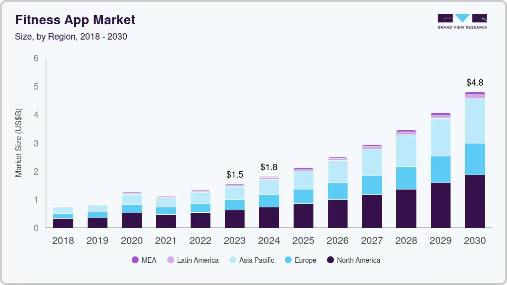

## Capítulo I: Introducción 

## 1.1. Startup Profile

### 1.1.1. Descripción de la Startup

Tech Solutions nace como una startup enfocada en crear soluciones digitales innovadoras que aprovechan la inteligencia artificial y la tecnología móvil para resolver problemas cotidianos de manera práctica, accesible y personalizada. Nuestro objetivo es transformar la forma en que las personas se relacionan con la tecnología, poniendo al usuario en el centro de cada solución.

**Misión**

Desarrollar soluciones tecnológicas inteligentes que mejoren la calidad de vida de las personas, integrando innovación, accesibilidad y personalización en cada proyecto que emprendemos.

**Visión**

Ser reconocidos como una startup líder en el desarrollo de aplicaciones y plataformas que combinen tecnología de vanguardia con un impacto positivo en la salud, el bienestar y el estilo de vida de los usuarios.

### 1.1.2. Perfiles de integrantes del equipo

<table>
  <tr>
    <th>
      
    </th>
    <td valign="top">
      
<b>Calisaya Sánchez, Juan Jesús</b>

      

        Soy estudiante de octavo ciclo de Ingeniería de Software en la UPC, con sólidos conocimientos en arquitecturas de software escalables y mantenibles, aplicando metodologías ágiles y buenas prácticas de desarrollo. Domino tecnologías como Java, Spring Boot, .NET, TypeScript, React, Angular y Docker, además de bases de datos SQL y NoSQL. Me considero una persona colaboradora y comunicativa, capaz de aportar tanto en el diseño técnico como en la coordinación del equipo para asegurar la calidad del proyecto.
      

    </td>
  </tr>
  <tr>
    <th>
      
    </th>
    <td valign="top">
      
<b>Cuadros Rodriguez, Juan Alejandro</b>

      

        Mi nombre es Juan Cuadros me considero una persona responsable, paciente y comprometida. Tengo conocimientos en los lenguajes de programación C/C++, Python y Java. Además de experiencia en gran manejo de datos usando SQL. También tengo conocimientos en Análisis de vulnerabilidades y explotación de datos. Estoy comprometido con el equipo y el proyecto.
      

    </td>
  </tr>
  <tr>
    <th>
      
    </th>
    <td valign="top">
      
<b>Jarama Peñaloza, Fiorella</b>

      

        Mi nombre es Fiorella Jarama Peñaloza y soy estudiante de noveno ciclo de Ingeniería de Software. Me considero una persona apasionada por la tecnología, curiosa y orientada al detalle. Tengo experiencia en Flutter, MySQL, APIs, y estoy en constante aprendizaje sobre Inteligencia Artificial. Mi objetivo es aplicar mis habilidades para desarrollar soluciones innovadoras y eficientes, contribuyendo a proyectos que tengan un impacto positivo y sostenible.
      

    </td>
  </tr>
  <tr>
    <th>
      
    </th>
    <td valign="top">
      
<b>Lucas Coronel, Nadia Alessandra</b>

      

        Mi nombre es Nadia Alessandra Lucas Coronel y soy estudiante de noveno ciclo de la carrera de Ingeniería de Software. Me considero una persona entusiasta, perseverante y responsable. Cuento con conocimientos en SQL, C++, Python, HTML, CSS, JavaScript, despligue y metodologías ágiles. Me comprometo a aplicar mis conocimientos de manera efectiva para contribuir al desarrollo de soluciones de software de alta calidad.
      

    </td>
  </tr>
  <tr>
    <th>
      
    </th>
    <td valign="top">
      
<b>Rubio Calixto, Adrian</b>

      

        .
      

    </td>
  </tr>
</table>

## 1.2. Solution Profile

### 1.2.1 Antecedentes y problemática

- **What:**  
  Muchas personas desean mejorar su condición física —bajar de peso, ganar músculo, prepararse para una meta personal—, pero enfrentan limitaciones como la falta de planes personalizados adecuados y seguimiento constante.

- **Where:**  
  Esta problemática es global, aunque su impacto se intensifica en zonas urbanas con alto consumo de apps de salud y fitness.

- **When:**  
  En los últimos años, especialmente desde 2020, el uso de aplicaciones móviles de fitness ha experimentado un crecimiento acelerado, intensificado por la pandemia y la conciencia creciente sobre la salud personal.

- **Who:**  
  Personas de todas las edades que buscan opciones accesibles y personalizadas de entrenamiento y nutrición sin depender de servicios costosos; típicamente usuarios de smartphones y, en muchos casos, wearables.

- **Why:**  
  - Contratar entrenadores personales o nutricionistas es costoso y poco accesible.  
  - Los planes gratuitos disponibles en internet suelen ser genéricos y no consideran el contexto o circunstancias de cada usuario.  
  - Sin seguimiento constante, la motivación disminuye rápidamente al no visualizar progreso de forma clara.

- **How:**  
  Al no existir herramientas asequibles, personalizadas e integrales (entrenamiento + nutrición + suplementación + metas concretas), los usuarios terminan usando múltiples apps desconectadas o abandonando sus objetivos.

- **How much:**  
  El mercado global de aplicaciones de fitness se encuentra en plena expansión. Por ejemplo, más del **74 % de ciudadanos estadounidenses** utiliza al menos una app de fitness, y el **60 % la ha sustituido por completo por membresías de gimnasio tradicionales**.

    (Revisar [Anexo N°1: Estadística sobre uso de apps de fitness](https://www.grandviewresearch.com/industry-analysis/fitness-app-market))  

    

    
    

### 1.2.2 Lean UX Process

#### 1.2.2.1. Lean UX Problem Statements

***Problem Statement 1***  

|Nuestro producto tiene como objetivo mejorar la condición física de las personas mediante un acompañamiento integral (ejercicio, nutrición y suplementos) basado en IA.|
| - |
|Hemos observado que muchas personas que desean bajar de peso, ganar músculo o cumplir metas personales se enfrentan a planes genéricos, costosos o poco accesibles. Esto impacta negativamente en su motivación y resultados.|
|¿Podría FitSense, a través de planes personalizados con IA, que integren entrenamiento, nutrición y suplementos, ayudar a los usuarios a lograr sus metas físicas de manera más accesible y sostenible?|

---

***Problem Statement 2***  

|Nuestro producto tiene como objetivo aumentar la adherencia y motivación de las personas hacia el ejercicio y una vida saludable.|
| - |
|Hemos observado que muchos usuarios abandonan sus rutinas por falta de seguimiento continuo, métricas claras o retroalimentación visual que muestre sus progresos.|
|¿Podría FitSense, mediante un dashboard visual con evolución de métricas (IMC, calorías, progreso semanal) y recordatorios personalizados, ayudar a mejorar la constancia y motivación de los usuarios?|

---

***Problem Statement 3***  

|Nuestro producto tiene como objetivo hacer accesible el acompañamiento fitness sin necesidad de pagar entrenadores o nutricionistas costosos.|
| - |
|Hemos observado que los servicios profesionales de entrenamiento y nutricionistas son caros y poco accesibles para la mayoría de personas.|
|¿Podría FitSense, mediante un entrenador integral impulsado por IA, ofrecer una alternativa más asequible y práctica que democratice el acceso al bienestar físico?|

---

#### 1.2.2.2. Lean UX Assumptions  

1. **¿Quién es el usuario?**  
   Personas que desean mejorar su condición física (bajar de peso, ganar músculo, prepararse para una meta específica) y buscan una solución digital personalizada, accesible y fácil de usar. Incluye tanto usuarios principiantes como intermedios, que no quieren depender de entrenadores costosos.  

2. **¿Dónde encaja nuestro producto en su vida?**  
   FitSense se integra en el día a día del usuario a través de su celular. La app acompaña desde la planificación de entrenamientos y comidas, hasta el seguimiento de métricas y recomendaciones de suplementos. Así se convierte en un **coach integral** en el bolsillo del usuario.  

3. **¿Qué problemas resuelve nuestro producto?**  
   - Planes genéricos que no consideran edad, peso o contexto.  
   - Falta de motivación por ausencia de métricas visibles.  
   - Costos elevados de entrenadores/nutricionistas.  
   - Dificultad para unificar en un solo lugar ejercicio + dieta + suplementos.  

4. **¿Cuándo y cómo es usado el producto?**  
   A diario, a través del smartphone. Los usuarios consultan FitSense antes de entrenar, al registrar comidas, o al evaluar sus progresos en gráficos. Además, reciben notificaciones motivacionales y recordatorios personalizados.  

5. **¿Qué características son importantes?**  
   - **Planes personalizados con IA**: rutinas y dietas adaptadas a metas reales.  
   - **Dashboard de progreso**: métricas visuales de IMC, calorías, peso y comparativas.  
   - **Recordatorios inteligentes**: notificaciones para mantener la motivación.  
   - **Integración integral**: ejercicio + nutrición + suplementos en una sola app.  
   - **Accesibilidad**: interfaz simple, amigable y multilenguaje.  

6. **¿Cómo debe verse y comportarse el producto?**  
   - **UI**: limpia, colorida y motivadora (paleta morado + verde + naranja).  
   - **UX**: fluida, intuitiva y gamificada (barra de progreso, badges, logros).  
   - **Comportamiento**: actualización en tiempo real de métricas y recomendaciones personalizadas.  

---

#### 1.2.2.3. Lean UX Hypothesis Statements  

**Hypothesis Statement 1**  
|Creemos que al ofrecer planes personalizados que integren ejercicio, nutrición y suplementos en FitSense, los usuarios obtendrán mejores resultados físicos de manera más eficiente y accesible.|
| - |
|Sabremos que esto es cierto…|
|Cuando al menos el 70% de los usuarios reporten mejoras en sus métricas (peso, IMC, resistencia) durante los primeros 3 meses de uso de la app.|

---

**Hypothesis Statement 2**  
|Creemos que al mostrar métricas visuales (gráficos de progreso semanal, calorías, comparativas) en un dashboard amigable, los usuarios aumentarán su motivación y constancia en sus rutinas.|
| - |
|Sabremos que esto es cierto…|
|Cuando observemos que al menos el 60% de los usuarios activos mantienen su constancia en rutinas y registro de comidas por más de 8 semanas consecutivas.|

---

**Hypothesis Statement 3**  
|Creemos que al posicionar FitSense como un “entrenador integral accesible” impulsado por IA, se logrará democratizar el acceso al bienestar físico frente a servicios tradicionales caros.|
| - |
|Sabremos que esto es cierto…|
|Cuando los usuarios destaquen en encuestas de satisfacción que FitSense reemplaza en al menos un 50% la necesidad de pagar entrenadores o nutricionistas externos.|

---

**Hypothesis Statement 4**  
|Creemos que al integrar recordatorios inteligentes y gamificación en FitSense, los usuarios aumentarán su nivel de compromiso con sus metas personales.|
| - |
|Sabremos que esto es cierto…|
|Cuando se observe un incremento del 20% en el tiempo promedio de uso semanal y un 15% más de usuarios completando sus rutinas de manera consistente en los primeros 6 meses de lanzamiento.|

#### 1.2.2.4. Lean UX Canvas

## 1.3. Segmentos objetivo

Nuestro público objetivo son las personas interesadas en **mejorar su condición física** (bajar de peso, ganar masa muscular, prepararse para una meta específica como una maratón, o simplemente mantener un estilo de vida saludable), que buscan una alternativa **más accesible y personalizada** que contratar entrenadores o nutricionistas.  

De acuerdo con el informe **Global Fitness App Market Size, Share & Trends Report 2023–2030 (Grand View Research, 2023)**, el uso de aplicaciones móviles de fitness ha crecido exponencialmente, alcanzando a millones de usuarios a nivel mundial, especialmente en el rango de **18 a 45 años**, quienes representan la mayoría de consumidores digitales en este sector.  

Estos usuarios valoran soluciones que combinen en un solo lugar **entrenamiento, nutrición y seguimiento visual de progreso**, evitando tener que utilizar múltiples aplicaciones o servicios separados. **FitSense** cubre precisamente esta necesidad al integrar un **coach integral basado en IA**.  

| **Segmento objetivo** | Personas que buscan crear su propio plan fitness |
| :- | :- |
| **Edad** | 16-55 años |
| **Ubicación** | Principalmente áreas urbanas con alto uso de smartphones e internet |
| **Sexo** | Masculino y Femenino |
| **Formación educativa** | Secundaria completa a universitaria, con uso básico de tecnología |
| **Poder adquisitivo** | Medio (usuarios que buscan alternativas más económicas a entrenadores o nutricionistas) |
| **Tecnología utilizada** | Smartphones con acceso a internet, aplicaciones móviles de fitness, dispositivos portátiles (wearables) para seguimiento de actividad física (opcional) |
